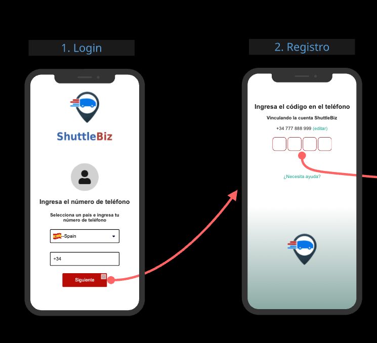
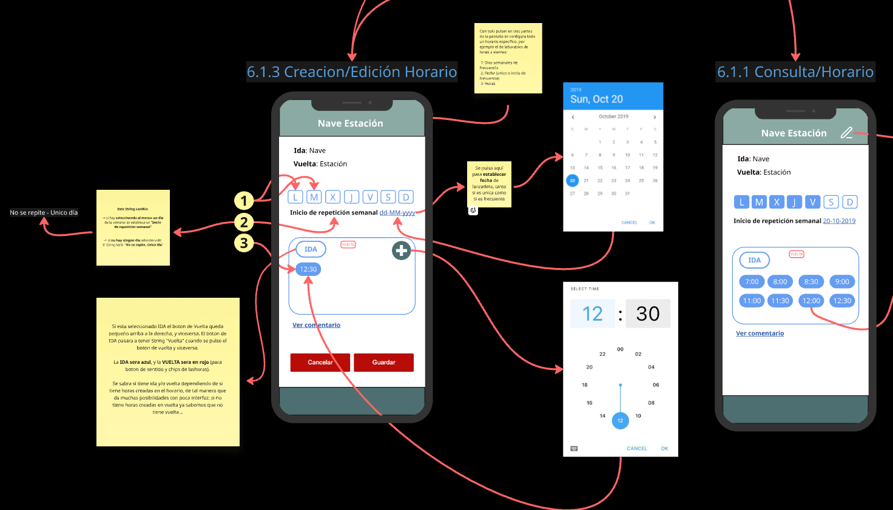
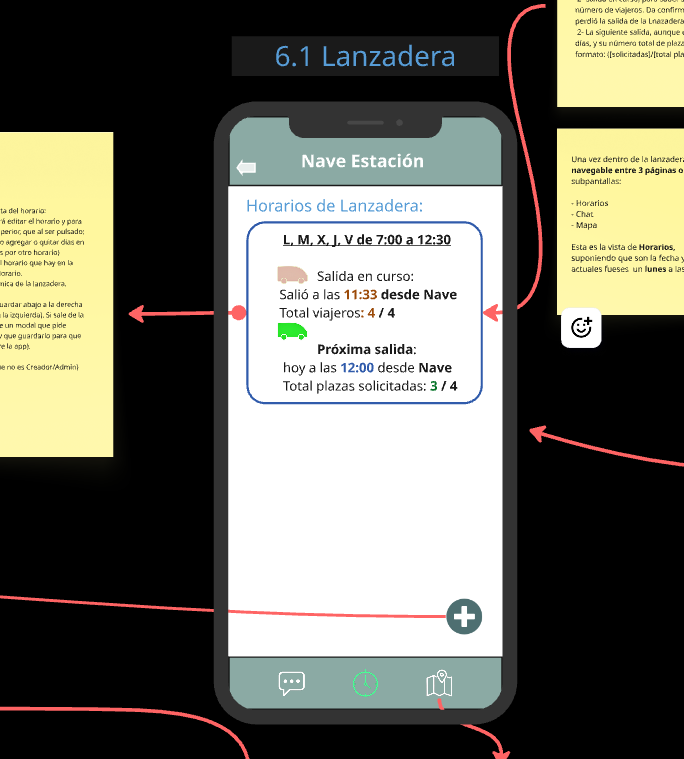

# ShuttleBiz APP

**ShuttleBiz** is a new mobile application concept designed to address a very specific need in the shared transportation space:

While many apps help people travel from point A to point B, ShuttleBiz focuses on **bringing together groups of people with a shared purpose**—such as employees from the same company or participants of a common event—and helping them coordinate rides in a shuttle provided either by themselves or by their organization.

The platform aims to include **real-time group chat**, **live GPS tracking**, and a **seat reservation system** to improve efficiency, communication, and overall usefulness.

> This project is currently in its **early planning and design phase**, focused on gathering requirements, creating initial wireframes, and exploring technical feasibility using Flutter and Firebase.

This is not just another ride-sharing app—ShuttleBiz is being built with **coordinated group transport** in mind, offering new possibilities for organizations and communities.

---

## 📋 Project Documentation

You can find the complete documentation and feature specifications at the link below. This includes functional requirements, UX considerations, and planning details.

👉 [View ShuttleBiz Documentation](docs/SPECIFICATIONS.md)

> If you're collaborating on this project, please request editing access via the same link.

---

## Tech Stack

- **Frontend**: Flutter (Dart)
- **Backend**: Firebase (Authentication, Firestore, Cloud Functions, Messaging)
- **Location Services**: Google Maps API
- **State Management**: Riverpod
- **Routing**: GoRouter
- **Version Control**: Git + GitHub Projects

---

## What I'm Learning

- Firebase integration with Flutter
- Location and real-time mapping
- UI/UX design for mobility solutions
- Project structure and modular development
- Collaborative workflows with GitHub Projects

---

## 📱 Screenshots

Here are some early in-app screens and mockups from the ShuttleBiz development:

| User Authentication              | Shuttle schedule lookup & editing                          | Shuttle schedule                         |
| -------------------------------- | ---------------------------------------------------------- | ---------------------------------------- |
|  |  |  |

> These screens reflect the current stage of development (2025, october), using miro.com. More features and refinements are on the way.

---

## Roadmap

- [x] Project planning and requirement gathering
- [x] UI/UX wireframes and complete specifications
- [x] Database schema design (Firestore structure)
- [x] Authentication flow design (Phone + SMS verification)
- [ ] Firebase implementation and environment setup
- [ ] Basic navigation and routing
- [ ] Chat module implementation
- [ ] Real-time location sharing _(post-MVP feature)_
- [ ] Booking and seat availability
- [ ] Notifications and reminders
- [ ] MVP launch

---

## Collaboration

This is a collaborative project currently being developed with [Ezequiel Coeli](https://github.com/ezecoeli), who is contributing in areas such as UI/UX design and feature planning.

We welcome contributions, feedback, and improvements.  
If you'd like to collaborate:

- Submit a pull request
- Open an issue
- Or contact us directly

**Note:** All contributions must be reviewed and approved before being merged.

---

## 🛡️ License & Collaboration Terms

This project is publicly visible for portfolio and evaluation purposes.  
All source code and materials are protected under the **Private Collaboration License – ShuttleBiz Team**.

- Collaboration or contributions require **prior written approval** from the ShuttleBiz Team.  
- **Unauthorized copying, redistribution, or derivative use** of the code is strictly prohibited.  
- For collaboration or partnership requests, contact **contact@marcdevelopez.com**.

Learn more: [marcdevelopez.com/shuttlebiz-license](https://marcdevelopez.com/shuttlebiz-license)

---

## Contact

For collaboration inquiries or commercial use requests, feel free to open a GitHub issue or reach out via email.

---

Created by [Marcos García](https://github.com/marcdevelopez)  
 Personal website coming soon: [marcdevelopez.com](https://marcdevelopez.com)
