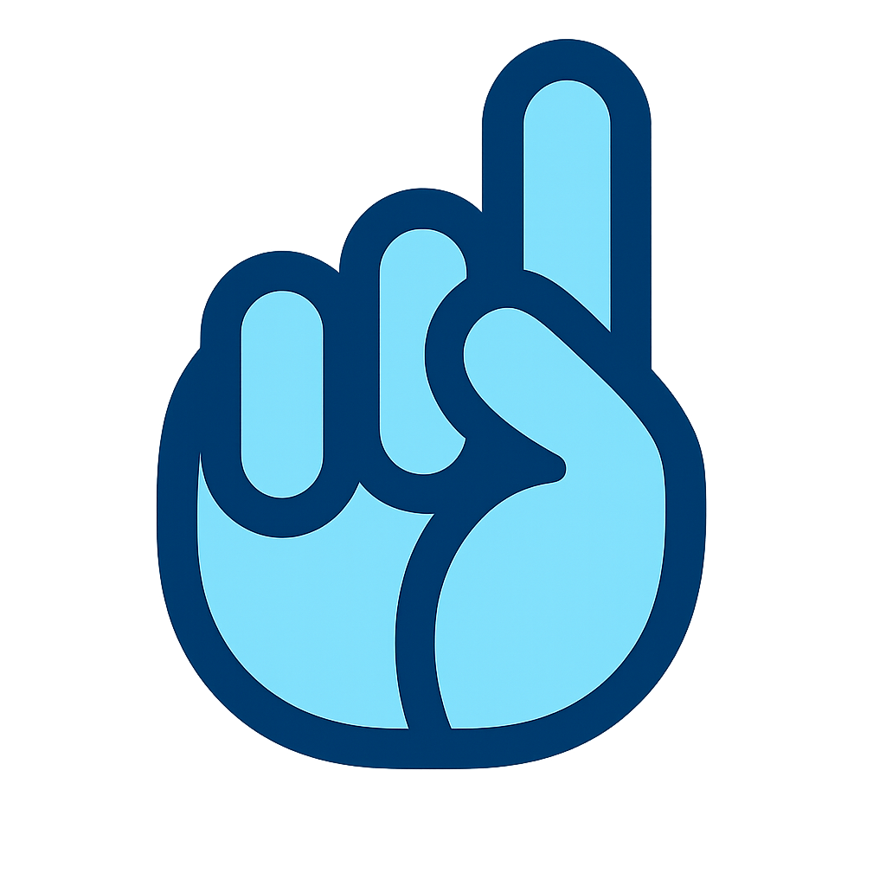
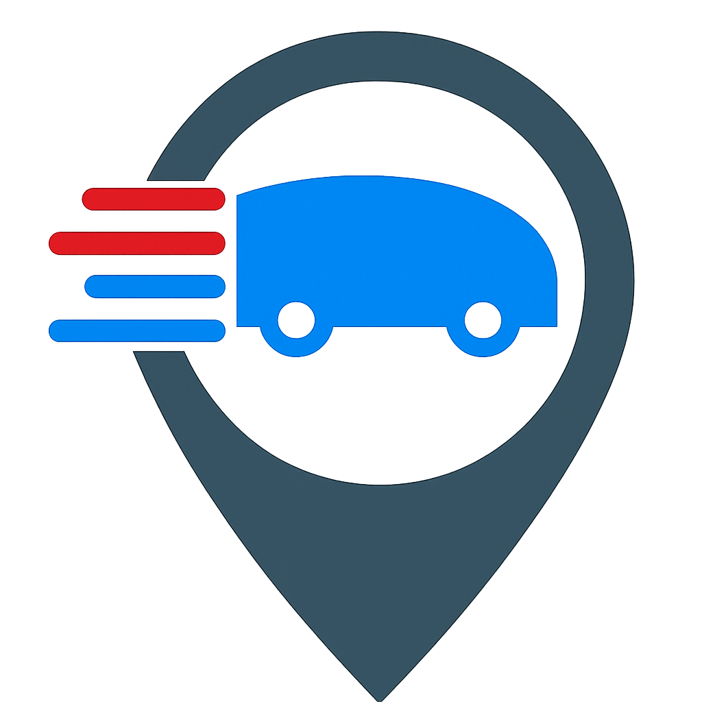
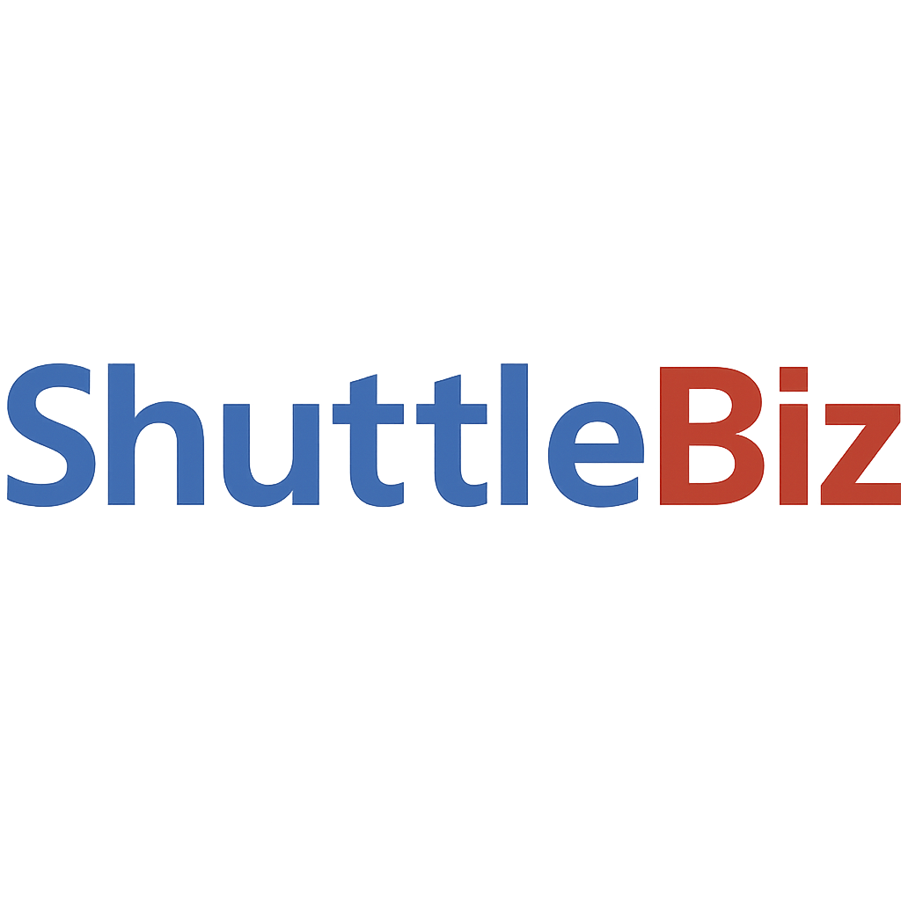

<style>
.i { margin-left: 20px; }
</style>

<div align="center">





</div>

<br>

<div align="center">



## Requerimientos Funcionales

#### **Aplicación donde los usuarios crean y usan lanzaderas para unir personas en un vehículo para viajar a determinado destino, con la posibilidad de comunicarse y saber la posición de cada uno.**

</div>

---

## **1\. Autenticación y Roles de Usuario**

- 🔐 **Login por número de teléfono** con verificación SMS/OTP.
- ✅ **Sesión persistente** tras primer acceso.
- 🔁 **Sistema de recuperación y respaldo:**
  - **Recuperación por SMS**: Si se pierde el login, recuperable con el número registrado
  - **Datos básicos en Firebase**: UID, número de teléfono y datos mínimos de perfil
  - **Respaldo en la nube personal**: Chats e historial en Google Drive (Android) o iCloud (iOS)
  - **Respaldo local**: Opción alternativa configurable desde Ajustes
  - **Cambio de número**: Flujo en Configuración para actualizar número manteniendo UID
- 👥 **Sistema de roles flexible**: cualquier usuario puede usar tanto el rol de conductor como de viajero
  - **Selección dinámica**: al entrar a una lanzadera, el usuario decide qué rol tendrá en esa ocasión
  - **Configuración permanente**: opción para mantener un rol preferido por defecto
  - **Cambio de rol**: pantalla de ajustes con opción "Cambiar rol predeterminado" para modificar la preferencia

---

## **2\. Gestión de Grupos ("Biz")**

- 📦 Los usuarios pueden **crear un grupo** (biz) para organizar lanzaderas.
- 👤 Solo el **creador del grupo** puede:
  - Crear o modificar lanzaderas.
  - Expulsar usuarios.
  - Asignar otro administrador.
- 🔒 **Visibilidad del grupo** configurable al crearlo:
  - **Privado**: solo accesible por invitación directa del creador/admin
  - **Público**: aparece en la lista de grupos disponibles y permite solicitar acceso
  - 🔄 **Modificable**: la visibilidad puede cambiarse después de crear el grupo
- 👥 **Acceso según visibilidad**:
  - **Grupos privados**: solo invitación del creador/administrador
  - **Grupos públicos**: solicitud desde lista pública + aprobación del creador/admin
- 🏠 Los usuarios agregados verán automáticamente ese grupo en su pantalla Home.
- 📅 El sistema guarda internamente la **fecha/hora de incorporación al grupo**.
- 🚪 Cualquier usuario puede **salir del grupo** en cualquier momento.
- 🔄 Si el creador abandona:
  - El nuevo administrador será designado por él.
  - Si no hay designación, será el miembro más antiguo.

### **🚨 Alertas de Conductores (gestión por admins)**

- 👨‍💼 **Asignación de conductores potenciales**: Creadores y administradores pueden asignar conductores potenciales para el grupo
- 🔔 **Sistema de alertas**: El usuario seleccionado recibe un aviso de "servicio de lanzadera como conductor"
- ✅ **Respuesta requerida**: Puede aceptar o rechazar la solicitud
- 📝 **Motivo de rechazo**: Si rechaza, debe indicar motivo:
  - Respuestas rápidas: "Imprevisto urgente", "No estoy asignado", "Otro usuario será el conductor"
  - Opción de texto breve personalizado

---

## **3\. Gestión de Lanzaderas**

> ### **3.1. Creación**

- ➕ El creador de un grupo puede crear lanzaderas dentro de él.
- 🛣️ Requiere definir:
  - **Nombre**
  - **Origen** y **destino**
  - **Periodicidad**: puntual (fecha única) o frecuencia semanal
  - **Plazas por defecto**
  - **Comentario** (opcional: normas, detalles de recogida)
- 🧭 Cada lanzadera pertenece a un único grupo (no es global).

> ### **3.2. Configuración de horarios**
>
> (Integrado en las secciones 6.1 y 6.1.3, donde se describe en detalle el flujo de creación y edición de horarios.)

## **4\. Consulta y Solicitud de Lanzaderas**

> ### **4.1. Vista en Home**

- 🏡 Se muestran las **lanzaderas** del **grupo activo**.
- Cada ítem incluye:

  - Nombre
  - Origen → destino
  - Plazas disponibles
  - Próximos horarios disponibles ese día
  - Estado visual con colores:
    - 🟢 Verde: disponible
    - 🔴 Rojo: fuera de horario o completa
    - ⚪ Gris: no disponible

- Se puede **cambiar de grupo** desde el nombre del grupo en la barra superior.

> ### **4.2. Vista de Detalle LANZADERA**

- Al **pulsar una lanzadera**:

  - Se muestra el nombre de Lanzadera, origen y destino.
  - Se muestra lista de horarios del día actual (diferenciando los aún disponibles).
  - Cada horario incluye (una vez pulsado, en nueva ventana):
    - Cantidad de viajeros
    - Nombre del conductor (si existe)
    - Botones:
      - "Solicitar plaza"
      - "Ser conductor"
      - "Cancelar solicitud"
      - "Ver viajeros"
    - Indicador del próximo horario.
  - Al seleccionar "conductor":
    - Si ya hay uno: se envía **notificación al ya existente para aprobar/rechazar**.
    - Si está libre: se solicita matrícula y plazas. Puede haber la posibilidad de tener una base de datos con las plazas de cada vehículo por defecto.
  - El botón de solicitud de plaza como viajero se bloquea si la lanzadera está completa.
  - Puede mostrarse como "estado completo".

---

## **5\. Reglas y Validaciones**

- 🚫 **Solo puede haber un conductor por horario**.
- 🔄 **Se puede anular una solicitud**.
- ✅ **Plazas disponibles visibles** en todo momento, con posibilidad de ver qué usuarios solicitaron plaza.
- 🛑 **No se puede solicitar plaza** si está completa.
- 🧾 Cada solicitud se guarda con fecha, rol y grupo asociado.
- 🧠 Validaciones para evitar solapamientos en la configuración de horarios.

#### Gestión automática de cancelaciones\*\*

- **15 minutos antes**: Si no hay conductor, aviso a creador y administradores
- **Hora de salida pasada**: Cancelación automática y aviso a usuarios con plaza
- **Conductor tardío**: Si aparece después, notificar salida tardía con tiempo de retraso

## **5.1 Persistencia y continuidad del rol de conductor**

El sistema define cómo se asigna y mantiene el rol de conductor en una lanzadera. Solo existen dos modalidades claras de funcionamiento.

## **1. Modos de asignación del conductor**

### **1.1 Conductor por salida única (con continuidad opcional)**

- El conductor se asigna únicamente para la **salida concreta** seleccionada.
- Tras completar el viaje (cuando marque “Llegada” o el sistema detecte la llegada) y siempre que haya mas salidas ese día con esa misma lanzadera, se mostrará un modal:

**“¿Deseas continuar como conductor en la siguiente salida?”**

Opciones:

- **[Sí, continuar]** → El usuario seguirá siendo conductor en la siguiente salida disponible, si aún no hay conductor asignado.
- **[No]** → El rol de conductor finalizará tras esta salida.
  Este modo se usa siempre que el conductor no tenga una asignación especial de rango.

- Si el conductor no responde al modal de continuidad:

  - A los **5 minutos**, los administradores reciben una notificación push indicando que se necesita conductor.
  - A los **15 minutos antes de la siguiente salida**, si aún no hay conductor, se envía un aviso de urgencia al chat del grupo.

- Si otro usuario solicita ser conductor:

  - La solicitud se envía al conductor actual y al creador/admin.
  - Si el conductor anterior respondió “No”, se puede aprobar automáticamente.
  - Si el conductor no ha respondido aún, el creador/admin tiene autoridad para decidir.

- Si el conductor eligió **“Sí, continuar”** pero no tiene vehículo asignado:

  - Se abrirá el selector de vehículo (según 6.1.2).

Si la siguiente salida ya tiene conductor asignado, en vez de preguntar si desea continuar, se mostrará:

> **“Ya hay un conductor asignado para esta salida.”**

### **1.2 Conductor asignado por rango temporal (día completo o bloque de horarios)**

- Solo puede asignarlo un Creador/Admin).
- El conductor puede ser asignado para
  - **todas las salidas del día**
  - **conjunto de horarios específicos**.
- El conductor recibe una notificación y debe aceptarla para que la asignación sea efectiva.
- En este modo **no se requiere confirmación individual por cada salida**.
- Una vez aceptado:
  - Es conductor automáticamente para todas las salidas incluidas en el rango.
  - No aparece el modal de continuidad.

## **2. Reglas de continuidad entre salidas consecutivas**

- El conductor **no continúa automáticamente**, salvo que:

  - Haya aceptado la continuidad opcional (1.1),
  - Esté asignado bajo rango temporal (1.2).

## **3. Restricciones generales**

- Solo puede haber **un conductor por salida**.
- No se puede asignar conductor una vez que la salida ya ocurrió.
- No se permite continuar como conductor si no se completó la salida anterior.
- El creador/admin siempre tiene la última palabra en conflictos.

---

## **6\. Comunicación y Notificaciones**

- 📢 Chat general por lanzadera _(no incluido en MVP)_.
- 🔐 **Privacidad de contacto**: el número de teléfono no será visible entre usuarios
  - Comunicación exclusivamente a través de mensajes dentro del grupo
  - **Versiones futuras**: llamada directa integrada en la app
  - **Opción personal**: cada usuario podrá configurar si mostrar su número de teléfono en su perfil
- 🔔 Notificaciones push:
  - Cuando un usuario se une a un grupo.
  - Cuando alguien solicita una plaza (informándose de plazas restantes).
  - Cuando comienza un viaje (para los viajeros).
- 🗺️ **Visualización de mapas incluida en MVP**:
  - **Pantalla de Grupo**: Mapas de todas las lanzaderas del grupo para consultar recorridos
  - **Pantalla de Lanzadera**: Mapa específico con trayecto, origen, destino y ubicación del usuario
  - **Funcionalidad futura**: Seguimiento en tiempo real del vehículo durante el viaje

> ### **📍 Políticas de Geolocalización** _(para implementación con mapas)_

- **🚗 Conductor**: Geolocalización **obligatoria** durante el viaje
  - Se activa automáticamente al confirmar salida de lanzadera
  - Visible para todos los viajeros de esa lanzadera específica
  - Necesaria para coordinación y seguridad del grupo
  - **Consentimiento requerido**: Aceptar términos de conductor incluye localización
- **🧑‍🤝‍🧑 Viajero**: Geolocalización **opcional**
  - El usuario decide si mostrar su ubicación o no
  - **Impacto en perfil**: No mostrar ubicación queda reflejado en perfil público
  - Puede ser factor negativo para aceptación en futuros grupos
  - Solo visible para el conductor y otros viajeros de la misma lanzadera
  - **Consentimiento granular**: Preguntar en cada viaje o configuración general

> ### **🔒 Privacidad y Retención de Datos GPS**

- **Almacenamiento temporal**: Los datos GPS se almacenan solo durante el viaje activo
- **Eliminación automática**: Al finalizar viaje, los datos de ubicación se eliminan en 24 horas
- **Excepciones de retención** _(solo con consentimiento explícito)_:
  - Estadísticas de rutas (datos anonimizados)
  - Histórico de viajes para soporte técnico (máximo 30 días)
- **Control del usuario**: Derecho a eliminación inmediata de cualquier dato de ubicación
- **Transparencia**: Log de acceso a ubicación visible en configuración de privacidad

> ### **⏰ Ventana de Activación del Tracking** _(para implementación con mapas)_

- **Cuándo se activa la localización**:

  - **Opción 1**: Tiempo fijo antes de la salida (ej: 30 minutos)
  - **Opción 2**: Cuando el conductor activa "Iniciar viaje"
  - **Opción 3**: Cuando el propio usuario decide mostrar ubicación

- **Visibilidad de ubicaciones**:
  - **Conductor puede ver**: Ubicación de todos los viajeros (si la han activado)
  - **Viajeros pueden ver**: Solo ubicación del conductor + otros viajeros que lo permitan
  - **Seguridad**: Los viajeros NO se ven entre sí automáticamente (privacidad)

> ### **GESTIÓN DE NOTIFICACIONES**

Sistema completo de notificaciones push e in-app para mantener informados a los usuarios.

- **Tipos de notificaciones:**
  - Nueva lanzadera creada en grupo
  - Alguien solicita plaza en tu viaje
  - Plaza confirmada/rechazada
  - Recordatorio 30min antes del viaje
  - Cambios en horarios
  - Mensajes del chat específico
  - **Invitación recibida** para ser miembro de un grupo
- **Configuración:** Usuario puede desactivar tipos específicos de notificaciones
- **Implementación:** Push notifications con Firebase Cloud Messaging (FCM)
- **Centro de notificaciones:** Historial in-app de notificaciones recibidas

---

## **7\. UX/UI Consideraciones**

- 🔀 Cambiar de grupo desde el nombre en la barra superior.
- 🟢 Estado visual por lanzadera y horario.
- 📅 Días sin lanzaderas muestran etiqueta "sin lanzadera".
- 📊 Colores y etiquetas para horarios de ida y vuelta.
- 📚 Implementación recomendada:

  - Provider, Riverpod o Bloc para actualización reactiva.
  - ExpansionTile para mostrar horarios organizadamente.

### 🧩 Patrones de Modales y Diálogos

- Los **modales** se utilizarán para confirmar acciones, mostrar avisos importantes o solicitar decisiones rápidas al usuario.  
  Ejemplo: Confirmar creación de lanzadera o agregar el primer horario.

- **Estructura visual recomendada:**

  - Fondo blanco con bordes suaves y ligera sombra.
  - Texto principal en gris oscuro (#212121).
  - Título o pregunta en negrita.
  - Espaciado amplio para evitar toques accidentales.
  - Línea divisoria superior a los botones de acción.

- **Botones dentro del modal:**

  - **Cancelar:** texto gris oscuro sin fondo (estilo “text button”).
  - **Aceptar / Confirmar:** fondo rojo (#D32F2F) con texto blanco.
  - Separación por línea gris (#E0E0E0) entre ambos botones.
  - Los botones siempre alineados en horizontal, centrados o de borde a borde.

- **Comportamiento:**

  - El modal debe bloquear la interacción con el resto de la interfaz hasta cerrarse.
  - Al pulsar fuera del modal no debe cerrarse automáticamente, excepto en modales informativos no críticos.
  - Debe ser consistente en toda la app (mismo color, tipografía y espaciado).

- **Ejemplo:**
  “¿Desea agregar el primer horario?”  
  [Cancelar] [ Aceptar ]

🧠 **Objetivo:** Mantener coherencia visual, simplicidad y claridad en las confirmaciones sin distraer de la acción principal.

<br>

---

# **🚩 Navegación y Pantallas**

## **🔹 Barra Superior de Navegación**

### **Estructura:**

[ Nombre de la App ] [ Nombre de Pantalla ] [ Menú ]

> ### **Patrón de Menús y Acciones Superiores**

- El **menú de tres puntos verticales (⋮)** en la esquina superior derecha se utilizará para **acciones y ajustes del contexto actual** de la pantalla (modificar datos, configuración, opciones avanzadas).
- El **menú hamburguesa (≡)** **no se usará** en la app, ya que la navegación principal se realiza con **BottomNavigationBar** y encabezados.
- Nunca deben coexistir ambos menús en la misma vista.
- Acceso a navegación y secciones principales siempre desde bottom bar o iconos visibles, no desde menús ocultos.

**Objetivo:** Mantener claridad, evitar confusión del usuario y seguir las pautas de Material/Flutter modernas.

<br>

---

# **📱 Pantallas**

> ## 1\. Pantalla de LOGIN

- Primera pantalla de la app.
- Campos:
  - País
  - Número de móvil (obligatorio)
- Botón: Siguiente
  - Enlaza con pantalla de **Registro con Código**.
- Opcional: subir una imagen de usuario.

> > ### 1.1. Pantalla de RECUPERACIÓN DE CUENTA

- Pantalla para casos de pérdida de móvil o cambio de número de teléfono.

- **Acceso:** Enlace desde pantalla de login
- **Métodos de recuperación:**
  - Verificación con número de teléfono anterior (si está disponible)
  - Verificación por email (si se configuró)
  - Contacto con soporte (último recurso)
- **Flujo de recuperación:**
  - Ingreso del nuevo número de teléfono
  - Verificación de identidad
  - Transferencia de cuenta al nuevo número
  - Confirmación y acceso restaurado
- **Seguridad:** Proceso de verificación robusto para prevenir accesos no autorizados

---

> ## 2. Pantalla de REGISTRO

- Parte superior: texto indicando que se debe ingresar el código recibido por SMS.
- Se muestra el número de teléfono al que se envió el código.
- Los números se introducen sin necesidad de pulsar el espacio para el código, como es usual en las verificaciones por códogo SMS.

---

> ## 3\. ONBOARDING

Tutorial interactivo sobre el funcionamiento de la app para nuevos usuarios.

**Activación:**

- Automático para usuarios nuevos tras primer login
- Manual desde menú de configuración: Ajustes > Ayuda > Ver tutorial

**Contenido del tutorial:**

- **Pantalla 1**: Bienvenida y presentación de ShuttleBiz
  - Logo y mensaje de bienvenida
  - Breve descripción: "Organiza viajes compartidos con tu comunidad"
- **Pantalla 2**: Cómo funcionan los grupos
  - Explicación de los "Biz" (grupos)
  - Diferencia entre grupos públicos y privados
  - Roles dentro de un grupo
- **Pantalla 3**: Crear y gestionar lanzaderas
  - Cómo crear una nueva lanzadera
  - Configurar horarios y frecuencias
  - Vista previa de lanzadera
- **Pantalla 4**: Solicitar plazas y ser conductor
  - Selección de rol (conductor/viajero)
  - Proceso de solicitud de plaza
  - Gestión de vehículos
- **Pantalla 5**: Comunicación y notificaciones
  - Sistema de chat por grupo
  - Tipos de notificaciones
  - Configuración de privacidad

**Características técnicas:**

- PageView con indicadores de progreso
- Botones "Siguiente", "Saltar" y "Empezar"
- Animaciones suaves entre pantallas
- Disponible después como ayuda en el menú: Ajustes > Ayuda > Ver tutorial
- Opción de cambiar todo esto por un simple video?? más sencillo y rápido.

---

> ## 4. PANTALLA DE GRUPOS\*\* _(origen/home de la aplicación)_

- **Función**: Permite ver los grupos del usuario y crear nuevos grupos. Es la pantalla primera, desde las que salen todas las demas.

### **Comportamiento del selector de grupo:**

- Si **no hay ningún grupo creado**, el texto mostrará: Agregar un Grupo, seguido de un icono +.
  - Al pulsarlo: navega a una pantalla de creación de grupo que incluye configuración obligatoria de **Visibilidad** (Privado/Público) además del nombre.
  - Este icono estará abajo a la derecha, floatingbutton, y dentro del menú superior.
- Si **ya hay uno o varios grupos creados**, se verá una lista de los grupos en el cuerpo de la pantalla.

### **Estados de inicio**

- **Sin grupos propios creados ni pertenencia a ninguno**:
  - Invitación a crear primer grupo
  - Vista de todos los grupos públicos a los que se podrá solicitar unirse.
- **Ya incluido en grupo/s**: Lista normal de todos los grupos, en primer lugar los que se ya se pertenece, y luego el resto de grupos priorizando los mas cercanos en distancia.

### **Contenido**:

- **Lista de grupos**: Cada ítem representa un grupo con foto de perfil opcional
- **Estados**:
  - Si **no hay grupos**: Mostrar invitación a crear el primer grupo
  - Si **hay grupos**: Lista de todos los grupos del usuario
- **Acciones**:
  - Al pulsar un grupo: abre la **Pantalla de Grupo (5)**
  - Botón "+" para crear nuevo grupo
  - **Ícono de búsqueda**: Para descubrir grupos públicos disponibles
- **Búsqueda de grupos públicos**:
  - Al pulsar ícono de búsqueda: abre modal de búsqueda
  - Muestra grupos públicos ordenados por proximidad (si hay geolocalización)
  - Permite buscar por nombre del grupo
  - Cada resultado muestra: nombre, número de miembros, lanzaderas activas
- **Acceso permanente**: Logo de la app (la mano) da acceso a "Estado de Mis Solicitudes"

> > ### 4.1. UNIRSE A GRUPO EXISTENTE

Flujo para usuarios que quieren unirse a un grupo creado por otros.

- **Métodos de acceso:**
  - Código de invitación (6 dígitos)
  - Enlace compartido
  - Búsqueda por nombre (si es público)
- **Pantalla de búsqueda:**
  - Campo para código/nombre
  - Lista de grupos públicos cercanos
- **Vista previa del grupo:**
  - Nombre, descripción
  - Número de miembros
  - Lanzaderas activas (preview)
- **Solicitud:**
  - Botón "Solicitar unirse"
  - Mensaje opcional al administrador

---

> ## 5\. Pantalla GRUPO _(vista completa del grupo)_

- **Función**: Muestra todas las lanzaderas y funcionalidades de un grupo específico.
- Al pulsar sobre el nombre del grupo arriba se abre modal para cambiar a otro grupo al que pertenezca el usuario.
  > MENÚ SUPERIOR DERECHO 3 PUNTOS (AJUSTES QUE APARECEN EN TODAS LAS PAGINAS DEL NIVEL GRUPO)
  >
  > - Gestión de vehículos: abre la pantalla 10 de gestión de vehículos.

> - **Estructura**: BottomNavigationBar + PageView con 4 secciones:

> > ### 5.1 Pantalla NEW SHUTTLE

- **Función**: Pantalla para crear una nueva lanzadera desde la Pantalla de Grupo.

- **Campos obligatorios**:

  - Nombre de la lanzadera (debe ser corto para UI)
  - Origen y destino (nombres cortos, se avisará de evitar nombres largos). Las coordenadas se elegirán en la siguiente pantalla, para no sobrecargar esta pantalla. Al pulsar El botón "Seleccione el origen" o el de destino, se abre pantalla "Elección Origen/Destino" (5.1.1)
  - Plazas por defecto: Será la capacidad habitual del vehículo, modificable por el conductor el día del viaje.
  - Comentario de la Lanzadera: Normas, instrucciones, etc. Es amplio, debajo de "Plazas por defecto".
    Estos datos se podrán modificar desde la pantalla de la lanzadera, en el menú superior derecho de la barra de app (⋮).

- La creación/edición de horarios se hara desde la pantalla Lanzadera en la pagina de "Horarios", editando uno de los ya creados o creando un horario nuevo desde el botón "añadir" (+) abajo a la derecha, aunque en la creación de la lanzadera, una vez configurados los datos básicos, al pulsar guardar se preguntará en un modal ("Horario desde NewShuttle") si desea agregar el primer horario, y en caso afirmativo se abrirá la pantalla 6.1.3 Creacion/Edición Horario, que es la misma que se usa para añadir o editar una vez ya está creada la lanzadera.

> > ### 5.1.1 Pantalla ELECCIÓN ORIGEN/DESTINO

- **Función**:
  Permitir al usuario definir el **nombre** y las **coordenadas geográficas** del punto de origen o destino de la lanzadera.
  Esta pantalla se abre al pulsar los botones **“Seleccione el origen”** o **“Seleccione el destino”** desde la pantalla “NEW SHUTTLE” (5.1).
- **Campos obligatorios**:

  - **Nombre del lugar**: Texto corto que identifica el punto (por ejemplo: “Aeropuerto”, “Centro Málaga”, “Campus UMA”).
    El sistema avisará si el nombre es excesivamente largo para evitar problemas de UI.
  - **Dirección o búsqueda en mapa**: Campo de texto con sugerencias de direcciones. Al introducir una dirección, se mostrará el marcador en el mapa.
    Alternativamente, el usuario podrá mover manualmente el marcador en el mapa para seleccionar la ubicación exacta.
    Por defecto, tendrá detección automática de ubicación actual.

- **Elementos interactivos**:

  - Campo de texto “Nombre del lugar” con icono de edición.
  - Campo de búsqueda con autocompletado (basado en API de mapas).
  - Mapa interactivo con marcador rojo movible.
  - Botón **“Confirmar”**, que guarda el punto seleccionado y retorna a la pantalla anterior, actualizando el campo correspondiente (“Origen” o “Destino”).

- **Comportamiento**:

  - Al confirmar, se guardan las coordenadas (latitud y longitud) junto al nombre elegido.
  - Si el usuario accede desde “Origen”, el título mostrará **“Selecciona el origen”**; si accede desde “Destino”, mostrará **“Selecciona el destino”**.
  - El botón de confirmación se habilita solo cuando ambos campos (nombre y coordenadas) están completos.

- **Notas adicionales**:

  - La pantalla debe mantener consistencia visual con “Configuración de Lanzadera” (5.1) y usar la misma paleta de colores y tipografía.

---

LO SIGUIENTE HAY QUE MODIFICARLO, EN PRINCIPIO ERA PARA LAS PAGINAS DEL VIEWPAGER DE GRUPOS, PERO HAY QUE REVISAR POR SI HAY ALGUNA IDEA QUE SE PUEDA PASAR A ESAS PANTALLAS...

### **5.2 Página HORARIOS-LANZADERAS DEL GRUPO**

**Función:**
Mostrar de forma unificada todos los horarios próximos de las distintas lanzaderas pertenecientes al grupo actual, permitiendo al usuario consultar rápidamente las salidas sin tener que entrar en cada lanzadera individualmente.

**Estructura general:**

- Pantalla similar a la **6.1 Horarios** (vista de horarios de una lanzadera), pero ampliada a nivel de grupo.
- Cada ítem corresponde a un grupo de horarios comunes (p. ej. L-V) específico dentro de una lanzadera.
- Se presenta una **lista cronológica todos los horarios de lanzaderas** del grupo:
  - Si un horario mostrado es el de lunes a viernes y otro es de fin de semana, y es viernes: se mostrará primero el de lunes a viernes y después el de fin de semana.
  - Los ítems se ordenan solo por tiempo, no por la lanzadera a la que pertenezcan.
  - Si no hay horarios próximos (no haya horarios semanales o aún no exista ninguna lanzadera con horario): se muestra un mensaje informativo “**No hay salidas próximas en el grupo**”.

**Contenido de cada ítem:**

- **Nombre de la lanzadera** (ej. “Nave ↔ Estación”) como encabezado destacado.
- **Días y franja horaria** del horario (ej. _L, M, X, J, V de 7:00 a 12:30_).
- **Secciones internas (idénticas al estilo de 6.1):**

  - **Salida en curso:**

    - Hora real de salida
    - Lugar de partida
    - Total de viajeros vs capacidad
    - Icono o indicador en color rojo coral (`#FF6B6B`)

  - **Próxima salida:**

    - Fecha (o “hoy” / “mañana” si corresponde)
    - Hora prevista y lugar de salida
    - Plazas solicitadas / plazas totales
    - Icono o indicador en verde (`#00C853`)

- Bordes suaves y tarjetas con sombra ligera, enmarcadas como bloques independientes.

**Interacciones:**

- Al pulsar sobre un ítem, se abre la pantalla **6.1.1 Consulta/Horario** correspondiente a esa lanzadera y horario, desde la que se puede seleccionar una hora de salida para solicitar plaza.

**Elementos visuales adicionales:**

- Título superior: “Horarios del grupo [Nombre del grupo]”.
- Color de encabezado y tipografía iguales a los de la pantalla 6.1 (consistencia visual).

**Objetivo de UX:**
Permitir una vista panorámica de la actividad del grupo, con un vistazo rápido a qué lanzaderas tienen salidas próximas y en qué horarios, manteniendo coherencia total con el diseño visual de las pantallas de lanzadera.

#### **5.3 Chat** _(general del grupo)_

- Título visible: "Chat general [nombre del grupo]"
- Chat que abarca a todos los usuarios del grupo
- Más amplio que el chat de una lanzadera específica

#### **5.4 Mapa** _(incluido en MVP)_

- Visualización de mapas de todas las lanzaderas del grupo
- Permite consultar recorridos de todas las lanzaderas
- Vista panorámica de todos los trayectos del grupo

**Navegación**: Flecha que regresa a **Pantalla de Grupos (4)**

---

## **5.5. GESTIÓN DE GRUPO**

Pantalla para administrar el grupo de la pantalla grupo (accesible desde menú superior).

### **Para creadores/administradores:**

- **Información del grupo:**
  - Nombre (editable)
  - Fecha de creación
  - Número de miembros
- **Gestión de miembros:**
  - Lista de usuarios del grupo
  - Promover a administrador
  - Expulsar miembros
- **Configuración:**
  - Grupo público/privado
  - Auto-aprobación de nuevos miembros
- **Acciones:**
  - Invitar nuevos miembros (código/enlace)
  - Eliminar grupo (confirmación)

#### **Para miembros regulares:**

- Ver información del grupo
- Lista de miembros
- Abandonar grupo

---

## **6 PANTALLA DE LANZADERA** _(vista específica de lanzadera)_

**Función**: Vista detallada de una lanzadera específica accesible desde Pantalla de Grupo.

**Al pulsar sobre una lanzadera desde Home**, dentro de un grupo (pantalla 5): Se abre la pantalla de Lanzadera, que es un **BottomNavigationBar \+ PageView.**

**Estructura**: BottomNavigationBar + PageView con 3 secciones: Horarios, Chat y Mapa.

Aquí se organiza todo lo relacionado con la solicitud de plazas, es el centro de la app; sin esta parte, la app no tendría sentido.

Tiene un menu superior derecho común a las 3 paginas del pageview. Este contiene, de momento:

- **Información de la lanzadera**: abre la información guardada en la pantalla 5.1 New Shuttle (Nombre, Origen y Destino, Comentario).  
  Si el usuario es **Creador/Admin del grupo**, podrá además modificar estos datos pulsando el icono para editar que se situará arriba, al lado izquierdo del menu:
  - Al ser pulsado se abre modal para confirmar cambio a modo edición
  - Al confirmar la edición se verán todos los campos en modo edición y arriba "✔️ Confirmar", “✖️”.
  - Solo se abre el teclado al pulsar un campo, para que no moleste la vista y se puedan ver todos los campos.

### **6.1 Horarios** _(sección central)_

Esta es la página central del **PageView**, con una lista de ítems que representan los diferentes horarios ya creados, cada uno de los cuales contiene grupos de días con sus horas de salida de la lanzadera.
De arriba abajo:

- String **"Horarios de Lanzadera"**.

- Lista de distintos horarios; cada horario es un grupo de días semanales o una fecha única de lanzadera, y se ordenan de **más próximo a más lejano en el tiempo**.
  Cada ítem de horario mostrará:

  - La **primera línea**: fecha y horas de comienzo y final del horario (a modo de título resumen).
    Ejemplo: `L, M, X, J, V de 7:00 a 12:30`

  - La **salida en curso**: se mostrará con un icono de tonalidad **roja**, indicando la hora de salida real, el lugar desde donde salió y el total de viajeros frente a la capacidad del vehículo.
    Ejemplo:

    ```
    Salida en curso:
    Salió a las 11:33 desde Nave
    Total viajeros: 4 / 4
    ```

  - La **próxima salida**: se mostrará con un icono de tonalidad **verde**, indicando la fecha (si es hoy o mañana se mostrará sin fecha explícita), la hora prevista y el lugar de salida, además del número de plazas solicitadas frente al total disponible.
    Ejemplo:

    ```
    Próxima salida:
    hoy a las 12:00 desde Nave
    Total plazas solicitadas: 3 / 4
    ```

- Al pulsar sobre un ítem de horario se abre la **pantalla 6.1.1 Consulta/Horario**, donde se muestra con más detalle la información del horario.

- Si además se es **Creador/Admin del grupo** al que pertenece la lanzadera, se muestra un **botón flotante (+)** en la esquina inferior derecha para **agregar un nuevo horario**.
  Al pulsarlo, se abre la **pantalla 6.1.3 Creación/Edición de Horario**, accesible solo para Creadores/Admin del grupo o del Biz en la app.

- Adicionalmente, si se es **Creador/Admin**, una **pulsación larga sobre un horario existente** abrirá un **modal de confirmación** para **eliminar dicho horario**.
  Este modal informará de forma clara que la acción es irreversible y requerirá introducir un **código de confirmación** antes de proceder, con las opciones **“Eliminar”** o **“Cancelar”**, para evitar eliminaciones accidentales.

### **6.1.1 Pantalla de consulta/Horario**

Se accede a esta vista al pulsar sobre un horario existente de una lanzadera.

En la parte superior se muestra el origen y el destino con el siguiente formato:

```
Salida:     Nave
Destino:    Estación
```

El origen se destaca en azul (“Nave”) y el destino en rojo (“Estación”).

Debajo de la cabecera del horario se muestran únicamente los días en los que ese horario está activo, para evitar confusiones. Cada día se resalta en azul o rojo según el sentido del trayecto: azul para la ida y rojo para la vuelta.

Estos colores se asignan al crear la lanzadera: el lugar definido como origen recibe el color azul y el destino el color rojo, manteniéndose esta misma codificación en todas las pantallas.  
El día actual se resaltará con un contorno especial (linea negra por ejemplo), y al seleccionar otro día, el sistema mostrará un modal de confirmación informando del cambio de fecha, para que el usuario sea consciente del día elegido y evitar confusiones.

Los días activos del horario pueden modificarse en la pantalla 6.1.3 Creación/Edición de Horario.

Debajo se muestra la **fecha**.
El texto será "Fecha de salida", tanto si hay dias semanales seleccionado como si no.
A la derecha se incluye un **text button con la fecha actual** que, al pulsarse, abre un **DatePicker** que permite seleccionar una fecha para poder consultar lanzaderas en otro dia distinto al actual. Se abrirá un selector de calendario que mostrará únicamente los días habilitados según la configuración del horario (por ejemplo, si el horario es de lunes a viernes, solo esos días serán seleccionables, y a partir del día actual inclusive).

Justo debajo de la fecha se mostrarán las **horas configuradas** en forma de **chips**, organizadas por sentido del trayecto (Ida/Vuelta) y con los colores correspondientes —**azul para la Ida** y **rojo para la Vuelta**—, manteniendo coherencia visual con la pantalla **6.1.3 Creación/Edición de Horario**.
En esta vista, los chips se muestran únicamente en modo **visualización**, sin permitir edición ni eliminación, sirviendo para que el usuario identifique rápidamente los horarios disponibles dentro de ese grupo.
El contenedor de estas horas mostrará al menos **3 filas y un máximo de 4 columnas**, dentro de un **scroll** para que no haya límite en la cantidad de horas visibles. Esta estructura será igual que en la pantalla **6.1.3**, con las horas ordenadas de forma ascendente.
Para alternar entre los horarios de **ida** y **vuelta**, bastará con pulsar el botón correspondiente (“Ida” o “Vuelta”).
El sentido **activo** se mostrará a la **izquierda** y con un **tamaño mayor**, mientras que el sentido **inactivo** permanecerá a la **derecha** y más pequeño.
Al pulsarlo, se ejecutará una **animación suave** que intercambia sus posiciones, manteniendo siempre el **color (azul o rojo)** y el **texto** asociado al sentido del trayecto —**azul para la Ida** y **rojo para la Vuelta**—, a fin de evitar confusiones.
Los colores de las horas coincidirán en color con la ida o vuelta (numeros en blanco).

Si no se es Creador/Admin del grupo: la vista de esta pantalla será igual pero sin icono de lápiz para editar arriba en la barra superior (o donde se decida para más usabilidad), sin botón de añadir hora, sin posibilidad de modificar días semanales, ni botones de guardar/cancelar, y todo aquello que esté extra en la vista de edición de horario.

> ### **6.1.2 Detalle de hora de Salida**
>
> Esta pantalla será la que se use para la solicitud de plazas, solicitud/asignacion de conductor, elección de vehiculo y cancelaciones.
> Esta pantalla comienza con el texto superior:
> **"Salida: [día], [hora]"**
>
> Debajo tendrá el total de plazas libres de esta manera:
> [numero de plazas libres] disponibles.
> Si ya no hay plazas libre se leera "Sin plazas libres" en rojo, y se deshabilitará el botónm de solicitar plaza.
>
> Debajo, de izquierda a derecha:
>
> - **Icono del conductor** con foto de perfil, mostrando **“Conductor: [nombre]”** o, si aún no está asignado, **“Sin conductor asignado”**.
>   Al pulsar el nombre o icono, se abre su perfil, desde donde puede iniciarse un chat.
>
> - **Icono del vehículo** con foto (si está asignado), seguido de **[marca-modelo] [matrícula]**. y plazas del vehiculo [numero] asientos sin contar conductor.
>   Si esta lanzadera tiene asociado un vehículo predeterminado (en la pantalla 10 se diescribe como se asocia un vehículo a una lanzadera), aparecerá de forma automática, pudiendose modificar si se necesita otro vehículo pulsando sobre el vechículo.
>   Si no está asignado vehículo para esa salida aparecerá "Sin vehículo" y si el susario es conductor y pulsa ese texto botón se abre la pantalla de vehiculos 10. GESTIÓN DE VEHÍCULOS.
>
> Luego se muestra el bloque **“Solicitudes”** con la lista de usuarios que han solicitado una plaza:
>
> - Icono de usuario + nombre.
>   Al pulsar sobre un usuario se abre su perfil (desde donde también se puede abrir chat privado).
>
> ### FLUJO PARA SER CONDUCTOR O VIAJERO
>
> En la parte inferior se muestran dos botones principales:
>
> **[SER CONDUCTOR]** **[SOLICITAR PLAZA]**
>
> Si un usuario pulsa **[SER CONDUCTOR]** y no solicitó plaza:
> Se procede a confirmar su rol de conductor ya que no es automático si no cualquiera sería conductor:
>
> - Se enviará un **aviso automático al chat de la lanzadera** informando de la solicitud, y tambien al chat privado de creador/admin con la solicitud de ser conductor, con 2 opciones: aprobar o rechazar.
> - Si ningún miembro aprueba la designación, el **creador/admin del grupo** podrá aprobarla manualmente.
> - Una vez apruebe alguien, el aviso se eliminará automáticamente del chat, y se enviará otro aviso al chat de la lanzadera de conductor de lanzadera de x hora de salida.
>
> El **creador/admin del grupo** también podrá **asignar directamente** un conductor para uno o varios días:
>
> - El usuario asignado recibirá una notificación; si acepta, quedará establecido como conductor del viaje o del día completo.
>
> En el momento de aprobación como conductor de una lanzadera a una hora en concreto o serie de horas, días etc, se le abrira aviso para que selecione vehículo:  
> Se muestra modal con opciones:  
> [Elegir ahora] → abre lista.
> [Hacerlo más tarde].  
> Como maximo, deberá de estar elegido el vehiculo 30 minutos antes de la salida de la lanzadera, este tiempo podrá ser modificado por el creador/admin del grupo, aunque la app aconsejará que no sea inferior a 30 minutos.
> El creador/admin del grupo puede dejar seleccionado el vehículo para mayor comodidad del conductor, pero si le llega el aviso al conductor y en el aviso aparece que no tiene asignado vehículo, se le llevará a la pantalla 10. de gestión de vehiculos, donde podrá elegir o crear un nuevo vehiculo, entre otras opciones... (ver pantalla 10).
> **Si el usuario ya es conductor**, los botones inferiores serán:
> **[Solicitar plaza]** **[Cancelar conducción]**
>
> - Si solicita plaza abre modal, avisa de que dejará de ser conductor de la salida x de x lanzadera y se le mostrará numero de plazas libres, con botones de solicitar plaza o cancelar.
> - Si pulsa cancelar conducción abre modal donde se avisa que dejará de ser conductor... se podría dar opcion a ceder condución y abrir lista de usarios, de esa manera pasa a dasrse aviso a ese otro usuario para que sea conductor.
>
> **Flujo al pulsar [SOLICITAR PLAZA]**
>
> **Validaciones previas:**
>
> - Deben quedar **plazas disponibles** (capacidad > solicitadas).
> - El usuario no debe tener ya una plaza activa en esta salida.
> - Si el usuario es **conductor** en este horario, se le pedirá **ceder conducción** antes de solicitar plaza, y en este caso se le abre una lista de usuarios del grupo para ceder la conducción.- Si pulsa Ceder conducción: abrirá lista de usuarios del grupo, y si algun usuario le ha solicitado ser conductor aparecerá arriba de la lista con un icono o texto de "conduccion solicitada".
>
> **Modal de confirmación:**
>
> - Título: **“Confirmar solicitud de plaza”**
> - Contenido: \_Hora, origen/destino, plazas restantes.
> - Botones: **[Cancelar]** **[Confirmar]**
>
>   **Al confirmar:**
>
> - Se **crea la solicitud** y se **incrementa** el contador de plazas solicitadas.
> - Se muestra **snackbar de éxito**: “Plaza reservada correctamente”.
> - Se envía **notificación** a los miembros relevantes según la configuración (ver sección Notificaciones).
> - En el chat de la lanzadera se publica un **aviso automático** con:
>
>   - Nueva plaza reservada:
>   - Nombre del solicitante.
>   - Hora del viaje.
>   - Estado actualizado de plazas (p. ej.: _3/4_).
>
> - **Modo offline**: si no hay conexión, la solicitud queda en **cola** y se sincroniza al recuperar red.
>
> **Estados y botones tras solicitar plaza:**
> Los botones abajo serán:
> **[SER CONDUCTOR]** **[CANCELAR PLAZA]**
>
> - Si el usuario pulsa **[SER CONDUCTOR]** teniendo plaza de viajero:
>   - Se muestra aviso: _“Ser conductor cancelará tu plaza como viajero. ¿Continuar?”_
>   - Al confirmar, se **asigna como conductor** (si no hay) tras seguir el flujo de aprobación de conductor descrito antes, y se **libera su plaza** de viajero.
> - Si intenta ser conductor y ya existe uno asignado:
>   - Será solo posible si aun no ha salido la lanzadera.
>   - Se enviará un mensaje directo al conductor actual y al **creador/admin** solicitando el cambio de rol.
>   - El primero que confirme que acepta el cambio, hará efectivo el cambio de conductor y será enviado al chat el cambio, y una notificación a todos los afectados (viajeros y ex-conductor).
> - Si pulsa **[CANCELAR PLAZA]**:
>   - Modal: **¿Desea abandonar su plaza en la salida x de la lanzadera x?**  
>     **[No] [Sí, cancelar]**
>   - Pulsa [Sí, cancelar] ->
>     - Decrementa el contador,
>     - Muestra snackbar de confirmación
>     - Envía aviso de nuevo numero de plazas al chat (opcional) y notificaciones según configuración.
>
> **Errores y casos límite:**
>
> - Si el horario **ya ha pasado**, se deshabiltará el botón solicitar plaza y si es pulsado lanza snak o notificacion "esta salida ya no acepta solicitudes".
> - Si existe **conductor tardío** o cambios de última hora, el sistema mantiene la coherencia y notifica a afectados (ver 5. Reglas y Validaciones).

### **6.1.3 Pantalla Creación/Edición Horario**

Se abre desde dos posibles lugares (siendo Creador/Admin del grupo al que pertenece la lanzadera de este horario el usuario que la abre):

1. Pulsando el botón de añadir (+) abajo a la derecha en la pantalla 6.1 Lanzadera; en este caso será creación de nuevo horario;
2. Pulsando el lápiz de edicion de horario en la pantalla 6.1.1 "Pantalla de consulta/Horario", que es la vista normal de horario.

En esta pantalla será posible:

1. Seleccionar los días semanales, pudiendo agregar o quitar días en este horario, **siempre que no estén ya usados por otro horario de la lanzadera**.
   En caso de intentar añadir un día que ya tenga un horario asignado, se abrirá un **modal informativo** indicando que no es posible añadirlo porque ya está ocupado, ofreciendo las siguientes opciones:

   - **Fusionar ambos días**.
   - **Establecer nuevas horas** para ese día (lo que eliminará las horas previamente configuradas en él).
   - **Cancelar la elección de día**.
   - **Ver las horas actuales de ese día** para comparar y decidir.

   Si el usuario sale del modal pulsando **Cancelar** (o cualquier otra acción que implique cancelación de la selección), el día que acababa de seleccionar quedará **deseleccionado automáticamente**.

   En caso de deseleccionar un día que ya formaba parte del horario, se abrirá un modal de confirmación preguntando qué acción realizar.  
   Este modal mostrará las siguientes opciones:

   - **Eliminar las horas** asociadas a ese día, retirándolo completamente del horario.
   - **Cancelar** la acción, manteniendo el día seleccionado y sus horas configuradas.  
     Si el usuario cancela o cierra el modal, el día permanecerá seleccionado sin cambios.

2. Seleccionar la fecha pulsando el texto FECHA (si se está creando el horario) o la fecha mostrada junto a “Inicio de repetición semanal” o “No se repite - Único día”, según si hay o no días semanales seleccionados (azules).  
   En caso de ser fecha única, será obligatorio la hora de salida y fecha sean superiores a la actual (evidente pero es necesario codificarlo bien).
   Si no se ha seleccionado ningún día de la semana, el horario se considerará de fecha única, siendo la fecha indicada obligatoria para definir la salida (sin repetición semanal).  
    Por el contrario, si hay uno o varios días seleccionados, el horario se configurará como de frecuencia semanal, repitiéndose los días elegidos a partir de la fecha establecida.  
    En ambos casos, deberá existir al menos una hora configurada (ya sea de ida o de vuelta) para poder guardar o finalizar la creación/edición del horario; de lo contrario, el sistema mostrará un aviso indicando que es necesario añadir al menos una hora antes de continuar.
3. Agregar una hora nueva al horario (12:30 por ejemplo), pulsando el botón (+) en el cuadro de horas (bajo los botones (chips) de dias de la semana y fecha), lo que abrirá el modal de selección de hora.
4. Se podrán agregar horas de ida o vuelta sin cambiar de pantalla, pulsando los botones Ida (azul) o Vuelta (rojo). El botón del sentido activo se mostrará a la izquierda y con mayor tamaño para destacar, mientras que el inactivo permanecerá a la derecha y más pequeño.

**Interacción con chips de hora:**

- **Pulsación corta** sobre un chip de hora: Edita esa hora específica (abre TimePicker)
- **Pulsación larga** sobre un chip de hora: Elimina esa hora del horario (con confirmación modal)

Los chips de horas serán azules cuando esté seleccionada la Ida y rojos cuando esté seleccionada la Vuelta, manteniendo coherencia con los colores de sus respectivos botones.

Las horas configuradas mediante los chips quedarán automáticamente asignadas a todos los días de la semana seleccionados en la parte superior.  
El color de fondo de los botones de día (L, M, X, J, V, S, D) reflejará también el sentido del trayecto activo: azul para la Ida y rojo para la Vuelta, garantizando coherencia visual y evitando confusiones.  
De este modo, los horarios creados en un sentido se aplican a todos los días marcados con el mismo color en la configuración actual.

En la parte superior se mostrarán los lugares de recogida y destino correspondientes a cada vista de Ida o Vuelta, para evitar confusiones. Por ejemplo, si en la vista de ida los horarios indican salidas desde la Estación hacia la Nave, se mostrará arriba: “Salida desde: Estación · Destino: Nave”, y viceversa en la vista de vuelta.
Además, el color del texto de cada lugar (tanto en “Salida desde” como en “Destino”) coincidirá con el color del sentido del viaje —azul para Ida y rojo para Vuelta— para facilitar su comprensión visual. Cada sentido mantendrá siempre su color asociado, aunque los lugares intercambien su posición como origen o destino según esté seleccionada la vista de Ida o de Vuelta en la sección de horas.

En esta pantalla no se mostrará “Ver comentario”, ya que no es editable y solo aparece en la pantalla 6.1.1 Consulta/Horario.

El guardado de cambios se hará desde el boton de guardar abajo a la derecha en la misma pantalla (tambien estará el de cancelar a la izquierda). Si sale de la pantalla sin pulsar el botón de guardado se abre un modal que pide confirmación para guardar cambios (este estado hay que guardarlo para que esta parte se cumpla aunque se cierre la app).

#### **6.2 Chat** _(de la lanzadera)_

(Ver 11. Pantallas de Chat ).
Este chat es distinto al Chat General del grupo. Se consigue así ser más específico a la hora de conversar para que no cause confusión al resto. Deberá de verse de forma clara arriba que este chat lo vean solamente los usuarios que han solicitado plaza en esa salida.

#### **6.3 Mapa** _(incluido en MVP)_

- Trayecto en línea azul
- Punto de origen
- Punto de destino
- Punto donde está el usuario
- **Futuras versiones**: Seguimiento del vehículo en tiempo real

**Navegación (con flecha hacia la izquierda en lado izquierdo de la barra superior)**:

- **Primera flecha**: Pantalla de Lanzadera → Pantalla de Grupo
- **Segunda flecha**: Pantalla de Grupo → Pantalla de Grupos

- Es necesario que en esta pantalla se haga comprobaciones de si el usuario que solicito la lanzadera está en dicha lanzadera durante el viaje para añadir a la lista de viajes realizados en su perfil.

---

### **8\. ESTADO DE MIS SOLICITUDES**

> > TODO: ESTA PANTALLA HAY QUE DESARROLLARLA AUN Y MEJORARLA
> > **Mis solicitudes**:  
> > Debe de estar a la vista accesible fácil en cualquier pantalla:

- Abre todas las solicitudes pasadas y futuras (futuras con sobresaltado verde) y al pulsar se abre el 6,1,2 detalle de hora de salida (da igual si fue pasada... seria como histórico todo en uno) en forma de lista, desde donde poder manejar la solicitud.
- Si es pasada solo aparecen datos, pero desaparecen los botones de solicitud.

**Función**: Vista permanente de todas las solicitudes del usuario.

**Acceso**: Logo de la app (la mano) en barra superior

**Contenido**:

- **Solicitudes futuras**: Lista de próximas reservas
- **Solicitudes pasadas**: Historial de viajes
- **Acciones**: Cancelar solicitud desde esta pantalla
- **Información detallada**: Fecha, hora, grupo, lanzadera, rol, estado

---

### **9\. PERFIL DE USUARIO**

**Función**: Gestión del perfil personal y estadísticas.

**Configuración disponible**:

- **Información personal:**
  - Editar foto de perfil
  - Nombre/alias
  - País/número (número no editable directamente)
  - Fecha de registro
  - Visibilidad del número de teléfono (privado o público)
- **Historial completo**: Solicitudes y viajes realizados
- **Estadísticas visibles**:

  - Viajes completados
  - Viajes cancelados (importante para reputación futura)
  - Grupos activos
  - Veces como conductor
  - Cancelaciones como conductor
  - Calificación como conductor/viajero

- **Sección opcional**: "Mis lanzaderas frecuentes"
- **Cambiar rol predeterminado**: opción para establecer rol preferido (conductor/viajero)
- Nota: La visivilidad del perfil no está configurada como modificable, en principio se podrá ver todos los datos salvo el del telefono (si el usuario lo dcide asi en esta pantalla)

**Nota**: Datos del historial se guardan en iCloud/Drive del usuario

---

## **10\. GESTIÓN DE VEHÍCULOS** _(por grupo)_

**Función**: Ver, elegir como lanzadera, agregar, editar y eliminar vehículos frecuentes del grupo.  
Al abrir la pantalla es una listview que en principio está vacía y se van agregando ítems de vehículos.
**Persistencia:** Los vehículos son visibles dentro del ámbito de cada grupo y pueden ser reutilizados por cualquier conductor del grupo.
**Reglas y comportamiento**

- Si faltan menos de **30 minutos** y aún no hay vehículo elegido:
  - Se enviará notificación de urgencia al conductor.
  - Si no responde en 5 minutos, se notifica al creador/admin y al chat de la lanzadera.

**Acceso a las funciones**:

- **Ver:** pulsando ítem/vehículo en la listview.
- **Elegir:** pulsando ítem/vehículo y luego, dentro del vehículo, arriba botón **"elegir como lanzadera"**.
- **Agregar:** En la listview de items/vehículos, abajo a la derecha, botón flotante (+).
- **Editar y eliminar:** pulsación larga sobre el ítem del vehículo en la lista:
  - Arriba la barra da a elegir entre eliminar o editar:
    - **Eliminar:** abre modal, aceptar y bye.
    - **Editar:** abre el vehículo en modo edición, pudiendo editar todos sus datos (pantalla 10.1).

**Acceso a la pantalla Gestión de vehículos**:

- Desde Ajustes del grupo (cada grupo maneja sus vehículos).
- Cuando se apruebe como conductor a un usuario, ya que asignar un vehículo es paso obligado para poder usar una lanzadera.

**Permiso de acceso para crear/agregar, editar o eliminar vehículos:**

- **Creadores y administradores:** pueden agregar vehículos directamente (aprobados automáticamente). Pueden editar/eliminar cualquier vehículo del grupo.
- **Cualquier miembro actuando como conductor:** puede solicitar aprobación para crear nuevos vehículos cuando va a conducir.
- **Conductor que creó el vehículo:** puede editar su propio vehículo sin autorización adicional.

**Funcionalidades:**

- **Sistema de aprobación:** solo las solicitudes de creación de nuevos vehículos requieren aprobación del creador/admin del grupo.
- **Trazabilidad:** se registra automáticamente quién hizo la última modificación en cada vehículo.
- **Notificaciones:** administradores y creadores reciben notificación de nuevas solicitudes de creación.
- **Chat integrado:** comunicación durante el proceso de aprobación de nuevos vehículos.  
  Chat privado con creador/admin del grupo, integrado en la misma pantalla para más agilidad.

> ### **Interfaz**
>
> **Lista de vehículos**
>
> - **ítem/vehículo**:
>   - **miniatura circular** (foto del vehículo almacenada en iCloud/Drive del usuario, necesario buena compresión del archivo),
>   - Marca/modelo
>   - Matrícula.  
>     Si un vehículo tiene como predeterminado la lanzadera en la que se encuentra el usuario, este vehículo aparece el primero de la lista, arriba, con la marca "predeterminado" y rodeado de un sobresaltado (por ejemplo una linea verde).
>   - Al pulsar un ítem/vehículo se abre la **pantalla 10.2 Vista de vehículo**
>
> **ElevateButton para agregar vehículo**:
>
> - Situado abajo a la derecha.
> - Si el usuario no es Creador/Admnin del grupo, será necesario permiso de uno de ellos:  
>   Los vehículos pueden estar en estado 'aprobado', 'pendiente' o 'rechazado', según el estado de la respuesta del Creador/Admin.
> - Al pulsarse abre la pantalla **10.1 Editor de vehículos**.

---

### 10.1 Pantalla CREACION/EDICIÓN DE VEHÍCULO

Arriba a la izquierda flecha atras para volver.  
En esta pantalla se puede modificar de un vehículo:

- **Foto** (se puede agregar desde cámara o galeria)
  - EditText para:
    - marca,
    - matrícula,
    - plazas.
- **Lanzadera predetermninada**: En una lista de las lanzaderas del grupo se puede elegir la que se usará por defecto (si se abre la pantalla de gestion de vehiculos desde una lanzadera por un conductor, aparece preseleccionada la lanzadera)
- **Sección de Notas y advertencias**: si se está creando el vehículo: posibilidad de agregar la primera nota sobre este vehiculo, que luego aparecerá como un ítem es esta sección.

---

### 10.2 Pantalla VISTA DE VEHÍCULO

> **Datos del vehículo**

- **Obligatorios:**

  - Marca / modelo
  - Número de matrícula
  - Número de plazas (sin contar al conductor)

- **Opcionales:**
  - Foto

> **Asignación del vehículo a lanzadera (predeterminada)**

**Función**:

- Cada vehículo puede asignarse como **vehículo predeterminado** para una o varias lanzaderas del grupo.
- El sistema propone automáticamente este vehículo si coincide con la lanzadera en cuestión.
  **Interfaz**:
- Botón **“Asignar a lanzadera”** que abre un modal con una lista de todas las lanzaderas del grupo:
  - Se elige una lanzadera,
  - Aparece Snackbar sin cerrar el modal, mostrando “Vehículo asignado a la lanzadera X”,
  - Se guarda como “vehículo predeterminado para esta lanzadera”.
  - El vehículo solo puede estar asignado a una lanzadera
- Si el vehículo ya está asignado:
  - Se muestra la lanzadera marcada con ✔️ en la lista del modal como la predeterminada

> **Historial del vehículo**

- El sistema mantendrá un historial ordenado de las últimas lanzaderas donde se utilizó el vehículo:
  - Fecha
  - Hora
  - Conductor que lo usó
  - Lanzadera correspondiente
    **Interfaz del historial**:
- Debajo de un titulo "Historial de Vehículo" hay un container con listview, con items de cada uso que ha tenido el vehículo:
  - ej.: “Última vez: Lanzadera Nave ↔ Estación, 7:30 - 05/11/2025”.
  - En varias lineas si es necesario, bien organizado y limpio.

> **Notas y advertencias adicionales** > > **Función**:
> Este apartado contiene información útil relacionada con el uso real del vehículo (características, peculiaridades, trucos, averías, etc.).

- Se muestra en un **container scrollable** con **ListView** de notas.
- Cada nota mostrará:

  - Fecha de creación
  - Fecha de última confirmación/verificación de que nota sigue activa y útil.
  - Usuario que la registró
  - Mensaje de la nota.

- Las notas se clasifican en:
  - **Característica**
  - **Avería**
- Si la nota es una **Avería**, aparecerá un icono de advertencia en:
  - El ítem del vehículo en la lista
  - La cabecera del vehículo dentro de su ficha
- En la parte inferior derecha del listado habrá un **botón flotante (FAB)** para agregar nuevas notas:
  - Al pulsarse: abre modal:
    - Por defecto cada nota será una carcteristica del vehiculo, abrá que pulsar el icono averia (dentro del modal) para advertir que la nota es una avería.
    - Debajo estará el espacio para el texto de la nota.
    - Botónes de cancelar y añadir nota.

---

### **11. PANTALLAS DE CHAT**

Comunicación completa entre usuarios con 2 canales de chat: grupo y lanzadera. En la pagina de chat a nivel de grupos, solo será posible elegir entre grupo, y al pulsar se baja al nivel del grupo elegido en la pagina de chat.

**Objetivo**:
Crear un chat funcional y elegante, coherente con el diseño general de ShuttleBiz, que permita conversaciones entre los usuarios de una lanzadera específica.

### Características generales de todos los chats:

- Estados de mensajes (enviado, entregado, leído)
- Indicador de "escribiendo..."
- Timestamps de mensajes
- Cola de mensajes offline
- Historial persistente de mensajes
- Mensajes multimedia (fotos, ubicación)
- Funcionalidad de búsqueda de mensajes (en el menú superior derecho del chat de 3 puntos verticales)
- Buscar dentro del chat por texto.
- Es posible menciones @usuario.
- Ver informacion de integrantes de ese chat.
- Silencia/desactivar silencio de notificaciones del chat
- Al pulsar sobre la imagen de un usuario se abre chat privado.
- Pulsación larga sobre un mensaje da opción de:
  - copiar contenido del mensaje
  - responder
  - reaccionar
  - reenviar
  - Detalle de mensaje
  - Reportar mensaje a Creador/Admin (él puede expulsar usuario de grupo)

Tendrá varios canales de chat:

### **Chat de Grupo:**

- Persiste mientras exista el grupo
- Se podra hablar con todo el grupo sin salir del chat y se abrirá cuando el usuario se encuentre en el nivel de grupo
- El chat no se eliminará (historico de mensajes) mientras exista el grupo.

### **Chat de Lanzadera:**

- Necesario para evitar confusión entre distintas lanzaderas.
- Se abre estando en el nivel de lanzadera (en la página de chat, desde un grupo, se pulsa una lanzadera, y se abre el chat de lanzadera; para entrar en el chat de otra lanzadera: flecha atras arriba a la derecha, se abre el nivel de grupo, y se pulsa otra lanzadera).
- El chat no se eliminará (historico de mensajes) mientras exista la lanzadera.

### **Chat privado:**

- Se abre al pulsar de forma simple sobre un mensaje de chat de un usuario.
- Tambien es posible entrar a chats privados anteriores pulsando en el icono de la barra superior al lado derecho del nombre del chat.
- Seguirá teniendo la flecha atras arriba a izquierda, volviendo en este caso al inmediato superior es decir si se estaba en lanzadera se vuelve a chat lanzadera, y si se estaba en chat de grupo se vuelve a chat de grupo.
- En la barra aparecerá el nombre del usuario en vez del nombre de la lanzadera o del grupo, mientras se esté en ese chat privado.

- Al pulsar sobre la imagen de usuario (superior izquierda a la derecha de la flecha de subir nivel) se abre el perfil del usuario, que es otra pantalla en la que se muestra:

  - Teléfono (lo es publico)
  - Usuario desde (fecha)
  - Veces que uso lanzaderas
  - Reputación (será un porcentage de 1 a 5 en el que se proporciona viajes solicitados con viajes realizados, viendose que tan confiable es para que use el servicio solicitado).

- Se prevee para futuras versiones que tenga icono de llamada al lado izquierdo del menu superior izquierdo para llamada de voz.

### 🧭 **Estructura general:**

**Barra superior:**

- Flecha atrás ⬅️ → vuelve a un nivel superior (de lanzadera a grupo y de grupo a grupos)
- Título centrado: **Chat grupos o nombre de grupo - lanzadera** (ej. “Chat Nave ↔ Estación”).
- Icono contextual (👤 / 👥) → permite cambiar entre vista de chats privados y chat grupal, según el contexto actual.
- Icono de menú (⋮) en el lado derecho con opciones contextuales:
  - Ver integrantes del grupo, dependiendo de si se ve desde un grupo o desde una lanzadera.  
    En esta opción es posible comenzar chat con cualquier usuario del grupo o lanzadera
  - Silenciar / reactivar notificaciones del chat.
  - Al pulsar sobre la imagen de un usuario se abre chat privado
  - Buscar dentro del chat.

**Cuerpo principal:**

- Fondo gris claro o color suave con patrón discreto.
- Burbuja azul (#0077B6) para mensajes propios.
- Burbuja gris/blanca para mensajes de otros.
- Nombre o alias sobre cada burbuja (solo si hay varios participantes).
- Hora pequeña alineada a la derecha de cada mensaje.
- Ícono ✓✓ azul para leído, recibido, no leído...
- Soporte para texto, emojis y fotos (miniaturas).
- Separadores automáticos por fecha: “Hoy”, “Ayer”.
- Indicador inferior: “Usuario está escribiendo…” en gris tenue, o animación gif.

**Zona inferior (input):**

- Caja redondeada con sombra leve y fondo blanco.
- Icono de emoji (😊) a la izquierda.
- Campo de texto expandible (máx. 4 líneas).
- Icono de cámara 📷 o clip 📎 para enviar imagen o ubicación.
- Botón circular de envío ➤ en color azul intenso.

### 📱 **Interacciones y comportamiento:**

- El teclado desplaza el chat hacia arriba automáticamente.
- Los mensajes nuevos se desplazan con animación suave desde abajo.
- Deslizar hacia la izquierda un mensaje → responder (con preview en miniatura).
- Pulsación larga → menú contextual (copiar, eliminar, reenviar).
- Al pulsar sobre la foto o alias de un usuario → abre su **perfil (pantalla 9)**.
- En el caso del conductor, puede tener un pequeño **badge 🚗** junto al nombre, mientras esté de conductor en una lanzadera, si termina el viaje, llegada al destino, se le quita el badge.

#### 🔐 **Detalles funcionales del chat de lanzadera (según SPEC):**

- El chat de lanzadera es visible para todos, aunque no hayan solicitado plaza, es una ayuda para conectar con los compañeros.
- El número de teléfono no se muestra (privacidad).
- Mensajes persistentes mientras la lanzadera exista.
- Chat individualizable por cada lanzadera (no se mezclan mensajes de otras lanzaderas).
- Indicadores en tiempo real: enviado, entregado, leído, escribiendo.
- Sincronización con Firestore (modo offline incluido).

#### 🧩 **Coherencia visual:**

- Colores y tipografía igual que el resto de pantallas (Roboto / Inter).
- Consistencia con el botón inferior del menú de navegación:

  - Horarios
  - Chat
  - Mapa

- Barra inferior tipo BottomNavigationBar con los tres iconos mencionados.

---

### **12\. CONFIGURACIÓN (Settings)**

**Función**: Configuración general de la aplicación.

**Opciones**:

- Idioma (si se plantea multilenguaje)
- Tema claro/oscuro
- Avisos/notificaciones
- **Configuración de copia de seguridad** (Drive/iCloud)
- **Cambiar número de teléfono** (mantiene UID)
- Ayuda/contacto
- **Eliminar cuenta** (flujo crítico)

<br>

---

## **🎨 Mejoras de Interfaz y Experiencia de Usuario**

### **Navegación y Encabezados**

#### **Títulos de pantalla:**

- Mostrar en la esquina superior izquierda el nombre de cada pantalla (Grupos, Lanzaderas, Horarios, Chat, etc.)
- Seguir el patrón de aplicaciones exitosas para facilitar la orientación del usuario

#### **Navegación inferior:**

- Implementar paginador inferior (BottomNavigationBar) en:
  - Pantalla de grupos
  - Pantalla de lanzaderas
  - Pantalla de chat
- Mejora la accesibilidad y navegación rápida entre secciones principales

#### **Botones de acción:**

- **En pantalla de lanzaderas:** Botón (+) en esquina inferior derecha para crear nueva lanzadera
- **En pantalla de grupos:** Botón (+) en barra superior (centro-izquierda, antes del menú hamburguesa) para agregar grupos

### **Estados de Error y Casos Extremos**

#### **Pantalla HOME:**

- **Estado sin conexión:** Interfaz clara cuando no hay internet disponible
- **Grupos archivados:** Sistema para gestionar grupos inactivos
- **Límite de grupos:** Definir y manejar el máximo número de grupos por usuario

#### **Pantalla de LANZADERA:**

- **Lanzadera inactiva:** Visualización cuando está deshabilitada temporalmente
- **Sin horarios hoy:** Estado informativo cuando no hay viajes programados
- **Conflicto de horarios:** Manejo de overlapping entre diferentes viajes

### **Accesibilidad:**

- Soporte para lectores de pantalla
- Validación de contraste de colores
- Tamaños de fuente accesibles
- Tamaños mínimos de áreas táctiles

<br>

---

## **⚖️ Reglas de Negocio y Resolución de Conflictos**

### **Preguntas Críticas del Sistema:**

#### **Conflictos de Conductores:**

1. **¿Qué pasa si hay dos conductores para la misma lanzadera/horario?**

   - Sistema de resolución: primer conductor confirmado tiene prioridad
   - Notificación al segundo solicitante con opciones alternativas

2. **¿Usuario solicita plaza pero ya hay conductor asignado?**
   - Validación automática antes de mostrar opciones
   - Interfaz clara del estado actual de la lanzadera

#### **Gestión de Plazas:**

3. **¿Conductor cancela el día del viaje?**

   - Sistema de notificaciones automáticas a todos los pasajeros
   - Opciones de rebooking o cancelación automática

4. **¿Más solicitudes que plazas disponibles?**
   - Sistema de lista de espera o first-come-first-served
   - Notificaciones automáticas cuando se liberen plazas

#### **Gestión de Grupos:**

5. **¿Usuario abandona grupo con lanzaderas activas?**

   - Limpieza automática de datos y notificaciones relevantes
   - Transferencia o cancelación de lanzaderas si es creador

6. **¿Creador del grupo elimina su cuenta?**

   - Sistema de transferencia de ownership automática
   - Disolución controlada del grupo si no hay sucesores

7. **¿Lanzadera tiene reservas pero se quiere eliminar?**
   - Workflow de cancelación con notificaciones previas
   - Confirmación obligatoria y período de gracia

### **Sistema de Permisos Detallado:**

- **Creador del grupo:** Permisos completos sobre todas las funcionalidades. También puede actuar como conductor en cualquier lanzadera del grupo
- **Administrador:** Gestión de miembros, creación de lanzaderas, aprobación de solicitudes de creación de nuevos vehículos, sin poder eliminar el grupo. También puede actuar como conductor en cualquier lanzadera del grupo
- **Miembro estándar:** Solo puede solicitar plazas y gestionar sus propias solicitudes
- **Cualquier miembro actuando como conductor:** Puede solicitar aprobación para crear nuevos vehículos cuando va a conducir una lanzadera (requiere aprobación de admin/creador del grupo). Una vez aprobado, puede editar el vehículo que creó sin autorización adicional. Sistema de trazabilidad registra quién hizo la última modificación

<br>

---

## **MODELO DE DATOS**

> 📋 **Referencia completa:** Ver [DATABASE_SCHEMA.md](DATABASE_SCHEMA.md) para especificaciones detalladas de Firestore, modelos Dart con Freezed, reglas de seguridad y optimizaciones.

### **Entidades principales:**

- **User**: Perfil, roles, configuración de privacidad
- **Group**: Grupos públicos/privados con gestión de miembros
- **Vehicle**: Vehículos frecuentes por grupo con permisos específicos
- **Shuttle**: Lanzaderas con horarios únicos o recurrentes
- **Booking**: Reservas de plazas con roles de conductor/viajero
- **Message**: Chat de grupo y específico de lanzadera.

<br>

---

## **TECNOLOGÍAS:**

- Flutter
- State Management - Riverpod (manejar interacciones)
- Firebase Authentication (login)
- Firebase Firestore (datos en tiempo real y chats)
- Firebase Cloud Functions (automatizaciones: notificaciones, etc)
- Firebase Cloud Messaging (FCM) (notificaciones cuando el viaje inicia o hay cambios en la lanzadera)
- Flutter Location Package (obtener ubicación)
- Google Maps API (ubicación de usuarios)
- Geofencing Plugin (alerta de cercanía a punto de recogida)
- Firebase Storage (almacén de archivos, fotos…)
- Github:
  - ramas main, develop, feature…
  - Usar "GitHub Projects" o "Issues" para organizar tareas en sprints.

<br>

---

## 🧰 Helpers y Utilidades Globales

Archivo principal: `lib/core/utils/helpers.dart`

Centraliza funciones comunes que asisten a diferentes módulos de la app.  
No implementa lógica de negocio, pero mejora la consistencia y reusabilidad en toda la arquitectura.

### Categorías principales

- **UI**

  - `showSnackBarSuccess()` y `showSnackBarError()` para mensajes visuales coherentes.
  - `dismissKeyboard()` para cerrar el teclado desde cualquier pantalla.
  - Detección automática de modo oscuro.

- **Diálogos**

  - `showConfirmationDialog()` con título, mensaje y botones configurables.

- **Validación**

  - `validateEmail()`, `validateLink()`, `validateEmpty()` usados en formularios de login, grupos y lanzaderas.

- **Geolocalización básica**

  - `calculateDistance(lat1, lon1, lat2, lon2)` — cálculo aproximado de distancia (no sustituye el tracking GPS).

- **Utilidades generales**

  - `generateInvitationCode()` — usado en flujos de invitación por código.
  - `formatDuration()` — formatea duración de viajes u operaciones.
  - `getFileSize()` — devuelve tamaño legible de archivos.

- **Depuración (Debug)**
  - `debugLog()` — imprime logs solo en modo desarrollo, evitando ruido en producción.

📘 _Estas funciones son auxiliares y se usarán a lo largo de las features definidas en las secciones anteriores (grupos, lanzaderas, chat, etc.) para mantener coherencia visual y lógica en toda la app._

<br>

---

## **PASOS DEL PROYECTO**:

1. MVP Minimal Viable Product: login, funcionalidad de grupo, lanzadera, chat? mapa?
2. User Interface (Miro): Diseño y navegación de pantallas.
3. Configurar Firebase y Google Maps API.
4. GitHub:
   1. gitignore para Flutter
   2. rama develop
      1. rama feature
   3. Tareas: cada developer tiene un issue asignado.
   4. Revisar antes de fusionar a develop y main: Pull Request (PR)

<br>

---

## **FUTURAS FUNCIONALIDADES:**

### **Post-Fase 5 (Polish & Deploy):**

- [ ] **Sistema de estadísticas de viajeros**:

  - Contador de viajes cancelados por usuario
  - Sistema de opiniones y puntuaciones entre usuarios
  - Reputación visible para otros miembros del grupo
  - Historial de comportamiento para mejorar la confianza

- [ ] **IA Asistente en ShuttleBiz**:

  - Interpretación de solicitudes en lenguaje natural
  - Sugerencias automáticas de horarios y rutas
  - Optimización de ocupación de vehículos
  - Predicción de demanda por rutas

- [ ] **Sistema de Ayuda Inteligente** _(tipo bot contextual)_:

  - **Sugerencias contextuales**: En cada pantalla, el sistema sugiere próximas acciones posibles
  - **Ejemplos de sugerencias**:
    - Al crear grupo → "¿Quieres crear tu primera lanzadera?"
    - Al configurar horario puntual → "¿Prefieres añadir frecuencia semanal?"
    - En pantalla vacía → "¿Necesitas ayuda para empezar?"
  - **Interfaz tipo chatbot**: Botón flotante que responde a consultas de usuario
  - **Navegación inteligente**: "Llévame a crear vehículo" → dirige automáticamente
  - **Aprendizaje de patrones**: Sugiere acciones basadas en comportamiento del usuario

- [ ] **Sistema de comunicación avanzado**:

  - Llamadas directas integradas en la app
  - Videollamadas para coordinación grupal
  - Sistema de mensajes de voz
  - Integración con servicios de mapas para ubicación en tiempo real

- [ ] **Configuración avanzada de privacidad**:
  - Opción por usuario para mostrar número de teléfono personal
  - Niveles de visibilidad del perfil (completo/básico/anónimo)
  - Control granular de notificaciones por tipo de evento

### **Funcionalidades adicionales:**

- [ ] Viajeros reciben notificaciones de seguimiento del vehículo.
- [ ] Características del coche (color, matrícula, etc)
- [ ] usar Firebase Firestore para mensajes básicos, en el MVP o siguiente versión, sin necesidad de una interfaz muy avanzada en la primera versión.
- [ ] En la lanzadera se podrá definir el lugar exacto en el mapa para el origen y destino, además del nombre que ya tiene, quedando guardado para poderlo usar en el mapa cuando se implemente.
- [ ] Posibilidad de incorporar lanzadera a demanda de tal manera que no sea necesario tenerlas programadas pudiendo haber usuarios que entren a la aplicación directamente como conductor y que usuarios puedan solicitar a demanda un transporte por si hay algún conductor disponible con un vehículo en la lanzadera seleccionada.

<br>

---

#### **RECOMENDACIONES PARA VERSIONES FUTURAS**:

- [ ] Definir bien los permisos de los usuarios que pueden invitar a otros miembros dentro del grupo.
- [ ] Cuando implementes Firestore en el MVP, verificar costos y optimización para evitar lecturas innecesarias y consumo excesivo de recursos.
- [ ] Si se agrega tracking en tiempo real, usar Firebase Firestore con actualizaciones por eventos en vez de lecturas constantes.

Notas:

1. **Product Backlog**: Contiene todas las características, mejoras y correcciones que se desean en el producto final. Es gestionado por el Product Owner.
2. **Sprint Backlog**: Es una lista de tareas seleccionadas del Product Backlog que el equipo se compromete a completar durante un sprint (un período de trabajo definido, generalmente de 1 a 4 semanas). Esto lo hará el Scrum Master…

De modo que hay que hacer una lista de product backlog aquí:

<br>

---

### Roles de trabajo en equipo

Sería interesante organizar cada trabajo según estos roles, para mejor organización en github, por grupos de trabajo:

- **Product Manager / Product Owner**:

  - Define y supervisa la visión del producto, los objetivos y la hoja de ruta.
  - Entiende las necesidades del cliente y colabora con los interesados para alinear el producto con los objetivos comerciales.

- **Project Manager**:

  - Gestiona los plazos, recursos y comunicación del proyecto.
  - Asegura que el proyecto se mantenga dentro del cronograma y el presupuesto.

- **Scrum Master**:

  - Facilita la implementación de prácticas ágiles y elimina obstáculos que puedan ralentizar el progreso del equipo.
  - Trabaja con el Product Owner para gestionar el backlog del producto y priorizar tareas.

- **UX Designer**:

  - Se enfoca en la experiencia del usuario, asegurando que la aplicación sea intuitiva y fácil de usar.
  - Crea personas, storyboards de usuario y wireframes, así como flujos de interacción.

- **UI Designer**:

  - Se encarga de los aspectos visuales de la aplicación, como el diseño de la interfaz, colores y tipografía.
  - Crea maquetas y prototipos de las pantallas de la aplicación.

- **Developers**:

  - Construyen la aplicación según los requisitos y el diseño.
  - Pueden ser desarrolladores de Android (Kotlin/Java), iOS (Swift/Objective-C) o desarrolladores multiplataforma (React Native, Flutter).

- **QA Engineer**:

  - Realiza pruebas en la aplicación para identificar y resolver errores o problemas funcionales.
  - Colabora con los desarrolladores para asegurar la calidad del producto.

- **DevOps Engineer / Release Manager**:

  - Se encarga de desplegar la aplicación en marketplaces como App Store y Google Play.
  - Implementa procesos de automatización y monitoreo para asegurar un despliegue eficiente.

- **Otros roles** (opcional):

  - **Visual Designer**: Crea elementos visuales avanzados y animaciones.
  - **Technical Writer**: Elabora documentación técnica y guías de usuario.
  - **Growth Hacker**: Analiza y optimiza métricas de adquisición y compromiso de usuarios.
  - **Community Manager**: Facilita la retroalimentación de los usuarios.
  - **Data Analyst**: Monitorea el uso de la aplicación.

prueba de indentacion
esto no es indentado

<div style="margin-left:20px">
    1 indentacion
</div>
