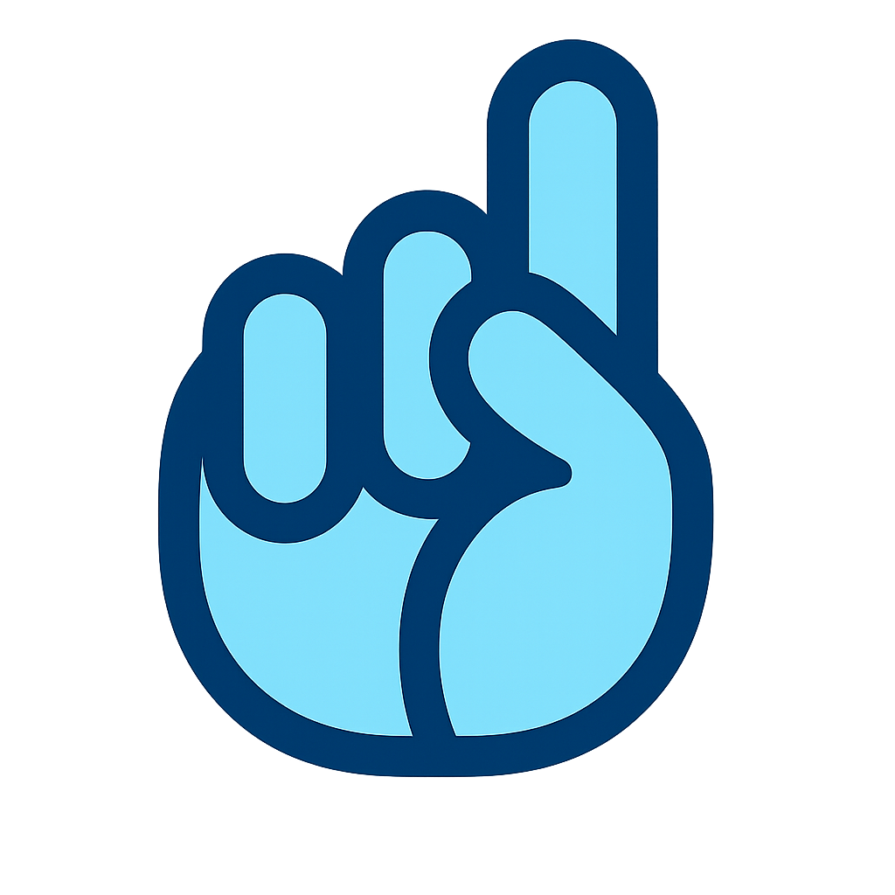
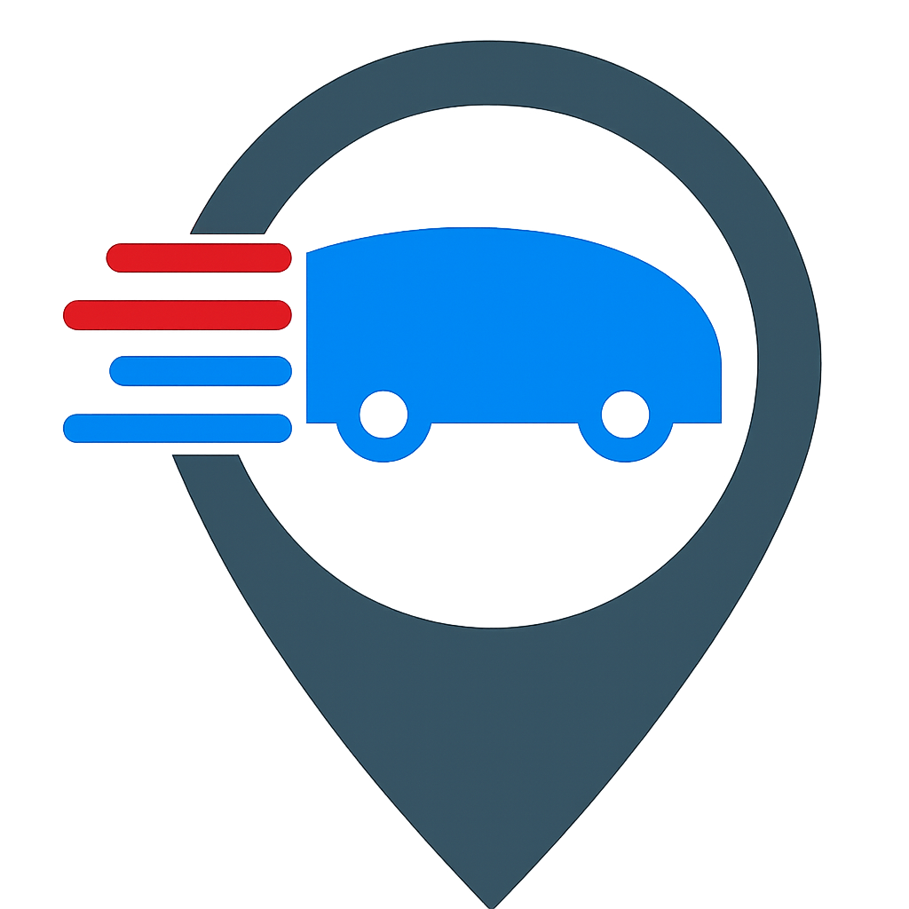
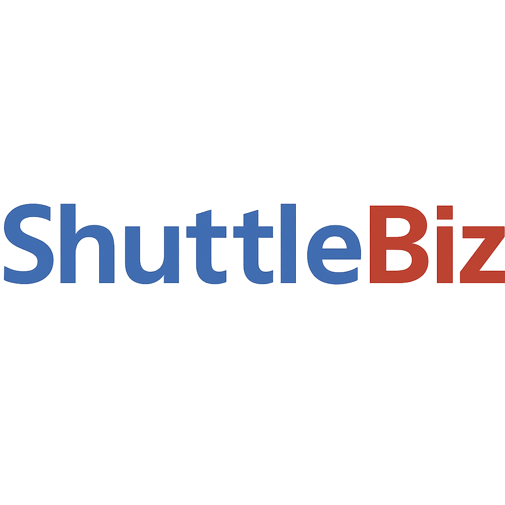

<div align="center">





</div>

<br>

<div align="center">



</div>

#### **Aplicación que permite crear y gestionar lanzaderas para conectar a varias personas que comparten un mismo trayecto.**

**Los usuarios pueden unirse a un vehículo hacia un destino concreto, comunicarse entre ellos, ver la ubicación en tiempo real de cada participante, programar horarios y organizar grupos que utilicen lanzaderas comunes.**

<br>

---

<div align="center">

# ESPECIFICACIONES TÉNICAS Y REQUISITOS FUNCIONALES

</div>

<br>

<br>

# `Glosario de términos y abreviaturas`

El glosario se mantiene en [`GLOSSARY.md`](GLOSSARY.md) para
centralizar las definiciones que se usan en estas especificaciones. Si introduces
un término nuevo (CTA, badge, salida, etc.) enlázalo allí y añade la definición
antes de usarlo en pantallas o flujos. Accesos rápidos: [CTA](GLOSSARY.md#cta-call-to-action),
[Salida](GLOSSARY.md#salida), [Badge](GLOSSARY.md#badge).

---

<br>

# **`Reglas de Negocio (Business Rules)`**

En esta sección se dan las funcionalidades básicas y reglas básicas de la app.

En la sección de IU se describen las pantallas más importantes para implementar estas funcionalidades.

---

## **Guía Visual Básica**

### **Tipografía oficial de ShuttleBiz**

- **Distribución:** Fuentes embebidas dentro del proyecto (`assets/fonts`) para uso offline; no se cargan desde Google Fonts en runtime.
- **Familia principal:** `Manrope` (embebida). Usa 400/500/600 como base; `450 (Medium)` es opcional para listas densas y lectura prolongada. Pensada para máxima legibilidad en móviles y listas densas.
- **Fallbacks locales:** `Manrope, SF Pro Text, Segoe UI, sans-serif`.
- **Pesos recomendados:**
  - 400 → cuerpo
  - 500 → etiquetas, chips, estado
  - 600 → títulos, AppBar, CTAs
- **Acentos numéricos/técnicos:** `Space Grotesk` 500 como primaria para horarios, contadores, chips, códigos y datos técnicos. Alternativa monoespaciada: `JetBrains Mono` 400–500 si se prefiere alineación de columnas. Aplicar solo en componentes numéricos/columnas para mejorar lectura de tiempos y tablas.
- **Escala (mobile-first):** H1/AppBar 20px/28lh; H2 18/26; H3/CTAs 16/24 (semibold); Cuerpo 15/22 (regular); Notas/Caps 13/18.
- **Tono y uso:** Títulos y CTAs peso 600; Cuerpo 400; Chips/Badges 500; evitar MAYÚSCULAS sostenidas salvo alertas.
- **Ritmo visual:** Grid base 4px; espaciado entre párrafos 8–12px; máx. 64–72 chars por línea (web) y 42–50 (móvil).
- **Accesibilidad:** Cumplir WCAG AA de contraste; respetar `textScaleFactor` y tamaños dinámicos; evitar condensar tracking.
- **Internacionalización:** Soporte de tildes y ñ; revisar kerning en números con separadores (10:30, 08:05); tipografía acento numérica recomendada para exactitud visual.
- **Uso por componente (ejemplos):** `Manrope` en títulos, cuerpo, botones y tabs; `Space Grotesk` en chips de hora, badges con contadores, columnas numéricas de tablas y códigos de referencia; `JetBrains Mono` solo si se requiere monoespaciado estricto en tablas o logs.

#### **Carga en Flutter (fuentes embebidas)**

```yaml
# pubspec.yaml (fragmento)
flutter:
  uses-material-design: true
  fonts:
    - family: Manrope
      fonts:
        - asset: assets/fonts/Manrope-Regular.ttf
        - asset: assets/fonts/Manrope-Medium.ttf
          weight: 500
        - asset: assets/fonts/Manrope-SemiBold.ttf
          weight: 600
    - family: SpaceGrotesk
      fonts:
        - asset: assets/fonts/SpaceGrotesk-Medium.ttf
          weight: 500
    - family: JetBrainsMono
      fonts:
        - asset: assets/fonts/JetBrainsMono-Medium.ttf
          weight: 500
```

```dart
// theming base con fuentes embebidas
const baseTextTheme = TextTheme(
  titleLarge: TextStyle(fontFamily: 'Manrope', fontWeight: FontWeight.w600, fontSize: 20, height: 1.4),
  titleMedium: TextStyle(fontFamily: 'Manrope', fontWeight: FontWeight.w600, fontSize: 18, height: 1.44),
  titleSmall: TextStyle(fontFamily: 'Manrope', fontWeight: FontWeight.w600, fontSize: 16, height: 1.5),
  bodyMedium: TextStyle(fontFamily: 'Manrope', fontWeight: FontWeight.w400, fontSize: 15, height: 1.46),
  labelMedium: TextStyle(fontFamily: 'Manrope', fontWeight: FontWeight.w500, fontSize: 14, height: 1.5),
  labelSmall: TextStyle(fontFamily: 'Manrope', fontWeight: FontWeight.w400, fontSize: 13, height: 1.38),
);

const accentNumeric = TextStyle(
  fontFamily: 'SpaceGrotesk',
  fontWeight: FontWeight.w500,
  fontSize: 16,
  height: 1.5,
);

ThemeData buildTheme() {
  return ThemeData(
    textTheme: baseTextTheme,
  );
}

// Uso puntual de acento numérico en chips/badges/tablas
Text(
  '08:35',
  style: accentNumeric,
);
```

<br>

---

### **`Paleta de color (ShuttleBiz Core)`**

_(Actualizada según la identidad oficial de marca de ShuttleBiz)_

### **Colores de marca (Brand Colors)**

- **Primario (acciones principales / botones / indicadores / links):** Azul Shuttle `#3664a9`
  - **Presionado:** `#2B5085`
  - **Fondo suave:** `#E8EEF7`

- **Primario Oscuro (AppBar / navegación / contenedores destacados):** Azul Marcador `#203038`

- **Acento Suave (chips, tags, fondos suaves, resaltados secundarios):** Verde Grisáceo `#8BAAA4`
  - **Presionado:** `#6D8E89`
  - **Fondo suave:** `#EFF4F3`

- **Acción Crítica / Confirmación fuerte:** Rojo Biz `#b80d06`
  - **Presionado:** `#8E0804`
  - **Fondo suave:** `#FCEAEA`

### **Neutros (estructura y texto)**

- **Texto principal:** `#203038`
- **Texto secundario:** `#4E6F71`
- **Texto deshabilitado:** `#9CA3AF`
- **Fondo de app:** `#F6F8F9`
- **Superficies (cards, sheets):** `#FFFFFF`
- **Divisores / Bordes:** `#E1E5E8`

### **Colores de estado**

- **Éxito:** `#4AAE8C`
  - Fondo suave: `#E8F4EF`

- **Advertencia:** `#F5A524`
  - Fondo suave: `#FFF4E0`

- **Error:** Rojo Biz `#b80d06`
  - Fondo suave: `#FCEAEA`

- **Info:** Azul Shuttle `#3664a9`
  - Fondo suave: `#E8EEF7`

### **Uso por componente**

- **Botón primario / FAB / acciones principales:**
  - Fondo: `#3664a9`
  - Texto: `#FFFFFF`

- **Botón de acción crítica:**
  - Fondo: Rojo Biz `#b80d06`
  - Texto: `#FFFFFF`

- **Botón secundario / chips informativos:**
  - Fondo: acento `#8BAAA4` o neutro `#FFFFFF`
  - Bordes: `#E1E5E8`
  - Texto: `#203038`

- **AppBar / encabezados / navegación:**
  - Fondo: Azul Marcador `#203038`
  - Texto e iconos: `#FFFFFF`

- **Badges numéricos:**
  - Fondo: primario `#3664a9` o error `#b80d06`
  - Texto: `#FFFFFF`

- **Tabs:**
  - Indicador: Azul Shuttle `#3664a9`
  - Fondo tab bar: `#FFFFFF` con sombra suave

- **Alertas / banners:**
  - Info: Azul Shuttle
  - Éxito: `#4AAE8C`
  - Error: Rojo Biz
  - Advertencia: `#F5A524`
  - Texto: `#203038` o blanco si el fondo es muy oscuro

### **Accesibilidad**

- Asegurar contraste **AA/AAA** para texto sobre todos los fondos.
- Evitar usar el primario sobre fondos suaves sin suficiente contraste;
  en esos casos, usar `#203038` como texto.
- El acento `#8BAAA4` debe combinarse siempre con texto `#203038`.

### **Notas de implementación (Flutter)**

- Mapear:
  - `colorScheme.primary` → Azul Shuttle (`#3664a9`)
  - `colorScheme.secondary` → Acento suave (`#8BAAA4`)
  - `colorScheme.surface` → Superficies (`#FFFFFF`)
  - `colorScheme.background` → Fondo app (`#F6F8F9`)
  - `colorScheme.error` → Rojo Biz (`#b80d06`)
  - `colorScheme.tertiary` → Éxito (`#4AAE8C`)

- Usar `surfaceVariant` para fondos suaves de listas, chips y contenedores secundarios.
- Evitar Material 3 dinámico para no alterar la identidad visual.

---

### **`Layout por nivel (mobile-first)`**

Marco visual para que los equipos usen el mismo esqueleto. El **contenido funcional ya está definido en las secciones de pantallas** (5.x, 6.x, 7.x, 10.x); aquí solo se fijan contenedores, spacing y elementos persistentes.

- **Grupos (nivel 0):**
  - AppBar con breadcrumb corto `Mis Grupos`, icono 🔔 y CTA ✋ según contexto; búsqueda/filtros en menú ⋮.
  - Lista vertical con cards de grupo; padding 16; grid base 4px; separadores `#E5E7EB`.
  - FAB `+` anclado para crear grupo; empty state centrado (icono + título 16/600 + descripción 14/400 + CTA primario).
- **Grupo (nivel 1):**
  - AppBar con breadcrumb `[$Grupo]`, menú ⋮ (ajustes, invitaciones), iconos 🔔/✋.
  - Tabs PageView fijas: Home, Chat, Horarios, Mapa; indicador primario; mantener pestaña activa al subir/bajar nivel.
  - Contenido de cada tab respeta lo descrito en 5.x; cards con radio 12 y sombra suave; listas con padding 16.
- **Lanzadera (nivel 2):**
  - AppBar con breadcrumb `[$Lanzadera]`, menú ⋮ (editar lanzadera, vehículos), iconos 🔔/✋.
  - Tabs PageView: Home, Chat, Horarios, Mapa (misma pestaña activa que al salir de nivel Grupo).
  - Contenido de cada tab según 6.x: chips de fechas/horas arriba, listas con chips de hora (fuente acento), estados coloreados por estado de reserva; panel fijo de chat conductor↔admin en pantallas de vehículos según specs.
- **Patrones comunes:**
  - Padding horizontal 16; cards radio 12; sombra sutil en superficies elevadas.
  - Empty states coherentes: icono, título 16/600, descripción 14/400 gris secundario, CTA primario.
  - Modales/bottom sheets: handle, título 16/600, acciones primarias a la derecha; texto secundario en gris.
  - Chips: altura 32–36, borde `#E1E5E8`, relleno primario/estado según tipo; texto 14/500; usa fuente acento para horas/contadores.

<br>

## **`1. Autenticación y Roles de Usuario`**

- 🔐 **Login por número de teléfono** con verificación SMS/OTP.
- **Sesión persistente** tras primer acceso.
- **Sin cierre de sesión manual**: el usuario permanece logueado; solo puede cambiar de número (manteniendo UID) o eliminar la cuenta.
- **Sistema de recuperación y respaldo:**
  - **Recuperación por SMS**: Si se pierde el login, recuperable con el número registrado
  - **Datos básicos en Firebase**: UID, número de teléfono y datos mínimos de perfil
  - **Respaldo en la nube personal**: Chats e historial en Google Drive (Android) o iCloud (iOS)
  - **Respaldo local**: Opción alternativa configurable desde Ajustes
  - **Cambio de número**: Flujo en Configuración para actualizar número manteniendo UID
- 👥 **Sistema de roles flexible**: cualquier usuario puede usar tanto el rol de conductor como de viajero
  - **Selección dinámica**: al entrar a una lanzadera, el usuario decide qué rol tendrá en esa ocasión, solicitando ser conductor o tener una plaza.

---

## **`2. Gestión de Grupos ("Biz")`**

- Los usuarios pueden **crear un grupo** (biz) para organizar lanzaderas.
- Solo el **creador del grupo** puede:
  - Crear o modificar lanzaderas.
  - Expulsar usuarios.
  - Asignar administradores de grupo.
- **Visibilidad del grupo** configurable al crearlo:
  - **Privado**: solo accesible por invitación directa del creador/admin. No es visible en la lista pública de grupos.
  - **Público**: aparece en la lista de grupos disponibles y permite solicitar acceso
  - **Modificable**: la visibilidad puede cambiarse después de crear el grupo
- **Acceso según visibilidad**:
  - **Grupos privados**: solo invitación del creador/administrador
  - **Grupos públicos**: solicitud desde lista pública + aprobación del creador/admin
- Los usuarios agregados verán automáticamente ese grupo en su pantalla de grupos.
- El sistema guarda internamente la **fecha/hora de incorporación al grupo**.
- Cualquier usuario puede **salir del grupo** en cualquier momento.
- Si el creador abandona:
  - Continuarán los administradoes haciendo las tareas de su rol.
  - Si no hay designación, será el miembro más antiguo.
- Un administrador puede hacer todo lo que hace un creador de grupo, salvo echar del grupo al creador o a otro administrador.
- El creador de grupo puede:
  - echar del grupo a cualquier usuario.
  - deshacer la acción de un admin: cuando un admin realice cualquier accion que requiera permisos, el creador puede deshacer, y será informado de esa funcionalidad cada vez que un admin haga algo con permisos de admin.

### **Alertas de Conductores (gestión por admins)**

- **Asignación de conductores**: Creadores y administradores pueden asignar conductores predeterminados para ciertas lanzaderas, o días, o rango de tiempo (desde una hora de salida hasta otra hora de salida dentro de un día), previa aceptación del usuario.
- **Sistema de alertas**: El usuario seleccionado recibe un aviso de "servicio de lanzadera como conductor"
- **Respuesta requerida**: Puede aceptar o rechazar la solicitud
- **Motivo de rechazo**: Si rechaza, debe indicar motivo:
  - Respuestas rápidas: "Imprevisto urgente", "No estoy asignado", "Otro usuario será el conductor"
  - Opción de texto breve personalizado

---

## **3\. Gestión de Lanzaderas**

### **3.1. Creación**

- El creador de un grupo puede crear lanzaderas y sus horarios dentro de su grupo.
- Requiere definir:
  - **Nombre**
  - **Origen** y **destino**
  - **Ubicación de preparación/garaje** (punto donde se toma el vehículo antes de salir) y **tiempo para llegar al Origen** (margen de traslado desde garaje si aplica; puede ser automático/calculado o configurado por creador/admin; si se usa el mismo punto que Origen, el margen es 0)
  - **Periodicidad**: puntual (fecha única) o frecuencia semanal
  - **Plazas por defecto**
  - **Comentario** (opcional: normas, detalles de recogida)
- 🧭 Cada lanzadera pertenece a un único grupo (no es global).

El margen de traslado (tiempo para llegar desde el garaje al Origen) se resta a la hora de salida en Origen para validar si el conductor está a tiempo en el punto de garaje. El creador/admin puede optar por usar automáticamente el cálculo sugerido por el sistema o definir manualmente ese margen. Si el garaje = Origen, el margen es 0.

### **3.2. Configuración de horarios**

Integrado en las secciones 6.1.3, donde se describe en detalle el flujo de creación y edición de horarios.

### **Notas sobre Diferencia entre Frecuencia Semanal y Fecha Única**

**Frecuencia semanal:**

- Se seleccionan uno o más días de la semana (L, M, X, J, V, S, D)
- Las horas configuradas se repiten cada semana en esos días
- Requiere fecha de inicio (y opcionalmente fecha de fin)
- El DatePicker muestra solo los días que coinciden con los seleccionados
- Etiqueta UI: "Se repite desde: [fecha]"

**Fecha única:**

- No se selecciona ningún día de la semana
- Las horas configuradas aplican solo a UNA fecha específica
- No se repite
- El DatePicker muestra todos los días >= hoy
- Etiqueta UI: "Fecha única: [fecha]"

**Transición entre modos:**

- Al **seleccionar el primer día semanal**: el modo cambia de "fecha única" a "frecuencia semanal" automáticamente.
- Al **deseleccionar el único día restante** (cuando solo queda uno marcado): el modo cambia de "frecuencia semanal" a "fecha única" automáticamente.

## **4\. Consulta de horario y Solicitud de Lanzadera**

La idea es mostrar una [salida](GLOSSARY.md#salida) en concreto, con los datos de conductor, vehiculo, solicitudes y opción de solicitar tanto conducción como plaza, y cancelaciones, todo en la misma pantalla (ver pantalla **_6.1.2 "Hora Salida: Detalle y Solicitud_**")

---

## **5\. Reglas y Validaciones**

- El usuario que sea conductor en una lanzadera deberá tener su posición localizada al menos **40 minutos antes** de la hora de salida en Origen (configurable). Si el garaje es distinto del Origen, además debe estar localizable en el garaje a más tardar en `hora de salida – margen de traslado`; si garaje = Origen, el margen es 0. La app avisa en T-40; si no está en la zona esperada, se avisa a creador/admin y, si no responden, al chat de la lanzadera. La ubicación recibida se muestra en el mapa de lanzadera (6.4) y, si no se recibe, se activa la alerta especial de notificaciones descrita en la sección 7.
- Todo usuario con plaza debe tener geolocalización activa en la ventana del viaje (por defecto desde T-20 configurable hasta llegada detectada o timeout post-llegada) para confirmar que está en el punto de salida y destino. Se activa en segundo plano aunque la app esté cerrada, con geocercas y baja frecuencia para optimizar batería. Si no se obtiene ubicación, se avisa al propio usuario y, como alerta a la lanzadera, que falta un viajero (sin compartir su ubicación exacta).
- **Solo puede haber un conductor por horario**.
- **Se puede anular una solicitud**.
- **Visibilidad de plazas en lanzaderas activas**:
  - Badge compacto `confirmadas/total` (solo viajeros; el conductor no ocupa plaza) en Home, Horarios, Mapa y Chat de nivel Grupo/Lanzadera cuando la próxima salida es hoy o mañana; se oculta si la siguiente salida es en >1 día o la lanzadera está cerrada/archivada.
  - Color del badge (paleta existente): verde (`#4AAE8C`) si ≥70 % libres, ámbar (`#F5A524`) si 30–69 %, rojo Biz (`#b80d06`) si <30 %, gris si está completa (`confirmadas = total`). Texto “Completo” opcional cuando está llena.
  - Si hay varias salidas hoy/mañana, se muestra la más próxima.
  - Ubicaciones concretas:
    - **5.1 Home de Grupo**: badge en esquina superior derecha de cada tarjeta de lanzadera; tap → bottom sheet.
    - **5.2 Chat de Grupo**: badge a la derecha del nombre en cada ítem de chat de lanzadera (lista), no dentro del hilo; tap → bottom sheet.
    - **5.3 Horarios de Grupo**: junto al texto de próxima/en curso en cada tarjeta de lanzadera; tap → bottom sheet.
    - **5.4 Mapa de Grupo**: overlay en esquina superior derecha del mapa en miniatura de cada lanzadera; tap → bottom sheet.
    - **6.1 Home de Lanzadera**: junto al nombre en la cabecera; visible en cualquier pestaña del nivel Lanzadera.
    - **6.2 Chat de Lanzadera**: chip en AppBar; microbadge en el avatar de cada mensaje con estado (🚗/✓/⏳/—) para la próxima salida hoy/mañana; tap en chip o menú contextual de avatar → bottom sheet.
    - **6.3 Horarios de Lanzadera**: solo en 6.3.2, ya que se muestra el bloque de solicitudes, no duplicar badge.
    - **6.4 Mapa de Lanzadera**: badge en AppBar; overlay opcional sobre marcador de origen si hay próxima salida; tap → bottom sheet.
  - Tap en el badge → bottom sheet con la próxima salida reutilizando el bloque “Solicitudes” de 6.3.2:
    - Cabecera: nombre de lanzadera, día/hora (“Hoy”/“Mañana”), Origen → Destino, badge.
    - Sección Confirmados (expandida): avatar + nombre; icono 🚗 en conductor.
    - Sección Pendientes (colapsable): contador; avatar + nombre + badge “Pendiente”; si es creador/admin, botones [✓ Aceptar]/[✗ Rechazar].
    - CTA: **[Ver detalles completos]** → abre 6.3.2.
  - Chat de lanzadera (6.2): microbadge en el avatar para la próxima salida hoy/mañana — 🚗 conductor, ✓ confirmada, ⏳ pendiente, — sin plaza; tap abre menú contextual con “Ver perfil” y “Ver estado en salida” (llama al mismo bottom sheet). Se actualiza en tiempo real cuando cambia el estado.
- **No se puede solicitar plaza** si está completa.
- Cada solicitud se guarda con fecha, rol y grupo asociado, en "Mis Solicitudes", resaltando en primer lugar la/s que está/n activas en ese momento.
- Validaciones para evitar solapamientos en la configuración de horarios (cubierto en sistema de **_Creación/Edición Horario pantalla 6.1.3_**)

### Gestión automática de cancelaciones\*\*

- **40 minutos antes** (configurable y considerando el margen de traslado): Si no hay conductor, aviso a creador y administradores.
- **Salida recuperada con conductor tardío**: Si ya pasó la hora de salida y se confirma un conductor después, la salida se reabre como “en curso (tarde)”, se avisa en chat de grupo/lanzadera y por notificación, y el chip de la hora muestra +X min (color/estilo diferenciado) para indicar que saldrá con retraso.
- **Hora de salida pasada**: En la fecha seleccionada, si la hora ya pasó o la salida no tuvo conductor, el chip queda deshabilitado y no se puede solicitar plaza (solo cambiando a otra fecha). Aunque una salida completa permite ver el detalle, no permite nuevas solicitudes.

### **5.1 Persistencia y continuidad del rol de conductor**

El sistema define cómo se asigna y mantiene el rol de conductor en una lanzadera.

### **Modos de asignación del conductor**

Solo existen dos modalidades claras de funcionamiento:

#### **1. Conductor por salida única (con continuidad opcional)**

- El conductor se asigna únicamente para la **salida concreta** seleccionada.
- Tras completar el viaje (cuando marque “Llegada” o el sistema detecte la llegada) y siempre que haya más salidas ese día con esa misma lanzadera, se mostrará el **Modal de continuidad de conductor** (ver **6.3.2.a** para UI y comportamiento).

Opciones:

- **[Sí, continuar]** → El usuario seguirá siendo conductor en la siguiente salida disponible, si aún no hay conductor asignado.
- **[No]** → El rol de conductor finalizará tras esta salida.
  Este modo se usa siempre que el conductor no tenga una asignación de conducción de días o rango de tiempo.

- Si el conductor no responde al modal de continuidad:
  - A los **5 minutos**, los administradores reciben una notificación push indicando que se necesita conductor. Ellos pueden asignar la conducción a otro usuario.
  - A los **40 minutos antes de la siguiente salida** (configurable; si hay margen de traslado se toma como referencia la hora de salida en Origen), si aún no hay conductor, se envía un aviso de urgencia al chat del grupo (se asegura así que quede cubierto el conductor o al menos quede bien avisado).
  - Si otro usuario solicita ser conductor:
    - Si el conductor anterior respondió “No” a la pregunta de continuar, se aprueba automáticamente la solicitud nueva de conductor.
  - Si aún no respondió el conductor a "continuar" con la siguiente salida, se vuelve a enviar solicitud al conductor para que delegue si desea la conducción en el nuevo usuario. Si el conductor no se encuentra en el lugar de salida, y el solicitante de conducción sí se encuentra en el lugar de salida, pasados 5 minutos desde la solicitud de delegación sin respuesta, pasa automáticamente el rol de conductor al nuevo solicitante, previa aceptación de activación de ubicación del solicitante. Se notifica por push/in-app a conductor saliente, solicitante y creador/admin, y se publica aviso en el chat de la lanzadera indicando el cambio de conductor (sin compartir ubicación).

- Si el conductor eligió **“Sí, continuar”** pero no tiene vehículo asignado (o vehiculo predeterminado para esa lanzadera):
  - Se abrirá el selector de vehículo (según 6.1.2).

Si la siguiente salida ya tiene conductor asignado, en vez de preguntar si desea continuar, se mostrará:

**“Ya hay un conductor asignado para esta salida.”**

#### **2. Conductor asignado por rango temporal (día completo o bloque de horarios)**

- Solo puede asignarlo un Creador/Admin.
- El conductor puede ser asignado para:
  - **Todas las salidas del día**
  - **Conjunto de horarios específicos**.
- El conductor recibe una notificación y debe aceptarla para que la asignación sea efectiva.
- En este modo **no se requiere confirmación individual por cada salida**.
- Una vez aceptado:
  - Es conductor automáticamente para todas las salidas incluidas en el rango.
  - No aparece el modal de continuidad.

### Restricciones generales\*\*

- Solo puede haber **un conductor por salida**.
- No se puede asignar conductor una vez que la salida ya ocurrió.

## **5.2 Reputación y valoraciones**

### **5.2.1 Categorías y cálculo**

- Cada viaje solo admite **una valoración por rol y trayecto** (1 por conductor, 1 por cada viajero que completó).
- Escala 0.0–5.0 con un decimal.
- Categorías internas:
  1. **Puntualidad** (auto): requiere ubicación activa.
     - Viajero: ≥5 min antes de la hora de salida en Origen → 5; 1–4 min antes → proporcional 1–4; tarde/no llega → 0.
     - Conductor: usa **punto de preparación/garaje** y su **margen**; si garaje=Origen, se evalúa sobre Origen. ≥ margen (o ≥5 min en Origen) → 5; justo a tiempo → 0; intermedio → proporcional 0–5.
  2. **Fiabilidad (Imprevisibilidad)** (auto): penaliza cancelaciones (0 si cancela; 5 si no cancela, media por viajes).
  3. **Trato/compañerismo** (pública): valoración 0–5 del usuario.
- **Peso**: categorías 1 y 2 peso 1; categoría 3 peso 2. Reputación = (cat1 + cat2 + 2\*cat3) / 4. Si no hay datos de una categoría, no se promedia esa parte.
- Se recalcula en cada viaje completado o cancelado.

### **5.2.2 Reglas adicionales**

- No se pueden enviar valoraciones pasadas **24 h** del viaje.
- Solo se puede valorar si el viaje fue **completado**.
- Máximo **una valoración por trayecto** y usuario/rol.
- Se almacena: fecha/hora, rol, grupo, lanzadera, salida, categoría afectada.
- Si el usuario no comparte ubicación no puede ser conductor; para viajeros la puntualidad solo se calcula si hubo ubicación, la cual es obligatoria.
- **UI del modal (ver 13)**: control 0–5 estrellas, texto opcional (máx. 120 caracteres), checkbox de reporte y botones **Enviar** / **Omitir**.

### **5.2.3 Recálculo automático de reputación**

La reputación se recalcula en tiempo real cuando:

1. ✅ Se completa un viaje (se aplican puntualidad + valoración pública)
2. ❌ Se cancela una solicitud (se actualiza fiabilidad)
3. 📢 Se verifica un reporte por admin (se penaliza -1 en trato)

El cálculo es inmediato y visible en el perfil del usuario al instante.

---

## **6\. COMUNICACIÓN Y NOTIFICACIONES**

### 6.1 **GESTIÓN DE COMUNICACIONES**

- Está previsto Chat desde la Mínima Versión Publicable, ya que es básico para la comunicación entre los usuarios y no sería eficiente sin los chats.
- El chat será a nivel de Grupo y de Lanzadera, además de chats privados y unos específico para comunicación entre creador/admins y conductor para eleccón de vehiculos o problemas durante el viaje.
- **Privacidad de contacto**: el número de teléfono por defecto no será visible entre usuarios, aunque se puede hacer visible desde ajustes. Cada usuario podrá configurar así si mostrar su número de teléfono en su perfil.
- **Versiones futuras**: llamada de voz integrada en la app.
- Notificaciones push: ver listado completo y comportamiento (push + in-app, con persistencia en Centro de Notificaciones) en **6.2 Gestión de Notificaciones**.
- **Visualización de mapas incluida en MVP**:
  - **Pantalla de Grupo**: Mapas de todas las lanzaderas del grupo para consultar recorridos.
  - **Pantalla de Lanzadera**: Mapa específico con trayecto, origen, destino y ubicación del usuario.
  - **Seguimiento del vehículo (_Real-time Vehicle Tracking_)**: Seguimiento en tiempo real del vehículo durante el viaje.

### **Políticas de Geolocalización** _(para implementación con mapas)_

- **🚗 Conductor**: Geolocalización **obligatoria** durante el viaje.
  - Se activa automáticamente antes de la salida en Origen (por defecto T-40, configurable). Si hay margen de traslado desde garaje, se espera ubicación en garaje a `hora de salida – margen` y el aviso T-40 se cuenta sobre la hora de salida en Origen.
  - Visible para todos los viajeros de esa lanzadera específica.
  - Necesaria para coordinación y seguridad del grupo.
  - **Consentimiento requerido**: Aceptar términos de conductor incluye localización.
- **🧑‍🤝‍🧑 Viajero con plaza**: Geolocalización **obligatoria** en la ventana del viaje para confirmar asistencia y completar el trayecto.
  - Permiso de localización se solicita en la instalación/onboarding para permitir activación automática; si no está otorgado, se vuelve a pedir al acercarse la salida (por defecto T-20, configurable por grupo).
  - Activación automática en segundo plano para usuarios con plaza desde T-20 (configurable) antes de la salida hasta la llegada detectada o timeout post-llegada; no depende de tener la app abierta.
  - Usos: verificar que está en el origen a la hora, confirmar llegada al destino y marcar viaje como realizado; disparar avisos si falta alguien en el punto de salida.
  - Optimización de batería: geocercas en origen/destino y muestreo reducido fuera de zona crítica; se pausa al terminar la ventana.
  - Visibilidad: conductor/admin ven ubicaciones de viajeros; el resto de viajeros solo recibe aviso si alguien con plaza no está en el punto en la ventana de salida (no se comparte ubicación exacta salvo esa alerta de ausencia).

### **🔒 Privacidad y Retención de Datos GPS**

- Los datos de GPS se usan solo durante la ventana del viaje para validar conductor y presencia de usuarios con plaza.
- No se almacenan datos de geolocalización una vez finalizado el trayecto.
- La ubicación de viajeros solo se muestra a conductor/admin; al resto se les notifica únicamente la ausencia de alguien con plaza (sin compartir coordenadas).

### ** Activación del Tracking** _(para implementación con mapas)_

- **Cuándo se activa la localización**:
  - **Caso 1**: conductor: Tiempo fijo antes de la salida en Origen (por defecto 40 minutos, configurable; si hay margen de traslado, la presencia se valida en garaje a `hora de salida – margen`).
  - **Caso 2**: viajero con plaza: Activación automática en segundo plano desde T-20 (configurable) antes de la salida hasta llegada detectada o timeout post-llegada; si no hay permiso, se solicita en ese momento. Se usa para check-in en origen/destino y para disparar avisos de ausencia.

- **Visibilidad de ubicaciones**:
  - **Conductor puede ver**: Ubicación de todos los viajeros con plaza durante la ventana activa.
  - **Viajeros pueden ver**: Ubicación del conductor; no ven ubicaciones de otros viajeros, salvo alerta de que alguien no está en el punto de salida.
  - **Seguridad**: La visibilidad se limita a la ventana del viaje (previo T-20 y hasta fin del trayecto) y se restringe a conductor/admin; solo se comparte al resto el estado de ausencia sin coordenadas.

### 6.2 **GESTIÓN DE NOTIFICACIONES**

Sistema completo de notificaciones push e in-app para mantener informados a los usuarios.

- **Tipos de notificaciones:**
  - Nueva lanzadera creada en grupo
  - Nuevo miembro se une a un grupo
  - Alguien solicita plaza
  - Plaza confirmada/rechazada
  - Recordatorio 40 min antes del viaje (y otros recordatorios configurables)
  - Lanzadera sale del origen (inicio de viaje) para solicitantes
  - Delegación/asignación automática de conductor (cuando se cede por falta de respuesta/presencia)
  - Viajero con plaza sin ubicación o fuera del punto de salida/destino en ventana T-20 (alerta a la lanzadera y al propio viajero)
  - Conductor sin ubicación T-40 (alerta crítica a admins/conductor)
  - Cambios en horarios
  - Mensajes del chat
  - **Invitación recibida** para ser miembro de un grupo
  - **Acción de admin (solo creador)**: acciones privilegiadas realizadas por un admin con opción de **[Deshacer]** mientras la ventana esté activa
- **Configuración:** Usuario puede desactivar tipos específicos de notificaciones (sin perder el historial en el Centro de Notificaciones). Se gestiona en **Pantalla 12 (Configuración) > Notificaciones**: permite desactivar sonido/banner/badge por tipo, activar silencio programado, y forzar que solo lleguen como in-app (sin push). Las críticas (ej. conductor sin ubicación) no se pueden silenciar por completo.
- **Implementación:** Push notifications con Firebase Cloud Messaging (FCM)

- **Centro de notificaciones:** Historial in-app de notificaciones recibidas en forma de ítems en una lista. Almacena el historial de notificaciones recibidas por el usuario, permitiéndole consultarlas posteriormente.
- **Visualización de estados:**
  - **No leídas**: icono de sobre cerrado con punto rojo, fondo blanco
  - **Leídas**: icono de sobre abierto, fondo gris claro
  - Cada ítem muestra: título, descripción breve, fecha/hora
- **Pestañas organizativas** (solo 2):
  - **No leídas**: todas las notificaciones nuevas; al abrirlas pasan automáticamente a leídas. Si hay urgentes, la pestaña muestra badge/rojo.
  - **Leídas**: historial completo ya visto.
- **Filtros/chips dentro de cada pestaña** (categorizan sin duplicar): `Solicitudes` (invitaciones a grupos, peticiones/asignaciones de conductor, vehículos), `Cambios de horarios/lanzaderas` (modificaciones, nuevas lanzaderas/horarios), y cualquier categoría futura.
- Al tocar una push abre el detalle/modal con el filtro/categoría correspondiente; se marca como leída y al cerrar (flecha atrás) regresa a la pestaña y filtro desde donde se abrió.
- **Filtros y acciones:**
  - **Icono de filtro**: permite filtrar por grupo y/o lanzadera (listas con checkboxes, selecciones múltiples se suman)
  - **Icono limpiar filtro**: reinicia selección
- **Acciones disponibles**: pulsación corta abre el detalle; pulsación larga muestra opción **Eliminar notificación** 🔔 (con confirmación/undo).
- **Alertas especiales:**
  - **Conductor sin ubicación** cerca de hora de salida: aparece en pestaña Solicitudes
  - **Viajero ausente (con plaza)**: push al viajero y aviso a la lanzadera. En app del viajero ausente muestra modal: título “No te detectamos en el punto de salida”, botones **[Estoy aquí]** (reintenta geolocalización y hace check-in si está en geocerca) y **[Abrir mapa]** (centra en origen) para ver su ubicación y el del conductor. Cierre al confirmar o tras check-in exitoso; si persiste sin ubicación, mantiene alerta a lanzadera (sin compartir coordenadas exactas).
  - Si el usuario es el conductor aludido: el icono 🔔 del AppBar muestra un badge adicional 📍 (tooltip “Activa ubicación”), y al tocarlo abre el modal prioritario 7.2 con CTA directa **[Activar ubicación]**.

---

## **6.3 CRITERIOS TÉCNICOS DE MENSAJERÍA Y OPTIMIZACIÓN DE COSTES**

Esta sección define criterios técnicos obligatorios para la implementación de mensajería (chat de grupo, chat de lanzadera y chats privados) con el objetivo de evitar costes innecesarios en Firebase/Firestore. No introduce nuevas funcionalidades ni modifica comportamientos descritos en secciones anteriores.

- **Alcance de listeners**
  - No debe existir ningún listener global o no acotado a un chat concreto.
  - Solo debe mantenerse activo el listener del chat que esté visible en pantalla.
  - Los chats inactivos no deben mantener listeners activos.

- **Carga inicial y paginación**
  - La carga inicial debe estar limitada a un máximo fijo de mensajes recientes (tope explícito).
  - Los mensajes antiguos deben cargarse exclusivamente mediante paginación explícita bajo demanda del usuario.

- **Escrituras y actualizaciones**
  - No deben realizarse escrituras derivadas de estados visuales (por ejemplo: typing, lectura, scroll o presencia visual).
  - Las actualizaciones solo deben ocurrir ante eventos funcionales reales: mensaje enviado, editado o eliminado.

- **Uso de notificaciones**
  - Firebase Cloud Messaging (FCM) debe ser el mecanismo principal para avisar de nuevos mensajes.
  - No debe implementarse polling ni refrescos periódicos para detectar mensajes.

- **Principios de control de coste**
  - Firestore debe usarse como fuente de sincronización, no como stream infinito.
  - Los chats inactivos no deben generar tráfico remoto ni operaciones en Firestore.
  - El modo local (cuando exista) no debe generar tráfico remoto ni operaciones en Firestore.

## **7. UX/UI Consideraciones**

- Cambiar de grupo: desde pantalla de Grupo o lanzadera, volviendo en la pila de pantallas atras con la flecha hasta el nivel Grupos.
- Días sin lanzaderas sencillamente no se muestran en la pantalla, días sin lanzaderas/horas asociadas no aparecen (no se muestran como vacíos, deshabilitados ni con placeholders) para evitar confusión “[Consulta/Horario 6.3.1](#6-3-1-consulta-horario)”.
- Colores y botones para horarios de ida y vuelta (ver pantalla). El detalle de cómo se presentan está descrito en la [pantalla 6.3.1 Consulta/Horario](#6-3-1-consulta-horario) y en la [pantalla 6.3.3 Creación/Edición Horario](#6-3-3-creacion-edicion-horario): el toggle de sentido (activo a la izquierda, tamaño mayor) y los chips de horas coloreados según el sentido.
- Implementación recomendada:
  - Riverpod para actualización reactiva.

### Patrones de Modales y Diálogos

Marco común para todos los modales/genéricos:

- **Tipos:**
  - **Confirmación breve:** altura compacta, título + descripción corta + botones primario/secundario.
  - **Alerta crítica:** icono de estado (error/advertencia), fondo suave de estado detrás del encabezado (`#FCEAEA` para error); botón primario rojo Biz (`#b80d06`) o amarillo (`#F5A524`) según gravedad.
  - **Bottom sheet (acciones/contexto):** handle superior, puede cerrarse por swipe/tap fuera si no es bloqueante.
  - **Formulario corto:** incluye campos 1–3 inputs; CTA primaria alineada a la derecha (ej.: Guardar/Aceptar a la derecha, Cancelar a la izquierda)
- **Layout:**
  - Padding 20px, espaciado vertical 12px; radio 12 en el contenedor (bordes redondeados del modal/sheet); sombra suave.
  - Título 16/600 (`Manrope`), body 14/400; icono opcional alineado a la izquierda.
  - Botones en fila: primario a la derecha (color según acción); secundario como texto u outlined con borde gris `#E5E7EB`.
  - Para bottom sheets: handle superior (rectángulo de agarre) centrado de 32px de ancho y 4px de alto en color `#E5E7EB`, separado del contenido con un pequeño margen superior.
- **Comportamiento:**
  - Bloqueantes por defecto (no cerrar al tocar fuera) salvo informativos o bottom sheets de contexto.
  - Estado deshabilitado: controles inactivos (sin interacción) y renderizados con opacidad 0.4; foco visible en inputs y botones (stroke primario).
  - Mensajes de error bajo campos en rojo Biz `#b80d06`, 12/400.
- **Accesibilidad:**
  - Soportar `textScaleFactor`; mínimo 44x44 en botones; lector de pantalla con orden lógico.
  - Contraste AA: garantizar ratio ≥4.5:1; texto oscuro sobre fondo claro y, en botones primarios de color, texto blanco.

### Patrones de Chips y Badges

- **Chips de horarios/estados:**
  - Altura 32–36 px; padding horizontal 12–16 px; radio 16 px.
  - Fuente acento (`Space Grotesk` 14/500) para horas y contadores; `Manrope` 14/500 en etiquetas.
  - Bordes `#E5E7EB` para neutros; relleno primario `#3664a9` para selección; rellenos de estado: éxito `#E7F8F1`, advertencia `#FFF4E0`, error `#FCEAEA`.
  - Texto: primario/blanco en chip primario; gris oscuro en neutros; rojo Biz `#b80d06` en estado error.
- **Badges numéricos:**
- Fondo primario `#3664a9` para contadores generales; fondo error `#b80d06` para alertas; texto blanco 12/600.
  - Tamaño mínimo 18x18; borde redondo completo.
- **Filtros/pestañas chips:**
  - Estado seleccionado sin borde (0 px) y con relleno primario; no seleccionado con borde gris `#E5E7EB`.
  - espaciado horizontal de 8px; las filas hacen wrap en móvil.

<br>

---

# **`Navegación y Pantallas`**

## **🔹 Barra Superior de navegación**

### **Estructura y acciones**

[ ← (si no es raíz) ] [ Breadcrumb por nivel (Grupos > Grupo > Lanzadera), segmentos coloreados y tramo actual resaltado ] [ 🔔 (solo si hay no leídas) ] [ ✋ Mis Solicitudes ] [ ⋮ Menú contextual ]

- Menú ⋮ para acciones del contexto actual; no hay menú hamburguesa.
- Tabs principales siempre visibles (BottomNavigationBar): Home, Chat, Horarios, Mapa. Existen en los tres niveles y mantienen la pestaña activa al subir/bajar.
- **🔔 Notificaciones**: solo con no leídas, siempre a la izquierda de ✋; abre Pantalla 7.
- **✋ Mis Solicitudes**: abre Pantalla 8 en Home/Chat/Horarios/Mapa de los tres niveles; no en pantallas secundarias.
- Breadcrumb muestra el nivel actual (`Grupos > [Grupo] > [Lanzadera]`); truncar con elipsis si falta espacio.

**Objetivo:** claridad y consistencia con Material/Flutter.

### **Navegación anidada con PageView**

**Implementación Flutter recomendada (unificada):**

- Un `PageView` con `PageController` por nivel (Grupos, Grupo, Lanzadera) y `BottomNavigationBar` de 4 tabs: Home, Chat, Horarios, Mapa.
- Al bajar/subir de nivel se empuja una ruta del siguiente nivel que contiene su propio `PageView`, conservando el índice de pestaña activo (usa `Navigator`/`Router`/`go_router` con shell routes).
- Cada tab mantiene estado con `AutomaticKeepAliveClientMixin`; el índice actual se guarda en estado global (`Riverpod`/`ChangeNotifier`/`ValueNotifier`) para restaurarlo al cambiar de nivel.
- Botón atrás gestionado con `WillPopScope/PopScope`: primero cierra modales, luego sube nivel manteniendo la pestaña; en raíz, sale si no hay overlays.
- Transición de nivel con `PageRouteBuilder` y `SlideTransition + FadeTransition` vertical 150–200 ms, coherente con la spec.

### **1. Nivel Grupos (tab Home)**

- ListView con todos los grupos; se pueden crear o solicitar unirse.
- Tocar un grupo abre el **Nivel Grupo**.

### **2. Nivel Grupo (tab Home)**

- Se crean lanzaderas y se listan en una ListView.
- Tocar una lanzadera abre el **Nivel Lanzadera**.

### **3. Nivel Lanzadera (tab Home)**

- Detalle de la lanzadera y comentario.
- Muro de novedades (cronológico inverso, tarjetas scrollables con icono/tipo/fecha) para: rechazos de acciones de admin por el Creador, ausencia de conductor, eliminación o modificación de horarios, ingreso de nuevos usuarios y otros cambios relevantes. Tocar un evento abre su contexto.

### **Estructura común de navegación**

- Cada nivel tiene **4 páginas** (Home, Chat, Horarios, Mapa); la ListView de Home permite bajar de nivel. En Lanzadera no hay navegación descendente; solo se sube con flecha atrás.

### **Reglas de navegación entre niveles**

- Para retroceder, debe existir una **flecha de atrás** en cada pestaña principal (Home, Chat, Horarios, Mapa) del nivel activo.
- En el nivel raíz (Grupos), la AppBar **no muestra flecha atrás**; el botón atrás del sistema muestra la confirmación de salida.
- La navegación superior (flecha atrás arriba a la izquierda) permite subir niveles:
  - De **Lanzadera → Grupo**
  - De **Grupo → Grupos**

- El **botón atrás del sistema** respeta la jerarquía: primero cierra modales/toasts, luego sube un nivel (Lanzadera → Grupo → Grupos) manteniendo la pestaña actual del PageView; en el nivel raíz (Grupos) muestra confirmación **“¿Deseas salir de la app?”** (aceptar para salir, cancelar para permanecer) si no hay overlays.
- **Transiciones entre niveles**: animación vertical (slide up/down) con fade ligero, 150–200 ms, al bajar o subir de nivel. Cambio de pestaña dentro de un nivel usa el PageView nativo (swipe/handoff sin animación extra).

### **PageView en toda la aplicación**

Toda la app se basa en un PageView que organiza las secciones principales:
**Home, Chats, Horarios y Mapa.**

Es muy importante que, en cada nivel, la parte superior de la pantalla muestre claramente en qué nivel está el usuario (**Grupos / Grupo / Lanzadera**) para evitar confusiones.

Reglas de PageView y stack:

- Al **bajar de nivel** desde cualquier pestaña (ej. Chat en Grupo → Chat en Lanzadera), se mantiene la pestaña activa del PageView.
- Al **subir de nivel** con la flecha atrás o botón del sistema, se regresa al nivel superior conservando la pestaña activa.
- Cada nivel tiene su propio PageView (4 pestañas); el estado de scroll en cada pestaña se conserva al navegar entre pestañas del mismo nivel, pero se reinicia al cambiar de nivel.

Menús contextuales (⋮) por nivel y pestaña:

- Nivel Grupos:
  - Home: crear grupo, ajustes personales rápidos (ver 4.1.4).
  - Chat: ajustes generales de chat, ver chats de grupo silenciados.
  - Horarios: ordenar/filtros globales de horarios, exportar (futuro) (ver 4.3.1).
  - Mapa: tipo de mapa, mostrar/ocultar tráfico y leyenda, centrar ubicación, configuración de capas.
- Nivel Grupo:
  - Home: gestión del grupo (5.5), gestión de vehículos (10), invitar miembros, configuración del grupo (menú ⋮ en Home abre estas pantallas/flows: 5.5 para gestión y configuración, 10 para vehículos, flujo de invitación descrito en 5.5 y 4.1.x).
  - Chat: ver miembros (ver 5.2.1), silenciar/activar notificaciones, configuración del chat (ver 5.2.2).
  - Horarios: ordenar/filtros de horarios del grupo (ver 5.3.1), configuración de vista (ver 5.3.2).
  - Mapa: tipo de mapa, leyenda, mostrar/ocultar lanzaderas.
- Nivel Lanzadera:
  - Home: ajustes de lanzadera (nombre/origen/destino/plazas por defecto/comentario); menú ⋮ → abre editor (5.1.1) en modo edición con campos precargados y las restricciones descritas en 6.1.
  - Chat: ajustes del chat de lanzadera (ver 6.2.1).
  - Horarios: filtros/orden de horarios (ver 6.3.1.b).
  - Mapa: opciones de visualización del trayecto (menú ⋮ → 6.4.1).

Nota: en Horarios de Nivel Lanzadera, la creación/edición se hace vía FAB (+) y lápiz que abren 6.3.3 (solo Creador/Admin), no desde el menú ⋮.

<br>

---

# **📱 PANTALLAS**

## 1\. Pantalla de LOGIN

- Primera pantalla de la app.
- Campos:
  - País
  - Número de móvil (obligatorio)
- Botón: Siguiente
  - Enlaza con pantalla de **Registro con Código**.
- Opcional: subir una imagen de usuario.

### 1.1. Pantalla de RECUPERACIÓN DE CUENTA

- Pantalla para casos de pérdida de móvil o cambio de número de teléfono.

- **Acceso:** Enlace desde pantalla de login
- **Métodos de recuperación:**
  - Verificación con número de teléfono anterior (si está disponible)
  - Verificación por email (si se configuró)
  - Contacto con soporte (último recurso)
- **Flujo de recuperación:**
  - Ingreso del nuevo número de teléfono
  - Verificación de identidad
  - Transferencia de cuenta al nuevo número
  - Confirmación y acceso restaurado
- **Seguridad:** Proceso de verificación robusto para prevenir accesos no autorizados

---

## 2. Pantalla de REGISTRO

- Parte superior: texto indicando que se debe ingresar el código recibido por SMS.
- Se muestra el número de teléfono al que se envió el código.
- Los números se introducen sin necesidad de pulsar el espacio para el código, como es usual en las verificaciones por códogo SMS.

---

## 3\. ONBOARDING

Tutorial interactivo sobre el funcionamiento de la app para nuevos usuarios.

**Activación:**

- Automático para usuarios nuevos tras primer login
- Manual desde menú de configuración: Ajustes > Ayuda > Ver tutorial

**Contenido del tutorial:**

- **Pantalla 1**: Bienvenida y presentación de ShuttleBiz
  - Logo y mensaje de bienvenida
  - Breve descripción: "Organiza viajes compartidos con tu comunidad"
- **Pantalla 2**: Cómo funcionan los grupos
  - Explicación de los "Biz" (grupos)
  - Diferencia entre grupos públicos y privados
  - Roles dentro de un grupo
- **Pantalla 3**: Crear y gestionar lanzaderas
  - Cómo crear una nueva lanzadera
  - Configurar horarios y frecuencias
  - Vista previa de lanzadera
- **Pantalla 4**: Solicitar plazas y ser conductor
  - Selección de rol (conductor/viajero)
  - Proceso de solicitud de plaza
  - Gestión de vehículos
- **Pantalla 5**: Comunicación y notificaciones
  - Sistema de chat por grupo
  - Tipos de notificaciones
  - Configuración de privacidad
- **Pantalla 6**: Mapas
  - Ver mapas de Lanzaderas
  - Entrar al mapa de una lanzadera y ver como se mueve el vehículo

**Características técnicas:**

- PageView con indicadores de progreso
- Botones "Siguiente", "Saltar" y "Empezar"
- Animaciones suaves entre pantallas
- Disponible después como ayuda en el menú: Ajustes > Ayuda > Ver tutorial
- Opción de cambiar todo esto por un simple video: más sencillo y rápido.

---

## 4. **NIVEL GRUPOS** _(origen/home de la aplicación)_

- **Función**:
  - Permite ver los grupos del usuario y crear nuevos grupos. Es la pantalla primera, desde las que salen todas las demas. Es el nivel mas alto (Grupos -> Grupo -> Lanzadera).
  - Este nivel (como los otros dos: Grupo y Lanzadera) tiene 3 páginas:

Aquí tienes el texto **sin eliminar nada de información**, pero **sin redundancias**, **más claro**, **mejor organizado** y **coherente para specs profesionales**.
No añadí contenido nuevo, solo reorganicé y limpié.

---

## 4.1 **PANTALLA GRUPOS HOME**

### **Estados iniciales**

La pantalla puede mostrar dos situaciones:

1. **Sin grupos propios ni pertenencia a ninguno**
   - Mensaje de invitación:

     ```
     Aquí se añadirán tus Grupos

     ¿Quieres agregar tu primer Grupo?
     Créalo pulsando el botón (+) abajo

     ¿Quieres buscar un Grupo público?
     Búscalo arriba pulsando el ícono de búsqueda.
     ```

2. **Con uno o varios grupos creados o con membresía**
   - Lista normal con todos los grupos.
   - Orden:
     1. En primer lugar, los grupos que el usuario ha creado (si ha creado alguno).
     2. Luego, los demás grupos a los que se pertenezca, priorizando los que estén mas cerca el origen o destino de alguna de sus lanzaderas.

### **Contenido de la pantalla**

- **Lista de grupos** (cada ítem con nombre, foto opcional y datos básicos):
  - **Tocar un grupo** → abre la **Pantalla de Grupo** correspondiente, bajando al nivel de "Grupo".
- **Icono de búsqueda** para descubrir grupos públicos. El icono de búsqueda abre la pantalla **Busqueda de grupos** 4.1.2.
- **Icono ✋ Mis Solicitudes** en la AppBar → abre la **Pantalla 8 (Estado de Mis Solicitudes)**. Este icono aparece en las vistas de Home/Chat/Horarios/Mapa del nivel Grupos; no en formularios u otras pantallas secundarias.
- **Opción adicional para crear grupo** en el menú del appbar.
- **Botón flotante (FAB) “+”**:
  - Ubicado abajo a la derecha.
  - Crea un nuevo grupo → navega a **Pantalla 4.1.1 (Crear Grupo)**.

---

### **Pantalla 4.1.1 Creación de Grupo**

- Se abre desde menú de appbar, o desde botón flotante (FAB).
- AppBar sin icono ✋ (solo flecha atrás y título); es una pantalla secundaria.
- Contiene:
  - Imagen para el grupo
  - Caja de texto para el nombre del grupo
  - Configuración obligatoria de **Visibilidad** (Privado/Público).
  - botones de Guardar y Cancelar

---

### **Pantalla 4.1.2 Búsqueda de grupos**

- Se abre desde el icono de búsqueda de la pantalla 4.1 **GRUPOS HOME**.
- AppBar sin icono ✋ (pantalla secundaria de búsqueda).
- Contendrá:
  - **Campo de búsqueda por nombre del grupo**.
  - **Botón “Pegar enlace de invitación”**
    - Útil para procesar enlaces de invitación generados desde:
      _Ajustes del grupo → Enviar invitación → Compartir enlace_.
    - Al pulsarlo, la app leerá el contenido del portapapeles:
      - **Si contiene un enlace válido de invitación ShuttleBiz**, la app abrirá directamente la pantalla **4.1.3 Detalle de grupo público**, mostrando la información del grupo e incluyendo el botón **“Solicitar unirse”**.
      - **Si el enlace no es válido**, se mostrará un modal indicando:
        **“El enlace copiado no corresponde a una invitación válida.”**

  - **Lista de grupos públicos**, ordenados por:
    1. Proximidad (si tienen lanzaderas activas),
    2. Luego los que no tienen lanzaderas,
    3. Y finalmente por fecha de creación o número de usuarios (criterio configurable).

  - **Datos mostrados por grupo**:
    - nombre,
    - número de miembros,
    - lanzaderas activas.

  - Al pulsar un grupo se abre la pantalla **4.1.3 Detalle de Grupo público**, donde se muestran sus datos y se da opción a solicitar membresía.

### **Pantalla 4.1.3 Detalle de Grupo público**

- Sirve para ver datos del grupo / solicitar ser parte del grupo:
  - Nombre del grupo
  - lista de usuarios
  - lista de lanzaderas
  - Solicitar unirse (se podrá agregar un mensaje al admin/creador del grupo)
- AppBar sin icono ✋ (pantalla secundaria de detalle).

#### **4.1.3.a Modal de solicitud de membresía (grupo público)**

- **Acceso:** botón **“Solicitar unirse”** en 4.1.3.
- **UI:** bottom sheet/modal centrado (bloqueante hasta decidir).
  - Título: **“Solicitar unirse a [Nombre del grupo]”**
  - Texto breve: “Enviaremos tu solicitud al creador/admin. Puedes añadir un mensaje.”
  - Campo opcional de mensaje (máx. 200 caracteres).
  - Resumen del grupo: tipo (Público/Privado), miembros, lanzaderas activas.
  - Botones:
    - **[Enviar solicitud]** (primario) → crea solicitud pendiente.
    - **[Cancelar]** (secundario) → cierra sin cambios.
- **Feedback:** Snackbar **“Solicitud enviada”** y badge en `Mis Solicitudes` (Pantalla 8) mostrando estado Pendiente; si el grupo tiene auto-aprobación ON, se añade de inmediato y se muestra “Unido al grupo”.
- **Comportamiento:** si ya existe una solicitud pendiente, el botón muestra estado “Solicitud enviada” y deshabilita reenvío; si fue rechazada, permite reenviar tras un cooldown (definir en backend).

### **4.1.4 Ajustes personales rápidos (Nivel Grupos · Home)**

- **Acceso:** menú (⋮) en la AppBar del tab Home en Nivel Grupos.
- **Tipo:** bottom sheet compacta; cambios aplican al usuario (no al grupo) y muestran snackbar de confirmación.
- **Opciones:**
  - **Silenciar notificaciones rápido:** chips 1 h / hasta mañana / indefinido; botón **[Configurar notificaciones]** abre Pantalla 12.1 para ajustes completos.
  - **Privacidad de contacto:** toggle “Mostrar mi número en perfil” (hereda el valor de Privacidad; cambia el flag global).
  - **Tema de la app:** toggle claro/oscuro; botón **[Ajustes de app]** abre Pantalla 12.
  - **Editar perfil:** atajo a Pantalla 9.1 (Mi Perfil) para editar nombre/foto y preferencias completas.

### UNIRSE A GRUPO EXISTENTE

Flujo para usuarios que quieren unirse a un grupo creado por otros.

- **Métodos de acceso:**
  - Código de invitación (6 dígitos). Se envía al usuario mediante número de teléfono (será necesario dar el numero de móvil para recibir la invitación): Un usuario desea que su conocido pertenezca al grupo, en ajustes del grupo hay la opción "enviar invitación de grupo", y en la opción "numero de móvil" se le pide el número del usuario, se envía la invitación al usuario. Si no existe ningún usuario con ese número de teléfono se avisa de que no existe el usuario. Si existe: al usuario le llega una invitación a notificaciones, donde al abrirla podrá aceptar la invitación y tendrá en su lista de grupos el grupo nuevo, añadiendose al usuario como miembro del grupo.
  - Enlace compartido: en ajustes del grupo hay la opción "enviar invitación de grupo", y en la opción "compartir con enlace", se podrá compartir como texto un enlace que abrirá la app de la misma manera que si recibe invitacion por numero de móvil, pudiendo aceptar y ser parte del grupo.
  - Búsqueda por nombre (si es público) en la pantalla 4.1.2.

---

## **4.2 Pantalla Grupos Chat**

Pantalla accesible desde la pestaña inferior **Chat** cuando el usuario se encuentra en el **nivel superior (Grupos)**.

### **Características principales**

- Es el nivel raíz del módulo de chat, por lo que **no muestra flecha atrás**.
- Permite ver todos los **chats generales de los grupos** a los que pertenece el usuario.
- Su única función es **redirigir al chat del grupo seleccionado**, sin mezclar todavía chats de lanzaderas.

### **AppBar (izquierda → derecha)**

- **“Grupos”** (título del módulo)
- **Icono de búsqueda** → permite buscar entre los chats generales de los grupos del usuario.
- **Icono Mis Solicitudes (✋)** → acceso rápido a la **Pantalla 8**; se mantiene en las AppBar de Home/Chat/Horarios/Mapa de este nivel.
- **Menú (⋮)**:
  - Ajustes generales del chat
  - Ver chats de grupo silenciado

### **Contenido**

Lista con un ítem por cada grupo:

- Foto del grupo o inicial
- Nombre del grupo
- Último mensaje y hora
- Indicador de mensajes no leídos
- Al tocar un ítem → se abre el **chat del grupo** dentro del **nivel de Grupo**, en la pestaña de Chat correspondiente.

### **Navegación**

- Esta pantalla no tiene flecha atrás (es el nivel más alto del módulo Chat).
- Al pulsar un grupo, el sistema baja un nivel de forma vertical hacia el Nivel Grupo, manteniéndose siempre dentro de la pestaña Chat.
- En el nivel Grupo se muestra:
  - El chat general del grupo (pantalla superior de ese nivel).
  - La lista de chats de las lanzaderas pertenecientes al grupo.
- Desde ese punto el usuario puede seguir bajando verticalmente de nivel para entrar al chat de una lanzadera concreta.

**Objetivo UX:**
Mantener la jerarquía Grupos → Grupo → Lanzadera en una navegación vertical, sin cambiar de pestaña (la pestaña Chat permanece activa en todos los niveles).

### **4.2.1 Ver chats de grupo silenciados (modal)**

- **Acceso:** opción “Ver chats de grupo silenciado” en el menú (⋮) de la AppBar de 4.2.
- **Tipo:** bottom sheet/modal scrollable.
- **Contenido:** lista de chats silenciados con:
  - Nombre del grupo.
  - Estado: “Silenciado indefinidamente” o “Silenciado hasta hh:mm / fecha”.
  - Acciones por ítem: **[Reactivar notificaciones]** y **[Abrir chat]**.
- **Acciones globales:** botón **[Reactivar todos]** (si hay más de uno silenciado).
- **Estado vacío:** icono + texto “No tienes chats silenciados” y CTA **[Ir a ajustes de chat]** (abre ajustes generales de chat del nivel Grupos).

---

## **Pantalla 4.3 — Horarios (Nivel Grupos)**

_(Versión final refinada y coherente)_

Esta pantalla forma parte del **PageView del nivel GRUPOS**, dentro del bottom tab-bar junto a **Grupos**, **Chat** y **Mapa**.
Su función es ofrecer una **vista global** de las próximas salidas en todas las lanzaderas de todos los grupos del usuario.

## **AppBar**

- Título centrado: **“Horarios · Mis Grupos”**
- Lado derecho:
  - 🔍 **Buscar** (filtra entre horarios y lanzaderas)
  - 🧭 Filtro
  - ✋ **Mis Solicitudes** (historial) → abre la **Pantalla 8** (icono presente en Home/Chat/Horarios/Mapa de este nivel)
  - **⋮ Menú**
- Sin flecha de atrás → **es nivel superior**.

## **Contenido principal**

La pantalla muestra una **lista vertical de grupos**, y dentro de cada grupo, sus **lanzaderas**, cada una con su **próxima salida**.

- Si un grupo **no tiene ninguna lanzadera con horario**: **no aparece** en esta pantalla.
- Si **ningún grupo** tiene horarios → mensaje:

```
Aún no tienes horarios de lanzaderas en tus grupos.
```

- Si el usuario no pertenece a ningún grupo → mensaje:

```
Únete a un grupo o crea uno para ver horarios aquí.
```

seguido de botones que redirigen la pantalla de busqueda de grupos, o creación de grupo:

- **Buscar grupos**
- **Crear nuevo grupo**

## **Estructura por nivel**

### ⭐ **NIVEL GRUPOS — Cada ítem es un grupo**

Cada grupo muestra:

```
Nombre de Grupo
   └── Nombre Lanzadera: `Origen → Destino`
          🟢 próxima salida disponible → hh:mm (o fecha/hora si no es hoy)
          o
          🔴 en curso / sin plazas
          Resumen: "Hasta las hh:mm"
   └── Nombre Lanzadera 2: ...
```

👉 **Al pulsar el grupo completo**, se baja de nivel a la **Pantalla 5.x (Nivel Grupo)** en la pestaña **Horarios**, donde ya se ven todas sus lanzaderas con más detalle.

## **Filtros, orden y búsqueda**

### **Orden por defecto**

- **Próxima salida más cercana en el tiempo** (prioriza utilidad real).

### **Orden alternativo (icono filtro)**

- Por próxima salida
- Por distancia al origen del usuario
- Por nombre de grupo

### **Filtros**

- Solo lanzaderas activas
- Solo lanzaderas con plazas disponibles

### **Búsqueda (🔍)**

El buscador filtra **grupos y lanzaderas** por:

- nombre de grupo
- nombre de lanzadera
- día (“viernes”)
  - hora (“7:30”)
  - sentido (“ida”, “vuelta”)
    Solo se muestran grupos que tengan **al menos una coincidencia relevante**.

### **4.3.1 Modal de filtros/orden (Nivel Grupos · Horarios)**

- **Acceso:** menú (⋮) de la AppBar en 4.3 (Horarios · Mis Grupos).
- **Tipo:** bottom sheet; aplica filtros de forma inmediata al cerrar con **[Aplicar]**.
- **Controles:**
  - Orden (radio): Próxima salida (por defecto) / Distancia al origen / Nombre de grupo.
  - Filtros (toggles): Solo lanzaderas activas; Solo lanzaderas con plazas disponibles.
  - Exportar horarios (futuro): opción mostrada deshabilitada/“Próximamente”.
- **Acciones:** **[Restablecer]** (vuelve a orden por defecto sin filtros) y **[Aplicar]**.

---

## **Pantalla 4.4 — Mapa (Nivel Grupos)**

Esta pantalla forma parte del **PageView del nivel GRUPOS**, dentro del bottom tab-bar junto a **Grupos Home**, **Chat** y **Horarios**.

### **AppBar**

- Título centrado: **"Mapa · Mis Grupos"**
- Lado derecho:
  - 🔍 **Buscar** (filtra grupos visibles)
  - ✋ **Mis Solicitudes** (icono de mano) → abre la **Pantalla 8** (icono presente en Home/Chat/Horarios/Mapa de este nivel)
  - **⋮ Menú** (opciones de visualización: tipo de mapa, leyenda, etc.)
- Sin flecha de atrás → **es nivel superior**.

### **Contenido principal**

Lista vertical donde **cada ítem es un grupo**.

Cada ítem de grupo muestra:

- **Nombre del grupo** (encabezado)
  - **Mapa del grupo** con:
    - Todas las rutas de lanzadera del grupo **superpuestas** en el mismo mapa
    - Cada ruta con un color distinto
    - Marcadores de origen (azul) y destino (rojo) de cada lanzadera
    - **Posición del usuario** (opcional, si no afecta rendimiento UI)
    - **Rendimiento:** cargar el mapa de cada grupo on-demand (lazy) al aparecer en viewport; usar preview estático/imagen si hay muchos grupos para no saturar; limitar mapas activos simultáneos y suspender los fuera de vista.

  - **Leyenda bajo el mapa**:
    - Lista horizontal o vertical compacta con:
      - Nombre de cada lanzadera
      - Color de la ruta correspondiente
  - **Al pulsar el nombre de una lanzadera**:
    - Toggle para **mostrar/ocultar** su recorrido en el mapa. resalta la lanzadera y muestra información básica.
    - El nombre se resalta o tacha según visibilidad

**Al pulsar sobre el mapa del grupo** → abre **Pantalla 5.4 (Mapa · Nivel Grupo)**, bajando un nivel.

### **Estados especiales**

- Si un grupo **no tiene lanzaderas**:
  - Muestra solo el nombre del grupo
  - Mensaje: _"Sin lanzaderas configuradas"_
  - No muestra mapa

- Si el usuario **no pertenece a ningún grupo**:
  - Mensaje centrado:
    ```
    Únete a un grupo o crea uno para ver mapas de lanzaderas.
    ```
  - Botones:
    - **Buscar grupos**
    - **Crear nuevo grupo**

### **4.4.1 Menú de Mapa (Nivel Grupos)**

- **Acceso:** menú (⋮) de la AppBar en 4.4.
- **Tipo:** bottom sheet compacto.
- **Opciones:**
  - **Tipo de mapa:** Estándar / Satélite / Terreno.
  - **Tráfico:** toggle mostrar/ocultar tráfico en todos los mapas de la lista.
  - **Leyenda:** toggle mostrar/ocultar la leyenda bajo cada mapa.
  - **Centrar en mi ubicación:** acción que recentra el mapa visible en la posición del usuario (si está habilitada).
  - **Capas:** checkbox para rutas de lanzaderas.

---

## **5. NIVEL GRUPO** _(vista completa del grupo)_

- **Función**:
  - Permite ver las lanzaderas del grupo y crear nuevas lanzaderas. Es el segundo nivel de la jerarquía (Grupos → Grupo → Lanzadera).
  - Este nivel (como los otros dos: Grupos y Lanzadera) tiene 4 páginas en el PageView.

---

## **5.1 PANTALLA GRUPO HOME**

### **Estados iniciales**

La pantalla puede mostrar dos situaciones:

1. **Sin lanzaderas creadas en el grupo**
   - Mensaje de invitación:

     ```
     Aquí se añadirán las Lanzaderas del grupo

     ¿Quieres agregar la primera Lanzadera?
     Créala pulsando el botón (+) abajo

     Las lanzaderas permiten organizar viajes compartidos
     con los miembros de este grupo.
     ```

2. **Con una o varias lanzaderas creadas**
   - Lista normal con todas las lanzaderas.
   - Orden:
     1. En primer lugar, las lanzaderas con próxima salida más cercana.
     2. Luego, las lanzaderas ordenadas por proximidad del origen al usuario.
     3. Finalmente, lanzaderas sin horarios configurados.

### **Contenido de la pantalla**

- **Lista de lanzaderas** (cada ítem con nombre, origen → destino, foto opcional y datos básicos):
  - **Tocar una lanzadera** → abre la **Pantalla de Lanzadera** correspondiente, bajando al nivel de "Lanzadera".
- **Icono ✋ Mis Solicitudes** en la AppBar → abre la **Pantalla 8 (Estado de Mis Solicitudes)**. Este icono aparece en las vistas de Home/Chat/Horarios/Mapa del nivel Grupo; no en formularios u otras pantallas secundarias.
- **Flecha atrás** (←) en la esquina superior izquierda → regresa al **Nivel Grupos (4.1)**.
- **Nombre del grupo** visible en el AppBar. Al pulsarlo, se abre un modal para cambiar rápidamente a otro grupo del usuario (ver **5.1.a**).
- **Menú (⋮)** en esquina superior derecha con opciones (la opción de vehículos solo aparece activa si el usuario es Creador/Admin, tiene rol de conductor asignado/solicitado en alguna lanzadera del grupo o es creador de un vehículo del grupo):
  - Gestión del grupo → abre **Pantalla 5.5**
  - Gestión de vehículos → abre **Pantalla 10** (creadores/admins gestionan; conductores asignados o creadores de un vehículo pueden elegirlo y solicitar alta/edición con aprobación)
  - Configuración del grupo
  - Invitar miembros
- **Botón flotante (FAB) "+"** (solo visible para Creadores/Admins):
  - Ubicado abajo a la derecha.
  - Crea una nueva lanzadera → navega a **Pantalla 5.1.1 (Creación de Lanzadera)**.

---

#### **5.1.a Modal de cambio rápido de grupo**

- **Cuándo se muestra:** al pulsar el nombre del grupo en el AppBar del Nivel Grupo (Home/Chat/Horarios/Mapa).
- **Objetivo:** cambiar de grupo sin salir a la lista principal.
- **UI:** bottom sheet modal (altura media) o diálogo centrado en desktop/tablet.
  - Campo de búsqueda para filtrar por nombre de grupo.
  - Lista de grupos del usuario:
    - Nombre + badge de rol (Creador/Admin/Miembro).
    - Contador de lanzaderas activas y próxima salida (si existe) en texto secundario.
    - Grupo actual marcado con check ✔ y deshabilitado para selección.
  - Botones: **[Cerrar]** (secundario) y acción implícita al tocar un grupo.
- **Acción al seleccionar grupo:** cambia contexto al grupo elegido, cierra modal y refresca la pantalla actual manteniendo la pestaña (Home/Chat/Horarios/Mapa) en ese nuevo grupo.
- **Comportamiento adicional:** si no hay más grupos, muestra mensaje “No tienes otros grupos” y solo botón **[Cerrar]**.

---

### **Pantalla 5.1.1 Creación de Lanzadera (NEW SHUTTLE)**

- **Función**: Pantalla para crear una nueva lanzadera desde el Home de Grupo.

- Se abre desde el botón flotante (FAB) en **Pantalla 5.1**.
- AppBar sin icono ✋ (pantalla secundaria de creación/edición).

- **Campos obligatorios**:
  - **Nombre de la lanzadera** (debe ser corto para UI; se avisará si es excesivamente largo)
  - **Origen y destino** (nombres cortos, se avisará de evitar nombres largos). Las coordenadas se elegirán pulsando en los botones **"Seleccione el origen"** y **"Seleccione el destino"**, para no sobrecargar esta pantalla. Al pulsar uno de estos botones, se abre **Pantalla 5.1.2 Elección Origen/Destino**.
  - **Plazas por defecto**: Será la capacidad habitual del vehículo, modificable por el conductor el día del viaje.
  - **Comentario de la Lanzadera**: Normas, instrucciones, etc. Campo amplio, debajo de "Plazas por defecto".
  - **Ubicación de preparación/garaje y tiempo para llegar al Origen**: punto donde se toma/prepara el vehículo antes de salir y margen de traslado hasta el Origen (desde garaje si aplica). El sistema sugiere un tiempo automático; el creador/admin puede ajustarlo o marcar “usar mismo punto que Origen” (margen 0).
    ℹ️ **Importante**: Si no configuras la ubicación de garaje, el sistema
    asumirá que el garaje es el mismo punto de Origen (margen = 0).

- **Botones**:
  - **Guardar**: Crea la lanzadera y pregunta en un modal si desea agregar el primer horario.
  - **Cancelar**: Descarta los cambios y vuelve a **Pantalla 5.1**.

- **Modal tras guardar ("Horario desde NewShuttle")**:
  - Pregunta: _"¿Desea agregar el primer horario a esta lanzadera?"_
  - Opciones:
    - **[Cancelar]**: Vuelve a **Pantalla 5.1** con la lanzadera creada pero sin horarios.
    - **[Aceptar]**: Abre **Pantalla 6.3.3 Creación/Edición Horario** para configurar el primer horario.

**Nota**: La creación/edición de horarios se hará principalmente desde el **Nivel Lanzadera** en la página de "Horarios" (6.3), editando uno de los ya creados o creando un horario nuevo desde el botón "añadir" (+) abajo a la derecha.

---

### **Pantalla 5.1.2a Elección Origen/Destino**

- **Función**:
  Permitir al usuario definir el **nombre** y las **coordenadas geográficas** del punto de origen o destino de la lanzadera.
- Esta pantalla se abre al pulsar los botones **"Seleccione el origen"** o **"Seleccione el destino"** desde la **Pantalla 5.1.1 (NEW SHUTTLE)**.
- AppBar sin icono ✋ (pantalla secundaria auxiliar).

- **Campos obligatorios**:
  - **Nombre del lugar**: Texto corto que identifica el punto (por ejemplo: "Aeropuerto", "Centro Málaga", "Campus UMA").
    El sistema avisará si el nombre es excesivamente largo para evitar problemas de UI.
  - **Dirección o búsqueda en mapa**: Campo de texto con sugerencias de direcciones. Al introducir una dirección, se mostrará el marcador en el mapa.
    Alternativamente, el usuario podrá mover manualmente el marcador en el mapa para seleccionar la ubicación exacta.
    Por defecto, tendrá detección automática de ubicación actual.

- **Elementos interactivos**:
  - Campo de texto "Nombre del lugar" con icono de edición.
  - Campo de búsqueda con autocompletado (basado en API de mapas).
  - Mapa interactivo con marcador rojo movible.
  - Botón **"Confirmar"**, que guarda el punto seleccionado y retorna a la pantalla anterior, actualizando el campo correspondiente ("Origen" o "Destino").

- **Comportamiento**:
  - Al confirmar, se guardan las coordenadas (latitud y longitud) junto al nombre elegido.
  - Si el usuario accede desde "Origen", el título mostrará **"Selecciona el origen"**; si accede desde "Destino", mostrará **"Selecciona el destino"**.
  - El botón de confirmación se habilita solo cuando ambos campos (nombre y coordenadas) están completos.

- **Notas adicionales**:
  - La pantalla debe mantener consistencia visual con **Pantalla 5.1.1 (NEW SHUTTLE)** y usar la misma paleta de colores y tipografía.

---

### **Pantalla 5.1.2b Elección de Ubicación de Garaje/Preparación**

- **Función**:
  Permitir al creador/admin definir el **punto de garaje o preparación**
  del vehículo y el **tiempo estimado para llegar al Origen** (desde garaje si aplica).

- Se abre al pulsar **"Seleccione ubicación de garaje"** en **Pantalla 5.1.1**.
- AppBar sin icono ✋ (pantalla secundaria auxiliar).

- **Campos:**
  - **Nombre del lugar**: ej. "Garaje Centro", "Casa del conductor"
  - **Mapa interactivo** con marcador para ubicación exacta
  - **Tiempo de preparación**:
    - Opción 1: **Automático** (calculado por sistema vía API de rutas)
    - Opción 2: **Manual** (creador/admin ingresa minutos)
    - Opción 3: **Checkbox "Usar mismo punto que Origen"** → margen = 0

- **Texto**:

```
Aviso informativo
ℹ️ Este tiempo se restará a la hora de salida para validar que el
conductor esté en el garaje con suficiente antelación. Si seleccionas
"mismo punto que Origen", no se restará tiempo adicional.
```

- **Botón Confirmar**: guarda ubicación y tiempo, vuelve a 5.1.1

---

## **5.2 Pantalla Chat (Nivel Grupo)**

Pantalla accesible desde la pestaña inferior **Chat** cuando el usuario se encuentra en el **Nivel Grupo**.

### **Características principales**

- Es el segundo nivel del módulo de chat, accesible desde **Pantalla 4.2 (Grupos Chat)**.
- Muestra el **chat general del grupo** y una **lista de chats de las lanzaderas** del grupo.
- Permite conversar con todos los miembros del grupo y acceder a chats específicos de cada lanzadera.

### **AppBar (izquierda → derecha)**

- **Flecha atrás** (←): regresa a **Pantalla 4.2 (Grupos Chat)**, subiendo un nivel en la jerarquía de chats.
- **Nombre del grupo** (título centrado)
- **Icono de búsqueda** → permite buscar mensajes dentro del chat general del grupo.
- **Icono Mis Solicitudes (✋)** → acceso rápido a la **Pantalla 8**; se mantiene en las AppBar de Home/Chat/Horarios/Mapa del nivel Grupo.
- **Menú (⋮)**:
  - Ver miembros del grupo
  - Silenciar/activar notificaciones del chat
  - Configuración del chat
  - Otras opciones de contexto

### **Contenido**

La pantalla se divide en dos secciones:

1. **Chat general del grupo** (parte superior o sección principal):
   - Interfaz de chat completa (ver **Pantalla 11** para detalles de diseño de chat)
   - Título visible: "Chat general · [Nombre del grupo]"
   - Todos los miembros pueden participar
   - Historial persistente mientras exista el grupo
   - **Flecha atrás (←)**: Al pulsar sobre el chat general del grupo para abrirlo en pantalla completa,
     incluye una flecha atrás para regresar a la vista principal donde se ven tanto el chat general
     como la lista de chats de lanzaderas. Esto permite una navegación coherente: vista de lista de chats ↔ chat individual abierto.

2. **Lista de chats de lanzaderas** (sección inferior o accesible mediante pestaña/toggle):
   - Lista con un ítem por cada lanzadera del grupo:
     - Nombre de la lanzadera
     - Origen → Destino
     - Último mensaje y hora
     - Indicador de mensajes no leídos
   - Al tocar un ítem de lanzadera → se abre el **chat de esa lanzadera** dentro del **Nivel Lanzadera**, en la pestaña de Chat correspondiente; En este caso, se vuelve a esta pantalla 5.2 de nivel de grupo con flecha atras (Navigation.pop)

### **Navegación**

- **Flecha atrás**: Regresa a **Pantalla 4.2 (Grupos Chat)**, manteniendo activa la pestaña Chat.
- Al pulsar una lanzadera de la lista, el sistema baja un nivel de forma vertical hacia el **Nivel Lanzadera**, manteniéndose siempre dentro de la pestaña Chat.
- En el nivel Lanzadera se muestra el chat específico de esa lanzadera.
- Desde ese punto el usuario puede volver con la flecha atrás al chat del grupo.

**Objetivo UX:**
Mantener la jerarquía Grupos → Grupo → Lanzadera en una navegación vertical, sin cambiar de pestaña (la pestaña Chat permanece activa en todos los niveles). El chat general del grupo es accesible y visible, separado de los chats específicos de lanzaderas.

---

### **5.2.1 Ver miembros del grupo (modal)**

- **Acceso:** opción “Ver miembros del grupo” en el menú (⋮) de la AppBar de 5.2 (Chat · Nivel Grupo).
- **Tipo:** bottom sheet scrollable.
- **Contenido:** buscador por nombre; lista de miembros con avatar, nombre, rol (Creador/Admin/Conductor/Viajero) y estado (activo/silenciado); indicador si es conductor actual de alguna lanzadera.
- **Acciones por ítem:** **[Ver perfil]** (abre Pantalla 9), **[Mensaje privado]** (abre o crea chat privado), y para Admin/Creador **[Gestionar]** (abre 5.5 en la sección de miembros).
- **Estado vacío:** “No hay miembros” (solo para casos de error/inconsistencia).

---

### **5.2.2 Configuración del chat (nivel Grupo)**

- **Acceso:** opción “Configuración del chat” en el menú (⋮) de la AppBar de 5.2.
- **Tipo:** bottom sheet/modal.
- **Controles:**
  - **Silenciar notificaciones:** radio 1 h / hasta mañana / indefinido, con toggle de sonido/vibración; muestra estado actual.
  - **Fijar chat** en la lista (pin) y **Desfijar** si ya está fijado.
  - **Acceso a ajustes globales:** botón **[Ajustes de chat y notificaciones]** abre Pantalla 12.1.
- **Acciones:** **[Guardar]** aplica cambios; **[Cancelar]** cierra sin cambios.

---

## **5.3 Pantalla Horarios (Nivel Grupo)**

Esta pantalla forma parte del **PageView del nivel GRUPO**, dentro del bottom tab-bar junto a **Grupo Home**, **Chat** y **Mapa**.
Su función es ofrecer una **vista consolidada** de los horarios de todas las lanzaderas del grupo actual.

### **AppBar**

- **Flecha atrás** (←) → regresa a **Pantalla 4.3 (Horarios · Mis Grupos)**, subiendo un nivel.
- Título centrado: **"Horarios · [Nombre del Grupo]"**
- Lado derecho:
  - 🔍 **Buscar** (filtra entre horarios y lanzaderas del grupo)
  - 🧭 **Filtro**
  - ✋ **Mis Solicitudes** (historial) → abre la **Pantalla 8** (icono presente en Home/Chat/Horarios/Mapa del nivel Grupo)
  - **⋮ Menú** (opciones de ordenamiento y configuración)

### **Contenido principal**

La pantalla muestra una **lista vertical de lanzaderas del grupo**, cada una con sus horarios y próximas salidas.

- Si el grupo **no tiene ninguna lanzadera con horario**: **mensaje informativo**:

```
No hay salidas programadas en este grupo.
```

Seguido de botones contextuales (solo visibles para Creadores/Admins):

**Caso 1: No existen lanzaderas en el grupo**

- Botón: **"Crear primera lanzadera"**
  - Navega a **Pantalla 5.1.1 (Creación de Lanzadera)**
  - Tras guardar, ofrece modal para agregar primer horario o volver a 5.3

**Caso 2: Existen lanzaderas pero ninguna tiene horarios**

- Botón: **"Configurar primer horario"**
  - Muestra selector para elegir la lanzadera
  - Navega a **Pantalla 6.3.3 (Creación/Edición de Horario)**
  - Tras guardar, regresa automáticamente a esta pantalla (5.3).

- Si el grupo **tiene lanzaderas pero sin horarios configurados**: mensaje:

```
Las lanzaderas de este grupo aún no tienen horarios.
Configura horarios para ver las próximas salidas.
```

### **Estructura de cada ítem**

Cada ítem corresponde con cada una de las lanzaderas del grupo (ítem == lanzadera).

Cada lanzadera (ítem de lista) una **tarjeta compacta** con:

- **Encabezado:**

```
Nombre Lanzadera + Origen → Destino
```

- **Bloque de estado actual** (_solo el más relevante_):
- **SI hay salida en curso:**

```
🔴 En curso · Salió 11:33 · 4/4 viajeros · Conductor: Pepito Grillo
```

- **SI NO hay salida en curso, mostrar próxima:**

```
🟢 Próxima: hoy 12:00 · 3/4 plazas · Conductor: Juan M.
```

- o

```
⚠️ Próxima: hoy 12:00 · 3/4 plazas · Sin conductor
```

**Resumen compacto de horarios:**

```
L-V: 7:00, 8:30, 14:00, 18:00
S-D: 9:00, 20:00
```

**Diseño visual:**

- Tarjeta con bordes suaves y sombra ligera
- Colores: 🔴 rojo para en curso, 🟢 verde para próxima disponible

(\*) Nota: Una vez que un conductor acepta y se confirma como conductor en una lanzadera, este aparece como conductor en la lanzadera en esta vista general, sin tener que entrar a la salida en particular de la lanzadera. Esto proporciona visibilidad inmediata del estado de cada lanzadera.

👉 **Al pulsar una lanzadera completa**, se baja de nivel a la **Pantalla 6.3 (Horarios de Lanzadera)** en el **Nivel Lanzadera**, donde se ven todos los horarios configurados con más detalle. En esa pantalla cada ítem es un horario de la lanzadera. Al pulsar un horario en concreto se abre la pantalla donde ya se puede elegir una salida en concreto. **Al pulsar una hora específica**, se abre directamente la **Pantalla Hora Salida: Detalle y Solicitud** para solicitar plaza en esa salida.... (ver nivel de lanzadera)

### **Filtros, orden y búsqueda**

#### **Orden por defecto**

- **Próxima salida más cercana en el tiempo** de cada lanzadera.

#### **Orden alternativo (icono filtro)**

- Por próxima salida (por defecto)
- Por distancia al origen del usuario
- Por nombre de lanzadera
- Alfabético

#### **Filtros**

- Solo lanzaderas con salidas hoy
- Solo lanzaderas con plazas disponibles
- Por sentido (ida/vuelta)
- Por rango de horas

#### **Búsqueda (🔍)**

El buscador filtra **lanzaderas y horarios** por:

- nombre de lanzadera
- origen o destino
- día ("lunes", "sábado")
- hora ("7:30", "14:00")

Solo se muestran lanzaderas que tengan **al menos una coincidencia relevante**.

**Objetivo de UX:**
Permitir una vista panorámica de la actividad del grupo, con un vistazo rápido a qué lanzaderas tienen salidas próximas y en qué horarios, manteniendo coherencia total con el diseño visual de las pantallas de lanzadera.

### **5.3.1 Modal de filtros/orden (Nivel Grupo · Horarios)**

- **Acceso:** menú (⋮) de la AppBar en 5.3 (Horarios · [Grupo]).
- **Tipo:** bottom sheet; aplica al pulsar **[Aplicar]**.
- **Controles:**
  - Orden (radio): Próxima salida (por defecto) / Distancia al origen / Nombre de lanzadera / Alfabético.
  - Filtros (toggles): Solo lanzaderas con salidas hoy; Solo lanzaderas con plazas disponibles; Por sentido (ida/vuelta); Por rango de horas (selector de intervalo).
- **Acciones:** **[Restablecer]** (orden por defecto, sin filtros) y **[Aplicar]**.

### **5.3.2 Configuración de vista (Nivel Grupo · Horarios)**

- **Acceso:** menú (⋮) de la AppBar en 5.3.
- **Tipo:** bottom sheet sencilla.
- **Controles:**
  - **Vista compacta / extendida**: toggle. Compacta muestra solo próxima salida y resumen; extendida muestra próximas 2–3 salidas por lanzadera.
  - **Mostrar salidas pasadas (últimas 2 h)**: toggle para ver salidas recientes ya lanzadas.
- **Acciones:** **[Guardar]** aplica cambios; **[Cancelar]** cierra sin cambios.

---

## **5.4 Pantalla Mapa (Nivel Grupo)** _(incluido en MVP)_

Esta pantalla forma parte del **PageView del nivel GRUPO**, dentro del bottom tab-bar junto a **Grupo Home**, **Chat** y **Horarios**.

### **Función**

- Visualización de mapas de **cada lanzaderas del grupo**con mas detalles.
- Vista de todos los trayectos de cada lanzadera del grupo. Un ítem es un mapa de lanzadera.

### **AppBar**

- **Flecha atrás** (←) → regresa a **Pantalla 4.4 (Mapa · Mis Grupos)**, subiendo un nivel y manteniéndose en la pestaña Mapa.
- Título centrado: **"Mapa · [Nombre del Grupo]"**
- Lado derecho:
  - 🔍 **Buscar** (filtra lanzaderas visibles)
  - ✋ **Mis Solicitudes** (icono de mano) → abre la **Pantalla 8** (icono presente en Home/Chat/Horarios/Mapa del nivel Grupo)
  - **⋮ Menú** (opciones de visualización)

### **Contenido principal**

Lista vertical donde **cada ítem es una lanzadera**.

Cada ítem de lanzadera muestra:

- **Encabezado**:
  - Nombre de la lanzadera
  - `Origen → Destino`

- **Mapa del recorrido de la lanzadera**:
  - Trayecto completo visible
  - Marcador azul en origen
  - Marcador rojo en destino
- **Indicador en el punto de origen** (solo si hay próxima salida):
  - **Marcador con número de viajeros**:
    - 🟢 `3/4` (fondo verde si hay plazas libres)
    - 🔴 `4/4` (fondo rojo si está completa)

  - **Globo informativo sobre el marcador**:
    - **Si faltan menos de 60 minutos**: `Sale en 15 min`
    - **Si faltan más de 60 minutos**: `Sale a las 12:00`
    - **Si ya salió**: el marcador desaparece o muestra posición en tiempo real del vehículo

**Al pulsar sobre el ítem del mapa de la lanzadera** → abre **Pantalla 6.4 (Mapa · Nivel Lanzadera)**, bajando un nivel con más detalles y opciones.

### **Estados especiales**

- Si el grupo **no tiene lanzaderas**:
  - Mensaje centrado:
    ```
    Este grupo aún no tiene lanzaderas.
    ```
  - Botón (solo para Creadores/Admins):
    - **Crear primera lanzadera** → navega a **Pantalla 5.1.1**

- Si una lanzadera **no tiene próxima salida**:
  - El mapa se muestra sin marcador de viajeros ni globo
  - Solo ruta visible con origen y destino

### **Navegación**

- **Flecha atrás**: Regresa a **Pantalla de Mapas Grupos (4.4)**.

**Objetivo UX:**
Poder elegir entre cada mapa de lanzadera con las detalle de viajeros y salida que en el nivel de grupos.

### **5.4.1 Menú de Mapa (Nivel Grupo)**

- **Acceso:** menú (⋮) de la AppBar en 5.4.
- **Tipo:** bottom sheet compacto.
- **Opciones:**
  - **Tipo de mapa:** Estándar / Satélite / Terreno.
  - **Tráfico:** toggle mostrar/ocultar.
  - **Leyenda:** toggle mostrar/ocultar el bloque de colores/nombres bajo el mapa.
  - **Mostrar lanzaderas:** checklist por lanzadera para mostrar/ocultar su trayecto en el mapa; al ocultar se quita su ruta y su entrada en la leyenda, pero la tarjeta/lista de la lanzadera sigue visible.
  - **Centrar en mi ubicación:** acción que recentra el mapa visible.

---

## **5.5 Pantalla de GESTIÓN DE GRUPO**

Pantalla para administrar el grupo, accesible desde el **menú (⋮)** en cualquier página del **Nivel Grupo**.

- AppBar sin icono ✋ (pantalla secundaria de gestión).

### **Acceso**

- Desde menú superior derecho (⋮) en cualquier pantalla del Nivel Grupo
- Opción: **"Gestión del grupo"** o **"Configuración del grupo"**

### **Para creadores/administradores:**

#### **Información del grupo**

- Nombre (editable)
- Foto/imagen del grupo (editable)
- Descripción (opcional)
- Fecha de creación (solo lectura)
- Número de miembros (solo lectura)
- Número de lanzaderas (solo lectura)

#### **Gestión de miembros**

- **Lista de usuarios del grupo** con roles visibles:
  - Icono de perfil
  - Nombre
  - Rol: Creador / Admin / Miembro
  - Fecha de incorporación
  - En pulsación larga sobre un usuario se abre modal con opciones:
    - **Acciones por miembro**:
    - Promover a administrador (solo Creador)
    - Quitar rol de administrador (solo Creador)
    - Expulsar del grupo (Creador y Admins, excepto entre ellos)
    - Ver perfil del usuario

#### **Configuración**

- **Visibilidad del grupo**:
  - Privado / Público (editable)
  - Explicación de diferencias a modo de info.
- **Gestión de solicitudes**:
  - Auto-aprobación de nuevos miembros (toggle)
  - Lista de solicitudes pendientes (si auto-aprobación está desactivada) → ver **5.5.a**
- **Configuración de lanzaderas**:
  - Tiempo mínimo para selección de vehículo (por defecto 30 minutos, editable)
  - Tiempo de aviso de conductor sin ubicación (por defecto 40 minutos antes de la salida en Origen, editable; considerar margen de traslado desde garaje)

#### **Acciones**

- **Invitar nuevos miembros**:
  - Por número de móvil → envía invitación por SMS ??
  - Compartir enlace → genera enlace único de invitación
  - Código de invitación → genera código de 6 dígitos
- **Gestión de vehículos** (solo visible si el usuario es Creador/Admin, conductor asignado o creador de un vehículo del grupo) → abre **Pantalla 10**
- **Eliminar grupo** (solo Creador):
  - Requiere confirmación con modal
  - Advierte sobre lanzaderas activas y solicitudes pendientes
  - Solicita confirmación escribiendo el nombre del grupo

### **Para usuarios que NO SEAN CREADOR/ADMIN del grupo:**

#### **Vista de solo lectura**

- Ver información del grupo
- Lista de miembros (sin opciones de gestión)
- Estadísticas básicas del grupo
- Lanzaderas activas

#### **Acciones disponibles**

- **Abandonar grupo**:
  - Requiere confirmación con modal
  - Advierte si tiene solicitudes activas en lanzaderas del grupo
  - Opciones: [Cancelar] [Confirmar salida]

### **Navegación**

- **Flecha atrás** (←): Regresa a la pantalla del Nivel Grupo desde donde se abrió.
- Los cambios se guardan automáticamente o con botón **"Guardar"** según el campo editado.

---

#### **5.5.a Pantalla de solicitudes pendientes (auto-aprobación OFF)**

- **Acceso:** desde Gestión del grupo (5.5) cuando la auto-aprobación está desactivada.
- **Función:** revisar y decidir sobre solicitudes de ingreso al grupo.
- **Contenido:**
  - Buscador por nombre/teléfono.
  - Lista de solicitudes:
    - Avatar + nombre + teléfono (si disponible).
    - Fecha de solicitud.
    - Contexto: cómo llegó (enlace, código, invitación directa).
    - Reputación rápida y contador de viajes (si existe).
    - Mensaje opcional del solicitante (si lo envió).
  - Filtros: pendientes/aceptadas/rechazadas (por defecto pendientes).
- **Acciones por ítem:**
  - **[Aceptar]** (primario) → agrega al grupo, envía notificación al usuario, limpia de pendientes.
  - **[Rechazar]** (secundario/destructive) → opcional motivo breve; notifica al usuario.
- **Feedback:** snackbar “Solicitud aceptada/rechazada” y actualización en tiempo real de la lista.
- **Estado vacío:** “No hay solicitudes pendientes” + CTA **Invitar miembros**.

---

#### **5.5.b Cambio de visibilidad del grupo**

- **Control principal:** Toggle único **Privado / Público** dentro de la sección Configuración de 5.5 (sin navegar a otra pantalla).
- **Ayuda inline:** texto breve bajo el toggle explicando:
  - Privado → solo invitación; no aparece en la lista pública.
  - Público → aparece en lista pública; cualquiera puede solicitar acceso.
- **Confirmación al pasar de Privado → Público:**
  - Modal bloqueante: título “Hacer público el grupo”, copy “Aparecerá en la lista pública y podrán llegar nuevas solicitudes. ¿Continuar?”. Botones **[Cancelar]** (secundario) / **[Confirmar]** (primario).
  - Si se confirma, aplica cambio y muestra snackbar “Visibilidad actualizada a Público”.
- **Cambio de Público → Privado:** aplica directo, snackbar “Visibilidad actualizada a Privado” (sin modal).
- **Permisos:** solo Creador/Admin ven y pueden editar el toggle; los demás lo ven deshabilitado con estado actual.

#### **5.5.c Deshacer acciones de admin (solo Creador)**

- **Alcance:** Cualquier acción de admin con permisos elevados (expulsar miembro, cambiar visibilidad, aprobar/rechazar solicitudes de membresía, editar/activar/desactivar lanzaderas o vehículos del grupo, ajustes de auto-aprobación) genera un evento reversible para el Creador.
- **Aviso inmediato:** Al ejecutarse, el Creador recibe snackbar contextual con CTA **[Deshacer]** y contador (p.ej. 60 s). El admin que ejecutó ve confirmación estándar (sin deshacer).
- **Notificación (solo Creador):** Se crea una notificación tipo “Acción de admin” con resumen de la acción y CTA **[Deshacer]** disponible mientras la ventana siga activa (p.ej. 10 min). Si expira, el CTA aparece deshabilitado con texto “Ventana de deshacer expirada”.
- **Centro de Notificaciones:** Al abrir la notificación, mostrar modal/simple sheet con detalles (quién, qué, cuándo) y botones **[Deshacer]** / **[Cerrar]**. Deshacer revierte el cambio y emite snackbar “Acción revertida” + nueva notificación a afectados.
- **Reversión:** Revierte el estado previo (restaurar miembro expulsado, volver a visibilidad anterior, reabrir solicitud, revertir cambio de auto-aprobación, revertir activación/desactivación de lanzadera/vehículo). Registro de auditoría mantiene ambas acciones.
- **Permisos:** Solo el Creador puede ver/usar Deshacer; si el Creador ejecuta la acción, no se genera deshacer (ya es autor).

---

## **6 NIVEL DE LANZADERA** _(vista específica de lanzadera)_

En este nivel se maneja una lanzadera de un grupo:

**Estructura**: BottomNavigationBar + PageView con 4 secciones: HOME de Lanzadera, Chat, horario y Mapa.

---

### **6.1 Pantalla Home de Lanzadera**

**Función**: Vista detallada de una lanzadera específica accesible desde Pantalla Home de Grupo.

**Al pulsar sobre una lanzadera desde Home de Grupo**: Se abre la pantalla de Home de Lanzadera, que es también **BottomNavigationBar \+ PageView.**

Esta página contiene:

- **Información de la lanzadera**: abre la información guardada en la pantalla 5.1 New Shuttle (Nombre, Origen y Destino, plazas por defecto y Comentario).  
  Si el usuario es **Creador/Admin del grupo**, podrá además modificar estos datos pulsando:
  - el icono para editar que se situará arriba, al lado izquierdo del menu, que al ser pulsado:
    - abre modal para confirmar cambio a modo edición
    - Al confirmar la edición se verán todos los campos en modo edición y arriba "✔️ Confirmar", “✖️”.
    - Solo se abre el teclado al pulsar un campo, para que no moleste la vista y se puedan ver todos los campos.
  - La edición reutiliza la pantalla **5.1.1 (New Shuttle)** en modo edición, con campos precargados y botones ✔️/✖️; al confirmar, vuelve a Home de Lanzadera.
  - **Origen/Destino con horarios existentes**: si la lanzadera tiene horarios activos, no se permite cambiar origen/destino. Modal: _“Para cambiar origen/destino debes eliminar los horarios existentes (6.3.3)”_. Botones: **[Ver horarios]** (abre 6.3) / **[Cancelar]**.
  - **Plazas por defecto con reservas**: solo se permite reducir plazas si el nuevo valor es ≥ al máximo de plazas reservadas en cualquier horario/salida. Si es menor, modal: _“No puedes reducir plazas por defecto a menos de las reservas actuales (X). Ajusta reservas o reduce después.”_. Subir plazas siempre permitido.

**Campos editables adicionales** (solo Creador/Admin):

- **Ubicación de garaje/preparación**: puede editarse en cualquier momento.
  Al pulsar, abre **Pantalla 5.1.2b** (Elección de Garaje) donde se puede:
  - Cambiar la ubicación del garaje
  - Ajustar el tiempo para llegar al Origen (margen de traslado, automático o manual)
  - Marcar "Usar mismo punto que Origen" (margen = 0)
- **Nota**: Cambiar la ubicación de garaje o el tiempo para llegar al Origen afecta
  la validación de puntualidad del conductor en las próximas salidas.

Tiene un menu derecho en el appbar, al igual que el resto de paginas de cada pestaña (chat, horario y mapa)
Las vistas principales del **nivel Lanzadera** (Home, Chat, Horarios, Mapa) comparten la AppBar con el icono ✋ que abre la **Pantalla 8 (Mis Solicitudes)**; las pantallas secundarias/auxiliares de este nivel (formularios, detalle profundo) no muestran el icono salvo que se requiera por contexto específico.

#### **AppBar (izquierda → derecha)**

- **Flecha atrás** (←) → regresa al **Nivel Grupo** (manteniendo la pestaña actual).
- **Título**: Nombre de la lanzadera.
- **Icono ✋ Mis Solicitudes** → abre la **Pantalla 8** (presente en Home/Chat/Horarios/Mapa del nivel Lanzadera).
- **Menú (⋮)** → opciones de ajustes de lanzadera.

#### **6.2 Chat** _(de la lanzadera)_

(Ver 11. Pantallas de Chat ).
Este chat es distinto al Chat General del grupo. Se consigue así ser más específico a la hora de conversar para que no cause confusión al resto. Deberá de verse de forma clara arriba que este chat lo vean solamente los usuarios que han solicitado plaza en esa salida.

**AppBar (izquierda → derecha)**:

- **Flecha atrás** (←): regresa al chat del **Nivel Grupo**.
- **Título**: "Chat · [Nombre Lanzadera]".
- **Icono de búsqueda** → buscar mensajes en este chat.
- **Icono Mis Solicitudes (✋)** → abre la **Pantalla 8** (presente en las vistas principales del nivel Lanzadera).
- **Menú (⋮)** → ajustes del chat.

### **6.2.1 Ajustes del chat de lanzadera (modal)**

- **Acceso:** opción “Ajustes del chat” en el menú (⋮) de la AppBar de 6.2.
- **Tipo:** bottom sheet/modal.
- **Controles:**
  - **Silenciar notificaciones:** radio 1 h / hasta mañana / indefinido; toggle sonido/vibración; muestra estado actual.
  - **Fijar chat** en la lista (pin) y **Desfijar** si ya está fijado.
  - **Acceso a ajustes globales:** botón **[Ajustes de chat y notificaciones]** abre Pantalla 12.1.
- **Acciones:** **[Guardar]** aplica cambios; **[Cancelar]** cierra sin cambios.

### **6.3 Horarios** _(sección central)_

Esta es la página central del **PageView**, con una lista de ítems que representan los diferentes horarios ya creados, cada uno de los cuales contiene grupos de días con sus horas de salida de la lanzadera.
De arriba abajo:

- String **"Horarios de Lanzadera"**.

- Lista de distintos horarios; cada horario es un grupo de días semanales o una fecha única de lanzadera, y se ordenan de **más próximo a más lejano en el tiempo**.
  Cada ítem de horario mostrará:
  - La **primera línea**: fecha y horas de comienzo y final del horario (a modo de título resumen).
    Ejemplo: `L, M, X, J, V de 7:00 a 12:30`

  - La **salida en curso**: se mostrará con un icono de tonalidad **roja**, indicando la hora de salida real, el lugar desde donde salió y el total de viajeros frente a la capacidad del vehículo.
    Ejemplo:

    ```
    Salida en curso:
    Salió a las 11:33 desde Nave
    Total viajeros: 4 / 4
    ```

  - La **próxima salida**: se mostrará con un icono de tonalidad **verde**, indicando la fecha (si es hoy o mañana se mostrará sin fecha explícita), la hora prevista y el lugar de salida, además del número de plazas solicitadas frente al total disponible.
    Ejemplo:

    ```
    Próxima salida:
    hoy a las 12:00 desde Nave
    Total plazas solicitadas: 3 / 4
    ```

- Al pulsar sobre un ítem de horario se abre la **[pantalla 6.3.1 Consulta/Horario](#6-3-1-consulta-horario)**, donde se muestra con más detalle la información del horario.

- Si además se es **Creador/Admin del grupo** al que pertenece la lanzadera, se muestra un **botón flotante (+)** en la esquina inferior derecha para **agregar un nuevo horario**.
  Al pulsarlo, se abre la **pantalla 6.1.3 Creación/Edición de Horario**, accesible solo para Creadores/Admin del grupo o del Biz en la app.

- Adicionalmente, si se es **Creador/Admin**, una **pulsación larga sobre un horario existente** abrirá un **modal de confirmación** para **eliminar dicho horario**.
  Este modal (ver **6.3.1.a**) informa que la acción es irreversible y requiere confirmación explícita antes de proceder.

#### **AppBar (izquierda → derecha)**

- **Flecha atrás** (←) → regresa a la pestaña Horarios del **Nivel Grupo**.
- **Título**: "Horarios · [Nombre Lanzadera]".
- **Icono ✋ Mis Solicitudes** → abre la **Pantalla 8** (presente en las vistas principales del nivel Lanzadera).
- **Menú (⋮)** → filtros/orden y acciones de horario.

<a id="6-3-1-consulta-horario"></a>

### **6.3.1 Pantalla de consulta/Horario**

Se accede a esta vista al pulsar sobre un horario existente de una lanzadera.

- AppBar sin icono ✋ (pantalla secundaria de detalle).

En la parte superior se muestra el origen y el destino con el siguiente formato:

```
Salida:     Nave
Destino:    Estación
```

El origen se destaca en azul (“Nave”) y el destino en rojo (“Estación”).

Debajo de la cabecera del horario se muestran únicamente los días en los que ese horario está activo, para evitar confusiones. Cada día se resalta en azul o rojo según el sentido del trayecto: azul para la ida y rojo para la vuelta.

Estos colores se asignan al crear la lanzadera: el lugar definido como origen recibe el color azul y el destino el color rojo, manteniéndose esta misma codificación en todas las pantallas.  
El día actual se resaltará con un contorno especial (linea negra por ejemplo), y al seleccionar otro día, el sistema mostrará un modal de confirmación informando del cambio de fecha, para que el usuario sea consciente del día elegido y evitar confusiones.

Los días activos del horario pueden modificarse en la pantalla 6.1.3 Creación/Edición de Horario.

Debajo se muestra la **fecha**:  
Tanto en edición como en consulta:

- Si NO hay días semanales seleccionados: "Salida el día: [fecha]"
- Si HAY >= 1 día semanal seleccionado: "Salidas desde el: [fecha]  
  A la derecha se incluye un **text button con la fecha actual** que, al pulsarse, abre un **DatePicker** que permite seleccionar una fecha posterior a la actual:
- Si es **frecuencia semanal**: el DatePicker debe deshabilitar días que NO coincidan con los días activos.
- Si es **fecha única**: el DatePicker muestra todos los días >= hoy.

Justo debajo de la fecha se mostrarán las **horas configuradas** en forma de **chips**, organizadas por sentido del trayecto (Ida/Vuelta) y con los colores correspondientes —**azul para la Ida** y **rojo para la Vuelta**—, manteniendo coherencia visual con la pantalla **6.1.3 Creación/Edición de Horario**.
En esta vista, los chips se muestran únicamente en modo **visualización**, sin permitir edición ni eliminación, sirviendo para que el usuario identifique rápidamente los horarios disponibles dentro de ese grupo.
El contenedor de estas horas mostrará al menos **3 filas y un máximo de 4 columnas**, dentro de un **scroll** para que no haya límite en la cantidad de horas visibles. Esta estructura será igual que en la pantalla **6.1.3**, con las horas ordenadas de forma ascendente.
Para alternar entre los horarios de **ida** y **vuelta**, bastará con pulsar el botón correspondiente (“Ida” o “Vuelta”).
El sentido **activo** se mostrará a la **izquierda** y con un **tamaño mayor**, mientras que el sentido **inactivo** permanecerá a la **derecha** y más pequeño.
Al pulsarlo, se ejecutará una **animación suave** que intercambia sus posiciones, manteniendo siempre el **color (azul o rojo)** y el **texto** asociado al sentido del trayecto —**azul para la Ida** y **rojo para la Vuelta**—, a fin de evitar confusiones.
Los colores de las horas coincidirán en color con la ida o vuelta (numeros en blanco).

Si no se es Creador/Admin del grupo: la vista de esta pantalla será igual pero sin icono de lápiz para editar arriba en la barra superior (o donde se decida para más usabilidad), sin botón de añadir hora, sin posibilidad de modificar días semanales, ni botones de guardar/cancelar, y todo aquello que esté extra en la vista de edición de horario.

#### **6.3.1.a Modal de confirmación de eliminación de horario**

- **Cuándo se muestra:** pulsación larga sobre un horario en la lista (solo Creador/Admin).
- **Objetivo:** evitar borrados accidentales y avisar de impactos.
- **UI:** modal centrado, icono ⚠️, bloqueante (no se cierra tocando fuera).
  - Título: **“Eliminar este horario”**
  - Texto de advertencia:
    - “La eliminación es irreversible.”
    - Si hay datos disponibles, mostrar: `Se cancelarán X solicitudes activas y se notificará a los afectados.`
  - Campo de confirmación: input corto que requiere escribir **ELIMINAR** para habilitar el botón.
  - Botones:
    - **[Eliminar horario]** (primario, rojo) → habilitado solo si se escribió ELIMINAR.
    - **[Cancelar]** (secundario) → cierra sin cambios.
- **Al confirmar:** se elimina el horario, se cancelan solicitudes activas asociadas, se envían notificaciones a viajeros/conductor/admins y se muestra Snackbar “Horario eliminado y solicitudes canceladas”.

#### **6.3.1.b Modal de filtros/orden (Nivel Lanzadera · Horarios)**

- **Acceso:** menú (⋮) de la AppBar en 6.3.
- **Tipo:** bottom sheet; aplica al pulsar **[Aplicar]**.
- **Controles:**
  - Orden (radio): Próxima salida (por defecto) / Día y hora / Sentido (ida/vuelta) / Alfabético (nombre de horario si aplica).
  - Filtros (toggles): Solo próximas salidas; Solo con plazas disponibles; Por sentido (ida/vuelta); Por día (selector de días activos); Solo sin conductor asignado.
- **Acciones:** **[Restablecer]** (orden por defecto, sin filtros) y **[Aplicar]**.

> ### **6.3.2 Hora Salida: Detalle y Solicitud**
>
> AppBar sin icono ✋ (pantalla secundaria de detalle/solicitud).
>
> **Acción AppBar (solo Creador/Admin):** botón **“Asignar”** que abre la subpantalla **6.3.2.b** con la salida actual preseleccionada.
>
> - Ubicación: extremo derecho del AppBar.
> - Plataforma: en Material/Android se muestra solo el icono `person_add`; en iOS/Cupertino usa texto “Asignar” (o icono + label si se usa Material en iOS). Desktop/Web: icono con tooltip “Asignar conductor”.
> - Mock rápido: `[←][Título]                 [Asignar/person_add]`
>
> Esta pantalla será la que se use para la solicitud de plazas, solicitud/asignacion de conductor, elección de vehiculo y cancelaciones.
> Esta pantalla comienza con el texto superior:
> **"Salida: [día], [hora]"**
>
> Debajo tendrá el total de plazas libres de esta manera:
> [numero de plazas libres] disponibles.
> Si ya no hay plazas libre se leera "Sin plazas libres" en rojo, y se deshabilitará el botónm de solicitar plaza.
>
> Debajo, de izquierda a derecha:
>
> - **Icono del conductor** con foto de perfil, mostrando **“Conductor: [nombre]”** o, si aún no está asignado, **“Sin conductor asignado”**.
>   Al pulsar el nombre o icono, se abre su perfil, desde donde puede iniciarse un chat.
>   Para **Creador/Admin**, si no hay conductor, aparece un enlace de texto **“Asignar conductor”** junto al estado (alineado con la fila de conductor, estilo text button), que abre la subpantalla **6.3.2.b**.
> - **Icono del vehículo** con foto (si está asignado), seguido de **[marca-modelo] [matrícula]**. y plazas del vehiculo [numero] asientos sin contar conductor.
>   Si esta lanzadera tiene asociado un vehículo predeterminado (en la pantalla 10 se diescribe como se asocia un vehículo a una lanzadera), aparecerá de forma automática, pudiendose modificar si se necesita otro vehículo pulsando sobre el vechículo.
>   Si no está asignado vehículo para esa salida aparecerá "Sin vehículo" y si el susario es conductor y pulsa ese texto botón se abre la pantalla de vehiculos 10. GESTIÓN DE VEHÍCULOS.
>
> Luego se muestra el bloque **“Solicitudes”** con la lista de usuarios que han solicitado una plaza:
>
> - Icono de usuario + nombre.
>   Al pulsar sobre un usuario se abre su perfil (desde donde también se puede abrir chat privado).
>
> ### FLUJO PARA SER CONDUCTOR O VIAJERO
>
> En la parte inferior se muestran dos botones principales:
>
> **[SER CONDUCTOR]** **[SOLICITAR PLAZA]**
>
> Si un usuario pulsa **[SER CONDUCTOR]** y no solicitó plaza:
> Se procede a confirmar su rol de conductor ya que no es automático si no cualquiera sería conductor:
>
> - Se enviará un **aviso automático al chat de la lanzadera** informando de la solicitud, y tambien al chat privado de creador/admin con la solicitud de ser conductor, con 2 opciones: aprobar o rechazar.
> - Si ningún miembro aprueba la designación, el **creador/admin del grupo** podrá aprobarla manualmente.
> - Una vez apruebe alguien, el aviso se eliminará automáticamente del chat, y se enviará otro aviso al chat de la lanzadera de conductor de lanzadera de x hora de salida.
>
> El **creador/admin del grupo** también podrá **asignar directamente** un conductor para uno o varios días:
>
> - El usuario asignado recibirá una notificación; si acepta, quedará establecido como conductor del viaje o del día completo.
>
> En el momento de aprobación como conductor de una lanzadera a una hora en concreto o serie de horas, días etc, se le abrira aviso para que selecione vehículo:  
> Se muestra modal con opciones:  
> [Elegir ahora] → abre lista.
> [Hacerlo más tarde].  
> Como maximo, deberá de estar elegido el vehiculo 30 minutos antes de la salida de la lanzadera, este tiempo podrá ser modificado por el creador/admin del grupo, aunque la app aconsejará que no sea inferior a 30 minutos.
> El creador/admin del grupo puede dejar seleccionado el vehículo para mayor comodidad del conductor, pero si le llega el aviso al conductor y en el aviso aparece que no tiene asignado vehículo, se le llevará a la pantalla 10. de gestión de vehiculos, donde podrá elegir o crear un nuevo vehiculo, entre otras opciones... (ver pantalla 10).
> **Si el usuario ya es conductor**, los botones inferiores serán:
> **[Solicitar plaza]** **[Cancelar conducción]**
>
> - Si solicita plaza abre modal, avisa de que dejará de ser conductor de la salida x de x lanzadera y se le mostrará numero de plazas libres, con botones de solicitar plaza o cancelar.
> - Si pulsa cancelar conducción abre modal donde se avisa que dejará de ser conductor... se podría dar opcion a ceder condución y abrir lista de usarios, de esa manera pasa a dasrse aviso a ese otro usuario para que sea conductor.
>
> **Flujo al pulsar [SOLICITAR PLAZA]**
>
> **Validaciones previas:**
>
> - Deben quedar **plazas disponibles** (capacidad > solicitadas).
> - El usuario no debe tener ya una plaza activa en esta salida.
> - Si el usuario es **conductor** en este horario, se le pedirá **ceder conducción** antes de solicitar plaza, y en este caso se le abre una lista de usuarios del grupo para ceder la conducción.- Si pulsa Ceder conducción: abrirá lista de usuarios del grupo, y si algun usuario le ha solicitado ser conductor aparecerá arriba de la lista con un icono o texto de "conduccion solicitada".
>
> **Modal de confirmación:**
>
> - Título: **“Confirmar solicitud de plaza”**
> - Contenido: \_Hora, origen/destino, plazas restantes.
> - Botones: **[Cancelar]** **[Confirmar]**
>
>   **Al confirmar:**
>
> - Se **crea la solicitud** y se **incrementa** el contador de plazas solicitadas.
> - Se muestra **snackbar de éxito**: “Plaza reservada correctamente”.
> - Se envía **notificación** a los miembros relevantes según la configuración (ver sección Notificaciones).
> - En el chat de la lanzadera se publica un **aviso automático** con:
>   - Nueva plaza reservada:
>   - Nombre del solicitante.
>   - Hora del viaje.
>   - Estado actualizado de plazas (p. ej.: _3/4_).
>
> - **Modo offline**: si no hay conexión, la solicitud queda en **cola** y se sincroniza al recuperar red.
>
> **Estados y botones tras solicitar plaza:**
> Los botones abajo serán:
> **[SER CONDUCTOR]** **[CANCELAR PLAZA]**
>
> - Si el usuario pulsa **[SER CONDUCTOR]** teniendo plaza de viajero:
>   - Se muestra aviso: _“Ser conductor cancelará tu plaza como viajero. ¿Continuar?”_
>   - Al confirmar, se **asigna como conductor** (si no hay) tras seguir el flujo de aprobación de conductor descrito antes, y se **libera su plaza** de viajero.
> - Si intenta ser conductor y ya existe uno asignado:
>   - Será solo posible si aun no ha salido la lanzadera.
>   - Se enviará un mensaje directo al conductor actual y al **creador/admin** solicitando el cambio de rol.
>   - El primero que confirme que acepta el cambio, hará efectivo el cambio de conductor y será enviado al chat el cambio, y una notificación a todos los afectados (viajeros y ex-conductor).
> - Si pulsa **[CANCELAR PLAZA]**:
>   - Modal: **¿Desea abandonar su plaza en la salida x de la lanzadera x?**  
>     **[No] [Sí, cancelar]**
>   - Pulsa [Sí, cancelar] ->
>     - Decrementa el contador,
>     - Muestra snackbar de confirmación
>     - Envía aviso de nuevo numero de plazas al chat (opcional) y notificaciones según configuración.
>
> **Errores y casos límite:**
>
> - Si el horario **ya ha pasado**, se deshabiltará el botón solicitar plaza y si es pulsado lanza snak o notificacion "esta salida ya no acepta solicitudes".
> - Si existe **conductor tardío** o cambios de última hora, el sistema mantiene la coherencia y notifica a afectados (ver 5. Reglas y Validaciones).

#### **6.3.2.a Modal de continuidad de conductor (post-viaje)**

- **Cuándo se muestra:** Al marcar “Llegada” (o detección automática) y solo si hay otra salida del mismo día para la misma lanzadera y el conductor no tiene asignación por rango.
- **Detección automática:** geocerca en el punto de destino/fin de trayecto; al entrar en la zona, se marca la llegada y se abre este modal sin requerir tap manual.
- **Fallbacks si falla la geolocalización:** el conductor puede marcar manualmente el fin del recorrido; si no lo hace, el sistema usa la duración teórica estimada + unos minutos de margen y muestra el modal al vencer ese tiempo.
- **No se muestra** si la siguiente salida ya tiene conductor asignado; en su lugar se muestra mensaje informativo: **“Ya hay un conductor asignado para esta salida.”**
- **UI:** Modal centrado, bloqueante (no se cierra tocando fuera).
  - Título: **“¿Deseas continuar como conductor en la siguiente salida?”**
  - Subtítulo: “Si continúas, seguirás como conductor en la siguiente salida disponible.”
  - Botones:
    - **[Sí, continuar]** (primario) → confirma rol para la siguiente salida disponible si no hay otro conductor asignado. Si no tiene vehículo asignado, abre selector de vehículo (6.3.2 / Pantalla 10) y aplican reglas T-30.
    - **[No, finalizar]** (secundario) → libera el rol tras la salida actual.
- **Timeout:** 2 minutos sin respuesta → se cierra como “sin respuesta”; se dispara el flujo de avisos (push a admins a los 5 min y aviso T-40 al chat si sigue sin conductor).

> #### **6.3.2.b Subpantalla de asignación de conductor (Creador/Admin)**
>
> - **Acceso:** botón **“Asignar conductor”** visible solo para Creador/Admin en 6.3.2 y desde notificación 7.3 (abre esta subpantalla con la salida preseleccionada).
> - **Contenido:**
>   - Buscador de miembros por nombre.
>   - Lista de miembros con:
>     - Nombre + badge de rol (Creador/Admin/Miembro).
>     - Disponibilidad: en el grupo, tiene vehículo, ubicación permitida (indicadores).
>     - Reputación rápida (conductor/viajero) y contador de viajes.
>     - Opción de preseleccionar vehículo (selector rápido si tiene vehículos).
>   - **Ámbito de asignación** (radio chips):
>     - **Salida puntual** (preseleccionada) — asigna solo la salida actual.
>     - **Día completo** — incluye todas las salidas del día; oculta/deshabilita el bloque de horas.
>     - **Rango de horas** — muestra contenedor con dos `TimePicker` en fila: **Desde** / **Hasta** (validación `Hasta > Desde`). Checkbox “Aplicar a todas las salidas entre estas horas”. Subtexto de ayuda: “Cubre todas las salidas de este día entre [desde] y [hasta]”.
>   - Resumen compacto bajo el CTA: “Asignación: [Salida puntual / Día completo / Rango 07:00–12:00]”.
>   - Aviso si la salida ya tiene conductor asignado.
> - **Acciones:**
>   - **[Asignar como conductor]** (primario) → dispara alerta 7.3 al usuario seleccionado; si hay vehículo preseleccionado, se adjunta.
>   - **[Cancelar]** (secundario) → cierra sin cambios.
> - **Feedback:** Snackbar **“Solicitud de conductor enviada a [usuario]”**; el estado queda visible en 7.3 hasta aceptación/rechazo.

<a id="6-3-3-creacion-edicion-horario"></a>

### **6.3.3 Pantalla Creación/Edición Horario**

Se abre desde dos posibles lugares (siendo Creador/Admin del grupo al que pertenece la lanzadera de este horario el usuario que la abre):

1. Pulsando el botón de añadir (+) abajo a la derecha en la pantalla 6.1 Lanzadera; en este caso será creación de nuevo horario;
2. Pulsando el lápiz de edicion de horario en la [pantalla 6.3.1 "Pantalla de consulta/Horario"](#6-3-1-consulta-horario), que es la vista normal de horario.

AppBar sin icono ✋ (pantalla secundaria de creación/edición).

En esta pantalla será posible:

1. Seleccionar los días semanales, pudiendo agregar o quitar días en este horario, **siempre que no estén ya usados por otro horario de la lanzadera**.
   En caso de intentar añadir un día que ya tenga un horario asignado, se abrirá un **modal informativo** indicando que no es posible añadirlo porque ya está ocupado, ofreciendo las siguientes opciones:

- **[Cancelar]**
- **[Ver horas actuales]**

Si se pulsa **Ver horas actuales**, se abre el **Modal de conflictos de horario** (ver **6.3.3.a**) con tres tarjetas comparativas para elegir una sola opción.

En caso de deseleccionar un día que ya formaba parte del horario, se abrirá un modal de confirmación preguntando qué acción realizar.  
Este modal mostrará las siguientes opciones:

- **Eliminar las horas** asociadas a ese día, retirándolo completamente del horario.
- **Cancelar** la acción, manteniendo el día seleccionado y sus horas configuradas.  
  Si el usuario cancela o cierra el modal, el día permanecerá seleccionado sin cambios.

2. Seleccionar la fecha pulsando el texto FECHA (si se está creando el horario) o la fecha mostrada junto a “Salidas desde el: ” (hay días seleccionados) o “salida el día: ” (no hay nungún día seleccionado) (La etiqueta debe cambiar dinámicamente según si hay días seleccionados).  
   En caso de ser fecha de salida de un solo día no semanal, será obligatorio que la hora de salida y fecha sean superiores a la actual (evidente ya que no tiene sentido programar una lanzadera para el pasado, pero es necesario codificarlo bien).  
   Lógica para establecer fecha única o frecuencia semanal:

- Si no se ha seleccionado ningún día de la semana, el horario se considerará de fecha única.
- Si hay al menos un día seleccionado, el horario se configurará como de frecuencia semanal, repitiéndose los días elegidos a partir de la fecha establecida.  
  En ambos casos, deberá existir al menos una hora configurada (ya sea de ida o de vuelta) para poder guardar o finalizar la creación/edición del horario; de lo contrario, el sistema mostrará un aviso indicando que es necesario añadir al menos una hora antes de continuar.

3. Agregar una hora nueva al horario (12:30 por ejemplo), pulsando el botón (+) en el cuadro de horas (bajo los botones (chips) de dias de la semana y fecha), lo que abrirá el modal de selección de hora.
4. Se podrán agregar horas de ida o vuelta sin cambiar de pantalla, pulsando los botones Ida (azul) o Vuelta (rojo). El botón del sentido activo se mostrará a la izquierda y con mayor tamaño para destacar, mientras que el inactivo permanecerá a la derecha y más pequeño.

**Interacción con chips de hora:**

- **Pulsación corta** sobre un chip de hora: Edita esa hora específica (abre TimePicker)
- **Pulsación larga** sobre un chip de hora: Elimina esa hora del horario (con confirmación modal)

Los chips de horas serán azules cuando esté seleccionada la Ida y rojos cuando esté seleccionada la Vuelta, manteniendo coherencia con los colores de sus respectivos botones.

Las horas configuradas mediante los chips quedarán automáticamente asignadas a todos los días de la semana seleccionados en la parte superior.  
El color de fondo de los botones de día (L, M, X, J, V, S, D) reflejará también el sentido del trayecto activo: azul para la Ida y rojo para la Vuelta, garantizando coherencia visual y evitando confusiones.  
De este modo, los horarios creados en un sentido se aplican a todos los días marcados con el mismo color en la configuración actual.

En la parte superior se mostrarán los lugares de recogida y destino correspondientes a cada vista de Ida o Vuelta, para evitar confusiones. Por ejemplo, si en la vista de ida los horarios indican salidas desde la Estación hacia la Nave, se mostrará arriba: “Salida desde: Estación · Destino: Nave”, y viceversa en la vista de vuelta.
Además, el color del texto de cada lugar (tanto en “Salida desde” como en “Destino”) coincidirá con el color del sentido del viaje —azul para Ida y rojo para Vuelta— para facilitar su comprensión visual. Cada sentido mantendrá siempre su color asociado, aunque los lugares intercambien su posición como origen o destino según esté seleccionada la vista de Ida o de Vuelta en la sección de horas.

El guardado de cambios se hará desde el boton de guardar abajo a la derecha en la misma pantalla (tambien estará el de cancelar a la izquierda). Si sale de la pantalla sin pulsar el botón de guardado se abre un modal que pide confirmación para guardar cambios (ver **6.3.3.b**) (este estado hay que guardarlo para que esta parte se cumpla aunque se cierre la app).

**Estados visuales de días (selector semanal en 6.3.3):**

- **Disponible (no seleccionado):** fondo blanco, borde gris claro.
- **Seleccionado (horario actual):** fondo azul (Ida) o rojo (Vuelta), texto blanco.
- **Ocupado por otro horario:** fondo gris medio (#BDBDBD), texto gris oscuro; se ve así al cargar la pantalla. Solo abre el modal al pulsar.

**Leyenda/ayuda breve:** “Gris = ocupado por otro horario; Azul/Rojo = seleccionado; Blanco = disponible.”

#### **6.3.3.a Modal de conflictos de horario**

- **Cuándo se muestra:** al pulsar un día ocupado por otro horario y elegir **Ver horas actuales**.
- **Layout:** modal centrado, ancho medio; scroll si hay muchas horas.
- **Tarjetas (stack vertical en móvil):**
  1. **Horas actuales** (badge gris “Actual”): lista de horas actuales en chips.
  2. **Fusionar horas** (badge azul “Fusionar”): mezcla sin duplicados; chips resultantes.
  3. **Horas nuevas** (badge verde “Nuevas”): solo las horas nuevas seleccionadas; chips.
- **Selección:** solo una tarjeta puede estar activa; estado seleccionado con borde y check ✔.
- **Acciones:**
  - **[Confirmar]** (primario) habilitado solo con tarjeta seleccionada → aplica opción.
  - **[Cancelar]** (secundario) → cierra sin cambios y deja el día deseleccionado.
- **Estados visuales adicionales:**
  - Tarjeta deshabilitada (opacidad reducida) si no hay datos (ej. sin horas nuevas).
  - Si la opción fusionar no cambia nada, mostrar aviso “Sin cambios; se mantienen las horas actuales”.

#### **6.3.3.b Modal de guardar cambios (salir sin guardar)**

- **Cuándo se muestra:** al intentar salir con cambios no guardados en pantallas de edición (p. ej. 6.3.3).
- **UI:** modal centrado/bottom sheet bloqueante.
  - Título: **“Tienes cambios sin guardar”**
  - Texto: “¿Qué deseas hacer?”
  - Botones:
    - **[Descartar]** (secundario) → cierra y pierde cambios.
    - **[Guardar]** (primario) → ejecuta guardado y luego cierra.
    - **[Cancelar]** (texto) → vuelve a la edición sin cambiar nada.
- **Comportamiento:** si no hay conexión, mostrar aviso en el modal (“Se guardará al recuperar conexión” o bloquear “Guardar” según política offline).

#### **6.4 Mapa** _(incluido en MVP)_

- Trayecto en línea azul
- Punto de origen
- Punto de destino
- Punto donde está el usuario
- **Seguimiento básico en tiempo real (MVP)**: si hay conductor, mostrar su posición desde **T-40 min** antes de la salida (o el tiempo configurado en ajustes, incluyendo margen de preparación desde garaje) hasta marcar llegada o cualquier otro algoritmo que detecte fin del recorrido. Actualizar posición cada 5-10 s (máximo 15 s si se prioriza batería/datos) y mostrar el icono del vehículo moviéndose sobre la ruta. Si no se recibe ubicación en el intervalo esperado, mostrar badge/alerta en el mapa y disparar la alerta especial de notificaciones.

**Navegación (con flecha hacia la izquierda en lado izquierdo de la barra superior)**:

- **Primera flecha**: Pantalla de Lanzadera → Pantalla de Grupo
- **Segunda flecha**: Pantalla de Grupo → Pantalla de Grupos

**AppBar (izquierda → derecha)**:

- **Flecha atrás** (←) → regresa al **Nivel Grupo**.
- **Título**: "Mapa · [Nombre Lanzadera]".
- **Icono ✋ Mis Solicitudes** → abre la **Pantalla 8** (presente en Home/Chat/Horarios/Mapa del nivel Lanzadera).
- **Menú (⋮)** → opciones de visualización.

- Es necesario que en esta pantalla se haga comprobaciones de si el usuario que solicito la lanzadera está en dicha lanzadera durante el viaje para añadir a la lista de viajes realizados en su perfil.

### **6.4.1 Menú de Mapa (Nivel Lanzadera)**

- **Acceso:** menú (⋮) de la AppBar en 6.4.
- **Tipo:** bottom sheet.
- **Opciones:**
  - **Tipo de mapa:** Estándar / Satélite / Terreno.
  - **Tráfico:** toggle mostrar/ocultar.
  - **Centrar en vehículo / origen / destino / mi ubicación**: acciones rápidas para recentrar.
  - **Leyenda:** toggle mostrar/ocultar.

---

## **7. Centro de Notificaciones**

Pantalla independiente accesible desde el **icono de notificaciones (🔔)** en las AppBar de Home/Chat/Horarios/Mapa en los tres niveles (Grupos, Grupo, Lanzadera). Si no hay no leídas, el icono no se muestra.

### **AppBar**

- Título: **“Notificaciones”**
- Botón **Marcar todas como leídas** (texto o icono) en lado derecho: el historial se conserva, aunque ya no aparece el icono de notificacion en appbar.
- Flecha atrás → vuelve a la pantalla previa manteniendo la pestaña activa.

### **Contenido**

- **Tabs/filtros** (superior): `No leídas`, `Leídas`, `Solicitudes` (invitaciones/peticiones), `Cambios en horarios/lanzaderas`.
- **Lista de notificaciones** (orden cronológico desc):
  - Icono: sobre cerrado con punto rojo para no leídas; sobre abierto y fondo gris claro para leídas (fondo blanco para no leídas).
  - Título + descripción breve + timestamp.
  - Badge si está no leída.
  - Acciones contextuales según tipo (ej.: Aceptar/Rechazar invitación; Ver cambios; Eliminar) incluyen los botones al abrir. Si es una notificación de solicitud (conducción por parte de admin/creador, otro usuario, o de creación de vehículo), la notificación al abrirse incluye botones para aceptar o rechazar. Las invitaciones a grupos abren el **Modal/Pantalla 7.1**. Las de **Acción de admin** (solo Creador) muestran CTA **[Deshacer]** con indicador de tiempo restante; si expiró, el botón aparece deshabilitado con nota.
- **Estados vacíos**: mensaje claro y CTA para volver o refrescar.
- **Filtros**: icono de filtro para elegir grupo y lanzadera (listas con checkboxes, múltiples selecciones suman); icono de limpiar filtro para reiniciar selección.

### **Pestaña `Solicitudes`** (detalles adicionales)

Contiene notificaciones que requieren **respuesta activa** del usuario:

- **Invitaciones a grupos**: botones [Aceptar] [Rechazar] inline
- **Peticiones de conducción**: cuando ya hay conductor asignado, solicitud de cambio
- **Asignaciones de conducción**: admin/creador asigna conductor, requiere aceptación
- **Respuestas a creación de vehículo**: confirmación de vehículo añadido por admin

**Indicador de urgencia:**

- Si requiere respuesta en **menos de X minutos** (configurable, por defecto 15-30 min):
  - La pestaña se marca en **rojo** con icono **⚠️**
  - La notificación aparece al tope de la lista
  - Al tocar, se abre **modal prioritario** con acciones destacadas

**Alerta especial: Conductor sin ubicación**

- Aparece cuando un conductor no activa geolocalización en la ventana configurada (por defecto **40 minutos antes** de la salida en Origen); si hay margen de traslado desde garaje, también se dispara si no está localizable en garaje a `hora de salida – margen`.
- Si el usuario actual **es el conductor**:
  - Icono 🔔 del AppBar muestra **badge extra de ubicación (📍)**
  - Notificación marcada con ⚠️ y prioridad máxima
  - Modal directo al abrir (ver **7.2**): **"Activa tu ubicación para continuar como conductor"** → [Activar ubicación] [Cancelar]

### **Comportamiento de marcado automático**

- Al tocar una notificación en `No leídas`:
  - Se marca automáticamente como **leída**
  - Desaparece de `No leídas` y aparece en `Leídas`
  - Badge numérico del icono 🔔 se actualiza en tiempo real
- **Botón "Marcar todas como leídas"**:
  - Marca todas las notificaciones actuales como leídas (sin eliminar historial)
  - El icono 🔔 desaparece del AppBar si no quedan no leídas

### **Comportamiento**

- Tocar una notificación:
  - Si es invitación de grupo → abre detalle **7.1** con botones **[Aceptar] [Rechazar]**; también crea entrada en lista de chats privados con el invitante (bloqueada hasta que el invitado responda o acepte).
  - Si es cambio de horario/lanzadera → abre la pantalla relevante (horarios/detalle de salida) y marca como leída.
  - Si es alerta de conductor sin ubicación → abre el **Modal prioritario 7.2**.
  - Si es alerta/asignación de conductor (admin/creador) → abre el **Modal 7.3** para aceptar/rechazar con motivo.
- Al marcar como leída se actualiza el badge del icono 🔔.
  Las notificaciones de invitación a grupo también muestran, dentro del chat privado del invitante, botones inline **[Aceptar invitación] / [Rechazar]**; aceptar desde cualquiera de los dos lugares desbloquea el chat completo.

### **Generación de no leídas**

- Nuevas lanzaderas, nuevos horarios o modificaciones → generan no leída automáticamente.
- Invitaciones a grupos → generan no leída y entrada en pestaña `Solicitudes/Invitaciones`.
  Solicitudes y respuestas (peticiones de conducción, creación de vehículo, asignaciones) → aparecen en `Solicitudes/invitaciones`; si requieren respuesta urgente, la pestaña se marca en rojo/alerta y el icono 🔔 añade indicador de ubicación si la alerta es por conductor sin ubicación cerca de la salida (si el usuario es el conductor aludido).

---

## **7.1 PANTALLA / MODAL DE INVITACIÓN A GRUPO (RECEPTOR)**

### **Función**

- Mostrar detalle de una invitación recibida a un grupo y permitir **Aceptar** o **Rechazar** con información suficiente antes de decidir.

### **Accesos**

- Al tocar una notificación de invitación (Notificaciones 6.2).
- Desde el chat privado con el invitante vía botones inline **[Aceptar invitación] / [Rechazar]**.

### **Contenido**

- Invitante: nombre + avatar (tap abre perfil).
- Grupo: nombre, tipo (Público/Privado), recuento de miembros, breve descripción (si existe).
- Nivel de visibilidad: badge **Público** / **Privado**.
- Información extra: fecha de creación (opcional), número de lanzaderas activas (si disponible).

### **UI y acciones**

- Modal/pantalla centrada (según plataforma), bloqueante hasta decidir:
  - Título: **“Te han invitado a un grupo”**
  - Subtítulo: **“[Invitante] te invita a unirte a [Nombre del grupo]”**
  - Botones:
    - **[Aceptar]** (primario) → une al grupo, marca notificación como aceptada y desbloquea chat con invitante.
    - **[Rechazar]** (secundario/destructive) → declina, cierra modal, marca notificación como rechazada.
  - Enlace contextual: **“Ver info del grupo”** → muestra resumen (nombre, tipo, miembros, lanzaderas activas).
- Al aceptar: toast/snackbar “Te uniste a [grupo]”; grupo aparece en lista de grupos; chat privado con invitante queda abierto.
- Al rechazar: toast “Invitación rechazada”; el chat queda cerrado/bloqueado.

### **Comportamiento con notificaciones y chat**

- Si se acepta desde notificación o modal, se sincroniza el estado con el chat privado (desbloqueado).
- Si se rechaza, el chat se cierra para ambos.
- La notificación pasa a leída; si había badge en pestaña `Solicitudes`, se reduce.

### **7.2 Modal prioritario de activación de ubicación (conductor)**

- **Cuándo se muestra:** alerta especial de conductor sin ubicación (T-40 min configurable) cuando el usuario es el conductor.
- **UI:** modal centrado o bottom sheet bloqueante (no cierra al tocar fuera).
  - Título: **“Activa tu ubicación para continuar como conductor”**
  - Texto: “Faltan [X] minutos para la salida. La ubicación es obligatoria para seguir como conductor.”
  - Botones:
    - **[Activar ubicación]** (primario) → abre permisos/ajustes según plataforma y reintenta activación.
    - **[Cancelar conducción]** (secundario/destructive) → libera el rol; se notifica a creador/admin y chat de lanzadera.
- **Comportamiento:**
  - Si activa ubicación, se cierra el modal y se limpia el badge de alerta.
  - Si cancela conducción, se dispara flujo de reasignación (avisos a admin/chat) y la salida queda sin conductor hasta que se asigne otro.
  - Si cierra con back/sistema, se mantiene la alerta y badge hasta resolver.

### **7.3 Modal/Pantalla de alertas de conductor (admin/creador → conductor)**

- **Contexto:** alertas del sistema de conductores (asignación o aviso de servicio) disparadas por admin/creador hacia un usuario conductor.
- **Accesos:** notificación en pestaña `Solicitudes`, y botón inline en chat privado admin↔conductor (panel de vehículos) abre el mismo flujo.
- **UI (conductor):** modal centrado / bottom sheet, prioridad alta.
  - Título: **“Servicio de lanzadera como conductor”**
  - Subtítulo: “Has sido seleccionado para conducir la lanzadera [Nombre] el [día] a las [hora].”
  - Botones:
    - **[Aceptar]** (primario) → confirma asignación; si no hay vehículo, abre selector (10) y aplica reglas T-30.
    - **[Rechazar]** (secundario/destructive) → requiere motivo (picker con opciones rápidas: “Imprevisto urgente”, “No estoy asignado”, “Otro conductor será”, + texto opcional).
  - Enlace: **“Ver detalles de la salida”** → lleva a 6.3.2.
- **UI (admin/creador):** vista de respuesta en la notificación (o panel de solicitudes) con estado:
  - Pendiente / Aceptada / Rechazada (con motivo).
  - Acciones: **[Reasignar]** (selector de usuario), **[Enviar mensaje]** (abre chat privado), **[Cancelar alerta]**.
- **Comportamiento:**
  - Si no hay respuesta en 5 min → reenvío al conductor y aviso a otros admins; a T-40 se publica en chat de lanzadera “Se necesita conductor”.
  - Al aceptar: se notifica a admin/creador y chat; se limpia la alerta de solicitudes.
  - Al rechazar: se notifica a admin/creador con motivo; se invita a reasignar; la alerta queda resuelta.

---

## **8. PANTALLA “MIS SOLICITUDES”**

_(Acceso universal desde el icono ✋ en todas las AppBars de la app)_

### **Función**

Pantalla independiente donde el usuario ve **todas sus solicitudes activas e históricas**, incluyendo:

- Solicitudes de **plaza**
- Solicitudes de **conducción**
- Estados de viajes (pendiente / confirmada / en curso / completada / cancelada)
- Acciones rápidas según rol (viajero o conductor)

### **AppBar**

- Título centrado: **“Mis Solicitudes”**
- Iconos:
  - 🔍 Buscar
  - 🧭 Filtros
  - ⋮ Menú contextual (exportar historial CSV/PDF en futuro)

- Flecha atrás solo si el usuario entra desde una pantalla profunda (como 6.1.2).

### **Estructura General**

Vista segmentada en dos pestañas o segmentos:

### **1. Activas**

- Pendientes
- Confirmadas
- En curso  
  Orden: En curso → Confirmadas → Pendientes  
  Orden cronológico ascendente.

### **2. Historial**

- Completadas
- Canceladas (usuario, conductor o admin).  
  Orden: más reciente primero (desc).

### **Contenido de Cada Ítem (card compacta)**

Cada solicitud se muestra como una **tarjeta** con:

- [Grupo] · [Lanzadera]
- Origen → Destino
- [Fecha] [Hora] · [Rol: Plaza / Conductor]
- [Badge de Estado](GLOSSARY.md#badge)
- Plazas: X/Y · Conductor: [nombre] o “Sin conductor”
- [CTA principal contextual](GLOSSARY.md#cta-call-to-action)

### **Badges sugeridos**

- Gris → Pendiente
- Azul → Confirmada
- Amarillo → En curso
- Verde → Completada
- Rojo → Cancelada

### **CTAs según estado y rol**

| Rol           | Estado               | Acción principal                            |
| ------------- | -------------------- | ------------------------------------------- |
| Viajero       | Pendiente            | Cancelar solicitud                          |
| Viajero       | Confirmada           | Cancelar (si permitido)                     |
| Viajero       | En curso             | Solicitar cancelación (no cancelar directo) |
| Conductor     | Pendiente asignación | Aceptar conducción                          |
| Conductor     | Confirmado           | Renunciar / Ceder conducción                |
| Conductor     | En curso             | Marcar llegada / Completar viaje            |
| Cualquier rol | Completada           | Ver detalle                                 |
| Cualquier rol | Cancelada            | Ver motivo                                  |

### **Flujos de Estado**

### **PENDIENTE**

- Usuario ve:
  - Rol solicitado
  - [CTA](GLOSSARY.md#cta-call-to-action): **Cancelar solicitud**
  - Si es solicitud de conducción, aparece **“Pendiente de aprobación del admin”**

### **CONFIRMADA**

- Viajero:
  - Mostrar plazas confirmadas
  - Botón: **Cancelar** (si estás antes del límite configurado)

- Conductor:
  - Acción: **Renunciar** (si está en ventana permitida)
  - Si está fuera de hora → modal con warning

### **EN CURSO**

- Viajero:
  - Cancelación deshabilitada
  - Acción alternativa: **Solicitar cancelación** (notifica al conductor/admin)

- Conductor:
  - Acciones: **Marcar salida / llegada / completar viaje**

### **COMPLETADA**

- Solo lectura.
- Datos extra:
  - Hora real de salida / llegada
  - Conductor final
  - Vehículo utilizado

### **CANCELADA**

- Motivo en rojo:
  - “Cancelada por usuario”
  - “Cancelada por falta de conductor”
  - “Cancelada por administrador”

### **Filtros Avanzados**

- Rol: Viajero / Conductor
- Estado: Pendiente / Confirmada / En curso / Completada / Cancelada
- Grupo o Lanzadera
- Rango de fechas
- Búsqueda:
  - Nombre de lanzadera
  - Grupo
  - Fecha
  - Estado

### **Navegación**

- Al pulsar un ítem → **Pantalla 6.1.2 (Detalle de la salida)** con contexto.
- Backstack mantiene jerarquía correcta Grupos → Grupo → Lanzadera.

### **Estados Vacíos / Errores**

**Sin solicitudes activas**

```
No tienes solicitudes activas.
Solicita una plaza o conducción desde Horarios.
```

**Sin historial**

```
Aún no hay historial de viajes completados.
```

**Error de red**

- Componente inline “Reintentar”
- El contenido que debería de haber cambiado aparece integrado ("inline") dentro del contenido, sin oscurecer, bloquear ni reemplazar toda la pantalla.

---

## **9\. Pantalla PERFIL DE USUARIO**

**Función**: Gestión del perfil personal y estadísticas.

**Configuración disponible**:

- **Información personal:**
  - Perfil público (siempre)
  - Avatar: si no hay foto, usar inicial con color según reputación (ej.: 5 dorado, 4 verde, 3 azul, 2 naranja, 1 rojo/morado, 0 gris).
  - Si hay foto, prevalece la foto.
  - Nombre/alias
  - País/número (número no editable directamente)
  - Fecha de registro
  - Visibilidad del número de teléfono (privado o público); el número de teléfono permanece privado (oculto) por defecto.
- **Estadísticas visibles**:
  - Mostrar:
  - **Media global** y medias por rol:
    - ⭐ Calificación media como conductor
    - ⭐ Calificación media como viajero
    - Indicadores internos simplificados:
      - Puntualidad: Excelente/Buena/Irregular/Mala (según media 0–5)
      - Fiabilidad: Muy fiable/Fiable/Variable (según media 0–5)
      - Trato/compañerismo: media de valoraciones (peso 2 en la reputación)
  - Viajes completados
  - Viajes cancelados (importante para reputación futura)
  - veces conductor completado (y cancelaciones)
  - veces viajero completado (y cancelaciones)
- Grupos activos
- Calificación como conductor/viajero

- **Enviar mensaje**: Botón visible en el perfil (icono globo de mensaje junto al nombre/encabezado o como CTA principal bajo los datos). Abre chat privado con ese usuario.

- **Sección opcional**: "Mis lanzaderas frecuentes"
- Nota: La visivilidad del perfil no está configurada como modificable, en principio se podrá ver todos los datos salvo el del telefono (si el usuario lo dcide asi en esta pantalla)

**Nota**: Datos del historial se guardan en iCloud/Drive del usuario

---

## **9.1 Pantalla EDICIÓN DE PERFIL (Mi Perfil)**

**Función**: Permitir al usuario editar su información personal y configurar preferencias de privacidad y comportamiento en la app.

**Acceso**:

- Desde el **menú principal** (⋮ o avatar/perfil en la AppBar superior)
- Opción: **"Mi Perfil"** o **"Editar Perfil"**
- También accesible desde **Pantalla 12 (Configuración)** → "Perfil de usuario"

**AppBar**:

- **Flecha atrás** (←) → vuelve a la pantalla anterior
- **Título**: "Mi Perfil" o "Editar Perfil"
- **Botón Guardar** (texto o icono ✓) → guarda cambios y vuelve atrás

### **Secciones de la pantalla**

#### **1. Información Personal** _(Editable)_

**Avatar/Foto de perfil:**

- Círculo grande con foto actual o inicial con color de reputación
- Al pulsar → abre opciones:
  - **[Tomar foto]** → abre cámara
  - **[Elegir de galería]** → abre selector de imágenes
  - **[Eliminar foto]** → vuelve a mostrar inicial con color
  - **[Cancelar]**
- Compresión automática de imagen para optimizar almacenamiento
- Previsualización antes de guardar

**Nombre/Alias:**

- Campo de texto editable
- Validación: mínimo 2 caracteres, máximo 30
- Aviso si contiene caracteres especiales no permitidos
- Texto de ayuda: _"Este nombre se mostrará a otros usuarios"_

**País:**

- Selector de país (dropdown o pantalla de búsqueda)
- Muestra bandera + nombre del país
- Por defecto: país detectado por código de teléfono

**Número de teléfono:**

- **Solo lectura** (no editable directamente desde aquí)
- Mostrado con formato internacional: +XX XXX XXX XXX
- Enlace/botón: **"Cambiar número"** → redirige a **Pantalla 12 (Configuración)**
  donde está el flujo completo de cambio de número

**Fecha de registro:**

- **Solo lectura**
- Formato: "Miembro desde DD/MM/YYYY"

#### **2. Privacidad y Visibilidad**

**Visibilidad del número de teléfono:**

- Toggle switch (ON/OFF)
- **OFF (por defecto)**: Número privado, no visible para otros usuarios
- **ON**: Número visible en perfil público
- Texto explicativo debajo:
  ```
  ℹ️ Si desactivas esta opción, otros usuarios no verán tu número
  de teléfono. Podrán contactarte mediante chat en la app.
  ```
  **Visibilidad de ubicación en viajes:**
- Toggle switch (ON/OFF)
- **OFF (por defecto)**: Preguntar en cada viaje si compartir ubicación
- **ON**: Compartir ubicación automáticamente en todos los viajes
- Texto explicativo:

  ```
  ℹ️ Si activas esta opción, tu ubicación se compartirá
  automáticamente con el conductor y otros viajeros durante los
  viajes. Puedes desactivarla en cualquier momento.

  ⚠️ Nota: Para ser conductor es obligatorio compartir ubicación.
  ```

#### **3. Estadísticas y Reputación** _(Solo lectura - Informativo)_

**Resumen visual de reputación:**

- ⭐ **Reputación global**: X.X / 5.0
- Separador visual o tarjetas diferenciadas:
  - 🚗 **Como conductor**: X.X / 5.0
  - 👤 **Como viajero**: X.X / 5.0

**Indicadores simplificados:**

- **Puntualidad**: [Barra de progreso] Excelente/Buena/Irregular/Mala
- **Fiabilidad**: [Barra de progreso] Muy fiable/Fiable/Variable
- **Trato**: [Estrellas visuales] X.X / 5.0

**Contador de actividad:**

- 📊 **Viajes completados**: XX
- ❌ **Viajes cancelados**: XX
- 🚗 **Como conductor**: XX viajes (XX cancelaciones)
- 👤 **Como viajero**: XX viajes (XX cancelaciones)
- 👥 **Grupos activos**: XX

**Enlace al historial completo:**

- Botón o enlace: **"Ver historial detallado"** → abre **Pantalla 8 (Mis Solicitudes)**
  en la pestaña "Historial"

#### **4. Configuración de Notificaciones** _(Acceso rápido)_

Enlace directo a configuración detallada:

- 🔔 **"Gestionar notificaciones"** → abre **Pantalla 12 (Configuración)**
  sección de notificaciones

**Eliminar cuenta:**

**Cambiar de número**

### **Validaciones y Comportamiento**

**Al cambiar datos:**

1. Los cambios NO se guardan automáticamente
2. Si el usuario pulsa "atrás" sin guardar → modal:

   ```
   Tienes cambios sin guardar

   [Descartar]  [Guardar]  [Cancelar]
   ```

**Al guardar:**

1. Validar todos los campos editables
2. Mostrar loader/spinner durante guardado
3. Al completar con éxito:
   - Toast/Snackbar: "Perfil actualizado correctamente"
   - Volver a pantalla anterior
4. Si hay error:
   - Toast/Snackbar: "Error al actualizar perfil. Intenta de nuevo"
   - Mantener en pantalla de edición con datos actuales

**Límites y restricciones:**

- **Foto**: máx. 5 MB, formatos JPG/PNG
- **Nombre**: 2-30 caracteres, sin emojis
- **Cambio de datos**: sin límite de veces

### **Estados de Error**

**Sin conexión:**

- Deshabilitar botón "Guardar"
- Mostrar banner: "Sin conexión. Conecta para guardar cambios"

**Error de carga:**

- Mostrar mensaje: "No se pudo cargar tu perfil"
- Botón: **"Reintentar"**

### **Diseño Visual (UI Guidelines)**

**Layout:**

- ScrollView vertical con padding 16px
- Separadores sutiles entre secciones
- Campos de texto con Material Design estilo outlined
- Toggle switches alineados a la derecha

**Colores:**

- Fondo: blanco o gris muy claro (#F5F5F5)
- Texto principal: gris oscuro (#212121)
- Texto secundario: gris medio (#757575)
- Elementos editables: azul (#0077B6)
- Solo lectura: gris (#9E9E9E)

**Tipografía:**

- Títulos de sección: 16sp, Semi-Bold
- Campos: 14sp, Regular
- Ayuda/descripción: 12sp, Regular, gris medio

### **Accesibilidad**

- Labels descriptivos en todos los campos
- Hints/placeholders informativos
- Contraste mínimo 4.5:1 en todos los textos
- Tamaño mínimo de touch: 48x48dp
- Soporte para lectores de pantalla

### **Ejemplo de Flujo Completo**

1. Usuario abre **"Mi Perfil"** desde menú principal
2. Ve su información actual precargada
3. Pulsa en avatar → elige nueva foto de galería
4. Cambia nombre de "Juan" a "Juan Martínez"
5. Activa toggle "Mostrar número de teléfono"
6. Pulsa **"Guardar"**
7. Sistema valida y guarda cambios
8. Toast: "Perfil actualizado correctamente"
9. Vuelve a pantalla anterior
10. Cambios visibles en perfil público inmediatamente

### **Relación con otras pantallas**

| Desde 9.1 se puede ir a:         | Acción                            |
| -------------------------------- | --------------------------------- |
| **Pantalla 12** (Config)         | Cambiar número / Notificaciones   |
| **Pantalla 8** (Mis Solicitudes) | Ver historial completo            |
| **Pantalla 9** (Perfil público)  | Vista previa de cómo te ven otros |

### **Notas de Implementación**

**Backend/Firebase:**

- Actualizar colección `users/{userId}` en Firestore
- Subir foto a Firebase Storage: `profile_images/{userId}.jpg`
- Mantener caché local de foto para rendimiento

**Seguridad:**

- Validar tamaño de imagen en cliente Y servidor
- Sanitizar inputs de texto
- Verificar autenticación antes de permitir cambios

**Performance:**

- Comprimir imagen antes de subir (max 800x800px, calidad 80%)
- Debounce en campos de texto (300ms)
- Guardar solo campos modificados (no todo el perfil)

---

## **10\. GESTIÓN DE VEHÍCULOS** _(por grupo)_

**Función**: Ver, elegir como lanzadera, agregar, editar y eliminar vehículos frecuentes del grupo.  
Al abrir la pantalla es una listview que en principio está vacía y se van agregando ítems de vehículos.
**Persistencia:** Los vehículos son visibles dentro del ámbito de cada grupo y pueden ser reutilizados por cualquier conductor del grupo.
**Reglas y comportamiento**

- Si faltan menos de **30 minutos** y aún no hay vehículo elegido:
  - **Alerta al conductor (no silenciable)**: push + banner in-app persistente con CTA **[Elegir vehículo ahora]** (abre Pantalla 10 con la lanzadera preseleccionada) y **[Recordar en 5 min]**.
  - **Timeout 5 min sin acción**: se reenvía la alerta al conductor y se notifica a creador/admin + chat de la lanzadera con mensaje de urgencia (“Salida sin vehículo asignado”). El conductor mantiene un badge rojo en la AppBar hasta asignar vehículo.
  - **Tap en la notificación**: abre directamente Pantalla 10 en modo selección (lista de vehículos con botón “elegir como lanzadera”); al confirmar, se cierra la alerta.

**Acceso a las funciones**:

- **Ver:** pulsando ítem/vehículo en la listview.
- **Badge de averías:** si un vehículo tiene averías activas, mostrar badge **⚠️** rojo en el ítem de la lista.
- **Elegir como lanzadera (selección para salida)**:
  - Botón visible dentro de la ficha (Pantalla 10.2) solo si el usuario es Creador/Admin, conductor asignado/solicitado o creador del vehículo.
  - Texto dinámico:
    - Si el usuario tiene **1 salida como conductor** próxima/activa: **"Elegir para [hoy/fecha] [hora]"**.
    - Si tiene **>1 salida como conductor**: **"Elegir vehículo"** → abre selector de salidas; cada opción muestra fecha/hora y lanzadera.
  - Validaciones: no muestra salidas solapadas si el vehículo ya está reservado; indica conflicto con badge ⚠️ si se intenta elegir.
  - Feedback: al elegir se muestra Snackbar **"Vehículo asignado a [lanzadera · hora]"** y se vuelve a la pantalla previa (6.3.2 o 8) desde donde se inició la selección; el badge rojo de falta de vehículo se limpia si aplica.
- **Agregar:** En la listview de items/vehículos, abajo a la derecha, botón flotante (+).
- **Editar y eliminar:** pulsación larga sobre el ítem del vehículo en la lista:
  - Arriba la barra da a elegir entre eliminar o editar:
    - **Eliminar:** abre modal, aceptar y bye.
    - **Editar:** abre el vehículo en modo edición, pudiendo editar todos sus datos (pantalla 10.1).

**Acceso a la pantalla Gestión de vehículos**:

- Desde Ajustes del grupo y menú ⋮ del Nivel Grupo, habilitado para:
  - Creadores y administradores.
  - Usuarios con rol de conductor asignado (o solicitud aprobada) en alguna lanzadera del grupo.
  - Usuarios que hayan creado un vehículo del grupo (pueden acceder para proponer correcciones aunque no estén asignados como conductores en ese momento).
- Cuando se apruebe como conductor a un usuario, ya que asignar un vehículo es paso obligado para poder usar una lanzadera.

**Permiso de acceso para crear/agregar, editar o eliminar vehículos:**

- **Creadores y administradores:** pueden agregar vehículos directamente (aprobados automáticamente). Pueden editar/eliminar cualquier vehículo del grupo.
- **Cualquier miembro actuando como conductor:** puede solicitar aprobación para crear nuevos vehículos cuando va a conducir.
- **Conductor que creó el vehículo:** puede proponer ediciones de su propio vehículo en cualquier momento, aunque no esté asignado como conductor en una salida actual; los cambios quedan pendientes de aprobación de creador/admin si el usuario no es creador/admin.

**Funcionalidades:**

- **Sistema de aprobación:** solo las solicitudes de creación de nuevos vehículos requieren aprobación del creador/admin del grupo.
- **Trazabilidad:** se registra automáticamente quién hizo la última modificación en cada vehículo.
- **Notificaciones:** administradores y creadores reciben notificación de nuevas solicitudes de creación.
- **Chat integrado:** comunicación durante el proceso de aprobación de nuevos vehículos.  
  Chat privado con creador/admin del grupo, integrado en la misma pantalla para más agilidad: panel fijo en la parte inferior de la pantalla de gestión de vehículos, con altura reducida, siempre visible al hacer scroll. Muestra claramente con quién se conversa (creador/admin) y permite escribir/leer sin salir de la pantalla. El creador/admin recibe notificación y, al abrirla, accede a la misma vista con el panel de chat abierto para coordinar en tiempo real.

> ### **Interfaz**
>
> **Lista de vehículos**
>
> - **ítem/vehículo**:
>   - **miniatura circular** (foto del vehículo almacenada en iCloud/Drive del usuario, necesario buena compresión del archivo),
>   - Marca/modelo
>   - Matrícula.  
>     Si un vehículo tiene como predeterminado la lanzadera en la que se encuentra el usuario, este vehículo aparece el primero de la lista, arriba, con la marca "predeterminado" y rodeado de un sobresaltado (por ejemplo una linea verde).
>   - Al pulsar un ítem/vehículo se abre la **pantalla 10.2 Vista de vehículo**
>
> **ElevateButton para agregar vehículo**:
>
> - Situado abajo a la derecha.
> - Si el usuario no es Creador/Admnin del grupo, será necesario permiso de uno de ellos:  
>   Los vehículos pueden estar en estado 'aprobado', 'pendiente' o 'rechazado', según el estado de la respuesta del Creador/Admin.
> - Al pulsarse abre la pantalla **10.1 Editor de vehículos**.

---

## 10.1 Pantalla CREACION/EDICIÓN DE VEHÍCULO

Arriba a la izquierda flecha atras para volver.  
En esta pantalla se puede modificar de un vehículo:

- **Foto** (se puede agregar desde cámara o galeria)
  - EditText para:
    - marca,
    - matrícula,
    - plazas.
- **Lanzadera predetermninada**: En una lista de las lanzaderas del grupo se puede elegir la que se usará por defecto (si se abre la pantalla de gestion de vehiculos desde una lanzadera por un conductor, aparece preseleccionada la lanzadera)
- **Sección de Notas y advertencias**: si se está creando el vehículo: posibilidad de agregar la primera nota sobre este vehiculo, que luego aparecerá como un ítem es esta sección.

---

### 10.2 Pantalla VISTA DE VEHÍCULO

**Encabezado:**

- Nombre del vehículo (+ matrícula opcional).
- **Averías activas:** si existen, mostrar icono **⚠️** rojo junto al nombre; al pulsarlo → abre 10.2.a con filtro “Averías” activado.

> **Datos del vehículo**

- **Obligatorios:**
  - Marca / modelo
  - Número de matrícula
  - Número de plazas (sin contar al conductor)

- **Opcionales:**
  - Foto

> **Asignación del vehículo a lanzadera (predeterminada)**

**Función**:

- Cada vehículo puede asignarse como **vehículo predeterminado** para una o varias lanzaderas del grupo.
- El sistema propone automáticamente este vehículo si coincide con la lanzadera en cuestión.
  **Interfaz**:
- Botón **“Asignar a lanzadera”** que abre un modal con una lista de todas las lanzaderas del grupo:
  - Se elige una lanzadera,
  - Aparece Snackbar sin cerrar el modal, mostrando “Vehículo asignado a la lanzadera X”,
  - Se guarda como “vehículo predeterminado para esta lanzadera”.
  - El vehículo solo puede estar asignado a una lanzadera
- Si el vehículo ya está asignado:
  - Se muestra la lanzadera marcada con ✔️ en la lista del modal como la predeterminada

> **Historial del vehículo**

- El sistema mantendrá un historial ordenado de las últimas lanzaderas donde se utilizó el vehículo:
  - Fecha
  - Hora
  - Conductor que lo usó
  - Lanzadera correspondiente
    **Interfaz del historial**:
- Debajo de un titulo "Historial de Vehículo" hay un container con listview, con items de cada uso que ha tenido el vehículo:
  - ej.: “Última vez: Lanzadera Nave ↔ Estación, 7:30 - 05/11/2025”.
  - En varias lineas si es necesario, bien organizado y limpio.
    > **Notas y advertencias adicionales**
    >
    > **Función**:
    > Este apartado contiene información útil relacionada con el uso real del vehículo (características, peculiaridades, trucos, averías, etc.).

**Interfaz en Pantalla 10.2 (Vista de Vehículo):**

- **Preview compacto de notas** en un container no scrollable:
  - Muestra **máximo 3 notas más recientes** (chips compactos con icono, fecha y primeras palabras).
  - Si hay **averías activas**: badge rojo **⚠️** visible en la cabecera del vehículo y junto al título "Notas".
  - Botón **"Ver todas las notas"** → abre **10.2.a** (historial completo).

- **Botón flotante (FAB +)** en parte inferior derecha para **agregar nueva nota**:
  - Abre modal:
    - Toggle o botón para elegir tipo: **Característica** (por defecto) / **Avería** (icono ⚠️).
    - Campo de texto para el contenido de la nota (200-500 caracteres).
    - Botones: **[Cancelar]** **[Añadir nota]**.

#### **10.2.a Pantalla de historial completo de notas/averías**

- **Función:** ver y gestionar **todas** las notas/averías de un vehículo específico.
- **Acceso:** desde 10.2 (Vista de vehículo) → botón **"Ver todas las notas"**.

**Contenido:**

- **Lista cronológica completa** (más recientes arriba, scrollable) con todas las notas del vehículo:
  - Icono: ℹ️ para **Característica**, ⚠️ para **Avería**.
  - Etiqueta/badge: "Característica" (azul claro) / "Avería" (rojo).
  - Texto completo de la nota.
  - Autor (nombre del usuario que la creó) y fechas:
    - Fecha de creación.
    - Fecha de última verificación/confirmación (si aplica).
- **Filtros rápidos** (chips superiores): **[Todas]** **[Averías]** **[Características]**.

**Acciones:**

- **Agregar nota:** FAB (+) reutiliza el modal descrito en 10.2 (tipo, texto, Cancelar/Añadir).
- **Editar/Eliminar (notas propias):** si el usuario creó la nota:
  - Tap sobre la nota → abre modal de edición (mismo formulario que creación); al guardar actualiza la nota.
  - Opción **"Eliminar"** (botón destructive) para borrar su propia nota.
- **Notas de otros usuarios:** solo lectura (no editable ni eliminable).

**Diferenciación visual:**

- **Averías:** borde/strip rojo lateral, badge ⚠️ destacado.
- **Características:** borde neutro o azul claro, icono ℹ️.
- Autor y fechas en texto secundario gris (#757575).
- Si hay muchas notas, agrupación opcional por mes/semana (separadores de fecha).

**Indicadores en Pantalla 10 (Lista de vehículos):**

- Si un vehículo tiene **averías activas**, mostrar badge **⚠️** en el ítem de la lista (junto a miniatura o matrícula).

---

### **10.3 Selección de vehículo para salida activa (Conductor)**

**Contexto**: Cuando un usuario es conductor de una salida, debe elegir vehículo antes de T-30 min.

**Accesos al flujo**:

1. Desde **Pantalla 6.3.2 (Detalle de Salida)**: botón "Seleccionar vehículo" (visible solo para conductor)
2. Desde **Pantalla 8 (Mis Solicitudes)**: en ítems donde el usuario es conductor, botón "Elegir vehículo"
3. Desde **notificación de urgencia T-30**: al tocar abre directamente Pantalla 10 con la lanzadera preseleccionada

**Dentro de Pantalla 10.2 (Vista de Vehículo)**:

- Botón **"Elegir para salida [hora]"** según reglas de visibilidad descritas en “Acceso a las funciones” (solo creador/admin, conductor asignado/solicitado o creador del vehículo).
- Al pulsar:
  - Si hay **1 salida** pendiente/activa donde es conductor → asigna directamente, muestra Snackbar "Vehículo asignado", vuelve a pantalla previa (6.3.2 o 8).
  - Si hay **múltiples salidas** → abre selector con lista (fecha/hora/lanzadera); tras elegir, asigna y muestra Snackbar.
  - Si hay conflicto (vehículo ya asignado en horario solapado) → muestra aviso ⚠️ y no permite elegir esa salida.

**Notificación de urgencia T-30**:

- **Tipo**: push + banner in-app persistente (no silenciable) con CTA **[Elegir vehículo ahora]** y **[Recordar en 5 min]**; al tocar abre Pantalla 10 en modo selección.
- **Escalado**: si en 5 min no hay acción, se notifica a creador/admin y al chat de lanzadera; se mantiene badge rojo hasta asignar vehículo.
- **Si ignora**: a los 5 min, notificación a creador/admin + mensaje en chat de lanzadera

---

## **11. PANTALLAS DE CHAT**

Comunicación completa entre usuarios con 2 canales de chat: grupo y lanzadera. En la pagina de chat a nivel de grupos, solo será posible elegir entre grupo, y al pulsar se baja al nivel del grupo elegido en la pagina de chat.

**Objetivo**:
Crear un chat funcional y elegante, coherente con el diseño general de ShuttleBiz, que permita conversaciones entre los usuarios de una lanzadera específica.

### Características generales de todos los chats:

- Estados de mensajes (enviado, entregado, leído)
- Indicador de "escribiendo..."
- Timestamps de mensajes
- Cola de mensajes offline
- Historial persistente de mensajes
- Mensajes multimedia (fotos, ubicación)
- Funcionalidad de búsqueda de mensajes (en el menú superior derecho del chat de 3 puntos verticales)
- Buscar dentro del chat por texto.
- Es posible menciones @usuario.
- Ver informacion de integrantes de ese chat.
- Silencia/desactivar silencio de notificaciones del chat (opciones coherentes en todos los chats: 1 h / hasta mañana / indefinido, con control de sonido/vibración y estado actual visible).
- Al pulsar sobre la imagen del usuaro arribe en el chat, se abre el perfil del usuario, donde abrá la opcion de enviar mensaje privado y comenzar chat.
- Pulsación larga sobre un mensaje da opción de:
  - copiar contenido del mensaje
  - responder
  - reaccionar
  - reenviar
  - Detalle de mensaje
  - Reportar mensaje a Creador/Admin (él puede expulsar usuario de grupo)

Tendrá varios canales de chat:

### **Chat de Grupo:**

- Persiste mientras exista el grupo
- Se podra hablar con todo el grupo sin salir del chat y se abrirá cuando el usuario se encuentre en el nivel de grupo
- El chat no se eliminará (historico de mensajes) mientras exista el grupo.

### **Chat de Lanzadera:**

- Necesario para evitar confusión entre distintas lanzaderas.
- Se abre estando en el nivel de lanzadera (en la página de chat, desde un grupo, se pulsa una lanzadera, y se abre el chat de lanzadera; para entrar en el chat de otra lanzadera: flecha atras arriba a la derecha, se abre el nivel de grupo, y se pulsa otra lanzadera).
- El chat no se eliminará (historico de mensajes) mientras exista la lanzadera.

### **Chat privado:**

- Se abre al pulsar de forma simple sobre un mensaje de chat de un usuario.
- Tambien es posible entrar a chats privados anteriores pulsando en el icono de la barra superior al lado derecho del nombre del chat.
- Seguirá teniendo la flecha atras arriba a izquierda, volviendo en este caso al inmediato superior es decir si se estaba en lanzadera se vuelve a chat lanzadera, y si se estaba en chat de grupo se vuelve a chat de grupo.
- En la barra aparecerá el nombre del usuario en vez del nombre de la lanzadera o del grupo, mientras se esté en ese chat privado.
- En todos los niveles de chat (Grupo y Lanzadera) hay un **selector superior (dos pestañas/segmented control bajo el AppBar)** con:
  - **Chat grupal** (pestaña activa por defecto).
  - **Chats privados** (lista de privados iniciados en ese contexto: miembros del grupo o de la lanzadera).
- Desde **Chat grupal**, al tocar la pestaña **Chats privados** se muestra la lista de privados activos (nombre, foto, último mensaje, no leídos). Al tocar uno → abre el chat privado. El selector permanece para volver a Chat grupal.
- Desde **Chat privado**, el selector permite volver a **Chat grupal** del mismo nivel con un toque. La flecha atrás sigue subiendo de nivel (Lanzadera → Grupo → Grupos) manteniendo la pestaña Chat activa.
- Invitaciones a grupos: además de aparecer en notificaciones, generan una entrada en la lista de chats privados con el invitante. La notificación tendrá un botón para enviar mensaje privado al invitante. El invitado puede responder primero para hacer preguntas y/o aceptar, esto se hara haciendo uso directo del chat privado, es decir, en el mismo chat que recibe la invitación puede responder y entonces sí recibirá el invitante el mensaje; Si el invitado acepta la invitación (desde notificaciones o botón inline en chat privado), el chat se desbloquea completamente y ambos pueden conversar libremente. hasta que el invitado envíe un mensaje o acepte, el invitante no puede escribir. Si el invitado rechaza la invitación en notificaciones, el chat se cierra para ambos y no se pueden enviar mensajes.

- Al pulsar sobre la imagen de usuario (superior izquierda a la derecha de la flecha de subir nivel) se abre el perfil del usuario, que es otra pantalla en la que se muestra:
  - Teléfono (lo es publico)
  - Usuario desde (fecha)
  - Veces que uso lanzaderas
  - Reputación (será un porcentage de 1 a 5 en el que se proporciona viajes solicitados con viajes realizados, viendose que tan confiable es para que use el servicio solicitado).

- Se prevee para futuras versiones que tenga icono de llamada al lado izquierdo del menu superior izquierdo para llamada de voz.

### 🧭 **Estructura general:**

**Barra superior:**

- Flecha atrás ⬅️ → vuelve a un nivel superior (de lanzadera a grupo y de grupo a grupos)
- Título centrado: **Chat grupos o nombre de grupo - lanzadera** (ej. “Chat Nave ↔ Estación”).
- Icono contextual (👤 / 👥) → permite cambiar entre vista de chats privados y chat grupal, según el contexto actual. Es decir, si se está en el chat grupal (de grupo o de lanzadera) abra un icono en barra superior que al pulsar cambie para ver la lista de chats privados. y si se está en un chat privado, existirá un icono similar que indique el cambio a chat de grupo del nivel en el que se encuentre el usuario.
- Icono de menú (⋮) en el lado derecho con opciones contextuales:
  - Ver integrantes del grupo, dependiendo de si se ve desde un grupo o desde una lanzadera.  
    En esta opción es posible comenzar chat con cualquier usuario del grupo o lanzadera, ya que al pulsar sobre un integrante se abre el perfil y dentro del perfil está la opción de enviar mensaje directo en chat privado.
  - Silenciar / reactivar notificaciones del chat.
  - Al pulsar sobre la imagen de un usuario se abre chat privado
  - Buscar dentro del chat.

**Cuerpo principal:**

- Fondo gris claro o color suave con patrón discreto.
- Burbuja azul (#0077B6) para mensajes propios.
- Burbuja gris/blanca para mensajes de otros.
- Nombre o alias sobre cada burbuja (solo si hay varios participantes).
- Hora pequeña alineada a la derecha de cada mensaje.
- Ícono ✓✓ azul para leído, recibido, no leído...
- Soporte para texto, emojis y fotos (miniaturas).
- Separadores automáticos por fecha: “Hoy”, “Ayer”.
- Indicador inferior: “Usuario está escribiendo…” en gris tenue, o animación gif.

**Zona inferior (input):**

- Caja redondeada con sombra leve y fondo blanco.
- Icono de emoji (😊) a la izquierda.
- Campo de texto expandible (máx. 4 líneas).
- Icono de cámara 📷 o clip 📎 para enviar imagen o ubicación.
- Botón circular de envío ➤ en color azul intenso.

### 📱 **Interacciones y comportamiento:**

- El teclado desplaza el chat hacia arriba automáticamente.
- Los mensajes nuevos se desplazan con animación suave desde abajo.
- Deslizar hacia la izquierda un mensaje → responder (con preview en miniatura).
- Pulsación larga → menú contextual (copiar, eliminar, reenviar).
- Al pulsar sobre la foto o alias de un usuario → abre su **perfil (pantalla 9)**.
- En el caso del conductor, puede tener un pequeño **badge 🚗** junto al nombre, mientras esté de conductor en una lanzadera, si termina el viaje, llegada al destino, se le quita el badge.

#### 🔐 **Detalles funcionales del chat de lanzadera (según SPEC):**

- El chat de lanzadera es visible para todos, aunque no hayan solicitado plaza, es una ayuda para conectar con los compañeros.
- El número de teléfono no se muestra (privacidad).
- Mensajes persistentes mientras la lanzadera exista.
- Chat individualizable por cada lanzadera (no se mezclan mensajes de otras lanzaderas).
- Indicadores en tiempo real: enviado, entregado, leído, escribiendo.
- Sincronización con Firestore (modo offline incluido).

#### 🧩 **Coherencia visual:**

- Colores y tipografía igual que el resto de pantallas (Roboto / Inter).
- Consistencia con el botón inferior del menú de navegación:
  - Home
  - Chat
  - Horarios
  - Mapa

- Barra inferior tipo BottomNavigationBar con los cuatro iconos anteriores en las pantallas principales; en pantallas secundarias (formularios, modales, detalle interno) no se muestra.

---

## **12\. Pantalla CONFIGURACIÓN (Settings)**

**Función**: Configuración general de la aplicación.

**Opciones**:

- Idioma (si se plantea multilenguaje)
- Tema claro/oscuro
- Avisos/notificaciones
- **Configuración de copia de seguridad** (Drive/iCloud)
- **Cambiar número de teléfono** (mantiene UID)
- Ayuda/contacto
- **Eliminar cuenta** (flujo crítico)
- No hay opción de cerrar sesión manual; la sesión permanece activa.

### **12.1 Notificaciones**

- **Modo global**:
  - Toggle principal: Activar/desactivar notificaciones push (in-app sigue mostrando historial).
  - Silencio programado: rango horario en el que no se muestran banners/sonidos (las notificaciones quedan en el Centro de Notificaciones).
- **Por tipo** (toggles independientes; todas ON por defecto):
  - Invitaciones a grupos
  - Cambios en horarios/lanzaderas
  - Solicitudes (plazas, conductor)
  - Chat (grupos/lanzaderas/privados) — permite “solo in-app, sin push”
  - Alertas de ubicación de conductor (críticas, no silenciables; solo se puede bajar a modo “solo in-app”)
  - Recordatorios de viaje (T-40 min o el configurado)
- **Canales de entrega**:
  - Sonido/vibración on/off
  - Badge en icono 🔔 on/off (si se desactiva, sigue apareciendo en la pantalla de notificaciones)
- **Acciones rápidas**:
  - Botón “Eliminar todas” (requiere confirmación, afecta solo al historial local)
  - Botón “Restablecer a valores por defecto” (todas ON, sonido/badge activados, sin silencio programado)

---

### **12.2 Cambiar número de teléfono (manteniendo UID)**

**Función**: Permitir actualizar el número de teléfono del usuario sin generar una nueva cuenta (mantiene UID y datos asociados: grupos, lanzaderas, reputación, backups).

**Acceso**: Desde **Pantalla 12 (Configuración)** → opción **“Cambiar número de teléfono”**. También accesible indirectamente desde Perfil (9.1) que redirige aquí.

**Flujo (paso a paso)**:

1. **Resumen actual**: Mostrar número actual (solo lectura, con prefijo país) y nota “Tu cuenta y UID se mantienen; solo cambiaremos tu número de login”. CTA primario **[Continuar]**.
2. **Nuevo número**: Pantalla con:
   - Selector de país (dropdown/buscador con bandera + prefijo, preselecciona país anterior).
   - Campo **Nuevo número** (valida formato E.164 del país; botón **[Enviar código]** activo solo si es válido y distinto al actual).
   - Mensaje de privacidad: “El número no se muestra a otros salvo que lo habilites en Privacidad”.
3. **Verificación OTP**:
   - Input de 6 dígitos (autofocus y autoadvance). Timer de reenvío (p.ej. 60s) + CTA **[Reenviar código]** tras expirar.
   - Si el OTP es correcto → confirmar cambio; si falla, mostrar error y permitir reintentar.
4. **Confirmación**:
   - Mensaje de éxito: “Número actualizado” + recordatorio de que la sesión sigue activa y el UID no cambia.
   - CTA **[Volver]** a Configuración.

**Validaciones y reglas**:

- No permitir usar el mismo número actual.
- Verificación obligatoria vía SMS/OTP antes de aplicar el cambio.
- Si el nuevo número ya está asociado a otra cuenta/UID → mostrar error “Número ya en uso; usa otro o recupera esa cuenta”.
- Manejar límite de intentos OTP y bloqueos temporales (antifraude).
- Si falla el envío de SMS (sin conexión o límite de envíos) → mostrar estado y sugerir reintentar más tarde.
- Persistencia: tras éxito, actualizar el número en Auth y en el perfil público (si la visibilidad del número estaba activada).
- Backups: no requieren acción; se mantienen ligados al UID.

**Estados de error/vacíos**:

- Sin red: mostrar banner/alerta “Sin conexión; no se puede enviar el código”. Deshabilitar **[Enviar código]**.
- OTP incorrecto: texto de error bajo el input; no reinicia el timer.
- Límite de reenvíos alcanzado: mensaje claro y temporizador hasta próximo intento.

**UI**:

- Layout consistente con el resto de Configuración: AppBar con título “Cambiar número”, botón atrás; body con secciones en cards o bloques con padding 16.
- Botón primario para **[Enviar código]** y **[Confirmar]**; secundario de texto **[Cancelar]**.
- Indicador de progreso al verificar OTP.

### **13. Modal de valoración al finalizar el viaje**

(\*) Nota: Ver 5.2 para reglas y cálculo de reputación.

- Al marcar llegada (o al detectar el fin del trayecto) se muestra un **modal de valoración 0–5 estrellas**:
  - Si el usuario fue **conductor**, valora a cada viajero.
  - Si el usuario fue **viajero**, valora al conductor.
- Es opcional pero prioritario; se puede cerrar manualmente.
- Interfaz:
  - Título: “Valora tu experiencia”
  - Pregunta según rol (conductor → viajero; viajero → conductor)
  - Control 0–5 estrellas
  - Texto opcional (máx. 120 caracteres) y checkbox para **reportar**; si se marca, llega aviso a creador/admin y, si se confirma, penaliza 1 estrella al usuario reportado.
  - Botones: **Enviar** / **Omitir**.

---

<br>

---

## **🎨 Mejoras de Interfaz y Experiencia de Usuario**

### **Navegación y Encabezados**

#### **Títulos de pantalla:**

- Mostrar en la esquina superior izquierda el nombre de cada pantalla (Grupos, Lanzaderas, Horarios, Chat, etc.)
- Seguir el patrón de aplicaciones exitosas para facilitar la orientación del usuario

#### **Navegación inferior:**

- Implementar paginador inferior (BottomNavigationBar) en:
  - Pantalla de grupos
  - Pantalla de lanzaderas
  - Pantalla de chat
- Mejora la accesibilidad y navegación rápida entre secciones principales

#### **Botones de acción:**

- **En pantalla de lanzaderas:** Botón (+) en esquina inferior derecha para crear nueva lanzadera
- **En pantalla de grupos:** Botón (+) en barra superior (centro-izquierda, antes del menú ⋮/perfil) para agregar grupos

### **Estados de Error y Casos Extremos**

#### **Pantalla HOME:**

- **Estado sin conexión:** Interfaz clara cuando no hay internet disponible
- **Grupos archivados:** Sistema para gestionar grupos inactivos
- **Límite de grupos:** Definir y manejar el máximo número de grupos por usuario

#### **Pantalla de LANZADERA:**

- **Lanzadera inactiva:** Visualización cuando está deshabilitada temporalmente
- **Sin horarios hoy:** Estado informativo cuando no hay viajes programados
- **Conflicto de horarios:** Manejo de overlapping entre diferentes viajes

### **Estados de error y vacíos (UI detallada)**

**Patrón base de empty state:**

- Layout centrado vertical, icono 64–80dp gris medio (#9E9E9E), título 18sp semi-bold gris oscuro (#424242), descripción 14sp gris medio (#757575) máx. 2 líneas, CTA principal (si aplica) + CTA secundario opcional.

- **Sin conexión (global):** overlay full-screen con icono `wifi_off`, mensaje “Sin conexión”, detalle “Revisa tu red o inténtalo de nuevo”; botón primario **[Reintentar]** y botón texto **[Trabajar sin conexión]** si hay caché disponible (solo lectura de últimos datos).
- **Sin grupos (Nivel Grupos):** ilustración ligera + mensaje “No tienes grupos aún”; CTAs: **[Buscar grupos públicos]** y **[Crear grupo]** (primario). Botón secundario **[Pegar enlace de invitación]** si hay portapapeles con link.
- **Sin lanzaderas en grupo (Nivel Grupo - Home):** estado ya descrito en 5.1, reforzar CTA: **[Crear primera lanzadera]** (creador/admin) o mensaje “Pide a un admin que cree la primera lanzadera” (miembro).
- **Sin horarios hoy (Nivel Grupo - Horarios / Nivel Lanzadera - Horarios):** mensaje “No hay salidas para hoy en este grupo/lanzadera”; CTAs contextuales: **[Configurar primer horario]** (creador/admin) o **[Ver otros días]** (filtra calendario).
- **Sin notificaciones (Pantalla 7):** icono 🔔 apagado, “No tienes notificaciones”, sin CTA o **[Actualizar]**.
- **Sin solicitudes (Pantalla 8):** icono 📋, “No tienes solicitudes”, texto “Cuando solicites una plaza o conducción, aparecerá aquí”.
- **Conflicto de horarios (solapamiento):** usar el modal 6.3.3.a; estado visual previo en selector de días: días en gris con badge ⚠️ y tooltip “Día ocupado por otro horario”.

### **Modal reutilizable "Guardar cambios"**

- **Cuándo se usa:** cualquier pantalla de edición si el usuario intenta salir con cambios sin guardar (5.1.1, 6.3.3, 9.1, 10.1, etc.).
- **UI:** modal centrado/bottom sheet bloqueante; icono ⚠️ opcional.
- **Texto:** Título “Tienes cambios sin guardar”; descripción “¿Qué deseas hacer?”.
- **Botones:**
  - **[Descartar]** (destructive/secondary) → pierde cambios y cierra.
  - **[Guardar]** (primario) → valida y guarda; si falla validación, muestra errores y mantiene en pantalla.
  - **[Cancelar]** (texto) → cierra modal y sigue en edición.
- **Sin conexión:** si no hay red, mostrar nota “Se guardará al recuperar conexión” o deshabilitar “Guardar” según política offline de la pantalla.

### **Accesibilidad:**

- Soporte para lectores de pantalla
- Validación de contraste de colores
- Tamaños de fuente accesibles
- Tamaños mínimos de áreas táctiles

<br>

---

## **⚖️ Reglas de Negocio y Resolución de Conflictos**

### **Preguntas Críticas del Sistema:**

#### **Conflictos de Conductores:**

1. **¿Qué pasa si hay dos conductores para la misma lanzadera/horario?**
   - Sistema de resolución: primer conductor confirmado tiene prioridad
   - Notificación al segundo solicitante con opciones alternativas

2. **¿Usuario solicita plaza pero ya hay conductor asignado?**
   - Validación automática antes de mostrar opciones
   - Interfaz clara del estado actual de la lanzadera

#### **Gestión de Plazas:**

3. **¿Conductor cancela el día del viaje?**
   - Sistema de notificaciones automáticas a todos los pasajeros
   - Opciones de rebooking o cancelación automática

4. **¿Más solicitudes que plazas disponibles?**
   - Sistema de lista de espera o first-come-first-served
   - Notificaciones automáticas cuando se liberen plazas

#### **Gestión de Grupos:**

5. **¿Usuario abandona grupo con lanzaderas activas?**
   - Limpieza automática de datos y notificaciones relevantes
   - Transferencia o cancelación de lanzaderas si es creador

6. **¿Creador del grupo elimina su cuenta?**
   - Sistema de transferencia de ownership automática
   - Disolución controlada del grupo si no hay sucesores

7. **¿Lanzadera tiene reservas pero se quiere eliminar?**
   - Workflow de cancelación con notificaciones previas
   - Confirmación obligatoria y período de gracia

### **Sistema de Permisos Detallado:**

- **Creador del grupo:** Permisos completos sobre todas las funcionalidades. También puede actuar como conductor en cualquier lanzadera del grupo
- **Administrador:** Gestión de miembros, creación de lanzaderas, aprobación de solicitudes de creación de nuevos vehículos, sin poder eliminar el grupo. También puede actuar como conductor en cualquier lanzadera del grupo
- **Miembro estándar:** Solo puede solicitar plazas y gestionar sus propias solicitudes
- **Cualquier miembro actuando como conductor:** Puede solicitar aprobación para crear nuevos vehículos cuando va a conducir una lanzadera (requiere aprobación de admin/creador del grupo). Una vez aprobado, puede editar el vehículo que creó sin autorización adicional. Sistema de trazabilidad registra quién hizo la última modificación

<br>

---

## **MODELO DE DATOS**

> 📋 **Referencia completa:** Ver [DATABASE_SCHEMA.md](DATABASE_SCHEMA.md) para especificaciones detalladas de Firestore, modelos Dart con Freezed, reglas de seguridad y optimizaciones.

### **Entidades principales:**

- **User**: Perfil, roles, configuración de privacidad
- **Group**: Grupos públicos/privados con gestión de miembros
- **Vehicle**: Vehículos frecuentes por grupo con permisos específicos
- **Shuttle**: Lanzaderas con horarios únicos o recurrentes
- **Booking**: Reservas de plazas con roles de conductor/viajero
- **Message**: Chat de grupo y específico de lanzadera.

<br>

---

## **TECNOLOGÍAS:**

- Flutter
- State Management - Riverpod (manejar interacciones)
- Firebase Authentication (login)
- Firebase Firestore (datos en tiempo real y chats)
- Firebase Cloud Functions (automatizaciones: notificaciones, etc)
- Firebase Cloud Messaging (FCM) (notificaciones cuando el viaje inicia o hay cambios en la lanzadera)
- Flutter Location Package (obtener ubicación)
- Google Maps API (ubicación de usuarios)
- Geofencing Plugin (alerta de cercanía a punto de recogida)
- Firebase Storage (almacén de archivos, fotos…)
- Github:
  - ramas main, develop, feature…
  - Usar "GitHub Projects" o "Issues" para organizar tareas en sprints.

<br>

---

## 🧰 Helpers y Utilidades Globales

Archivo principal: `lib/core/utils/helpers.dart`

Centraliza funciones comunes que asisten a diferentes módulos de la app.  
No implementa lógica de negocio, pero mejora la consistencia y reusabilidad en toda la arquitectura.

### Categorías principales

- **UI**
  - `showSnackBarSuccess()` y `showSnackBarError()` para mensajes visuales coherentes.
  - `dismissKeyboard()` para cerrar el teclado desde cualquier pantalla.
  - Detección automática de modo oscuro.

- **Diálogos**
  - `showConfirmationDialog()` con título, mensaje y botones configurables.

- **Validación**
  - `validateEmail()`, `validateLink()`, `validateEmpty()` usados en formularios de login, grupos y lanzaderas.

- **Geolocalización básica**
  - `calculateDistance(lat1, lon1, lat2, lon2)` — cálculo aproximado de distancia (no sustituye el tracking GPS).

- **Utilidades generales**
  - `generateInvitationCode()` — usado en flujos de invitación por código.
  - `formatDuration()` — formatea duración de viajes u operaciones.
  - `getFileSize()` — devuelve tamaño legible de archivos.

- **Depuración (Debug)**
  - `debugLog()` — imprime logs solo en modo desarrollo, evitando ruido en producción.

📘 _Estas funciones son auxiliares y se usarán a lo largo de las features definidas en las secciones anteriores (grupos, lanzaderas, chat, etc.) para mantener coherencia visual y lógica en toda la app._

<br>

---

## **PASOS DEL PROYECTO**:

1. MVP Minimal Viable Product: login, funcionalidad de grupo, lanzadera, chat? mapa?
2. User Interface (Miro): Diseño y navegación de pantallas.
3. Configurar Firebase y Google Maps API.
4. GitHub:
   1. gitignore para Flutter
   2. rama develop
      1. rama feature
   3. Tareas: cada developer tiene un issue asignado.
   4. Revisar antes de fusionar a develop y main: Pull Request (PR)

<br>

---

## **FUTURAS FUNCIONALIDADES:**

### **Post-Fase 5 (Polish & Deploy):**

- [ ] **Sistema de estadísticas de viajeros**:
  - Contador de viajes cancelados por usuario
  - Sistema de opiniones y puntuaciones entre usuarios
  - Reputación visible para otros miembros del grupo
  - Historial de comportamiento para mejorar la confianza

- [ ] **IA Asistente en ShuttleBiz**:
  - Interpretación de solicitudes en lenguaje natural
  - Sugerencias automáticas de horarios y rutas
  - Optimización de ocupación de vehículos
  - Predicción de demanda por rutas

- [ ] **Sistema de Ayuda Inteligente** _(tipo bot contextual)_:
  - **Sugerencias contextuales**: En cada pantalla, el sistema sugiere próximas acciones posibles
  - **Ejemplos de sugerencias**:
    - Al crear grupo → "¿Quieres crear tu primera lanzadera?"
    - Al configurar horario puntual → "¿Prefieres añadir frecuencia semanal?"
    - En pantalla vacía → "¿Necesitas ayuda para empezar?"
  - **Interfaz tipo chatbot**: Botón flotante que responde a consultas de usuario
  - **Navegación inteligente**: "Llévame a crear vehículo" → dirige automáticamente
  - **Aprendizaje de patrones**: Sugiere acciones basadas en comportamiento del usuario

- [ ] **Sistema de comunicación avanzado**:
  - Llamadas directas integradas en la app
  - Videollamadas para coordinación grupal
  - Sistema de mensajes de voz
  - Integración con servicios de mapas para ubicación en tiempo real

- [ ] **Configuración avanzada de privacidad**:
  - Opción por usuario para mostrar número de teléfono personal
  - Niveles de visibilidad del perfil (completo/básico/anónimo)
  - Control granular de notificaciones por tipo de evento

### **Funcionalidades adicionales:**

- [ ] Viajeros reciben notificaciones de seguimiento del vehículo.
- [ ] Características del coche (color, matrícula, etc)
- [ ] usar Firebase Firestore para mensajes básicos, en el MVP o siguiente versión, sin necesidad de una interfaz muy avanzada en la primera versión.
- [ ] En la lanzadera se podrá definir el lugar exacto en el mapa para el origen y destino, además del nombre que ya tiene, quedando guardado para poderlo usar en el mapa cuando se implemente.
- [ ] Posibilidad de incorporar lanzadera a demanda de tal manera que no sea necesario tenerlas programadas pudiendo haber usuarios que entren a la aplicación directamente como conductor y que usuarios puedan solicitar a demanda un transporte por si hay algún conductor disponible con un vehículo en la lanzadera seleccionada.

<br>

---

#### **RECOMENDACIONES PARA VERSIONES FUTURAS**:

- [ ] Definir bien los permisos de los usuarios que pueden invitar a otros miembros dentro del grupo.
- [ ] Cuando implementes Firestore en el MVP, verificar costos y optimización para evitar lecturas innecesarias y consumo excesivo de recursos.
- [ ] Si se agrega tracking en tiempo real, usar Firebase Firestore con actualizaciones por eventos en vez de lecturas constantes.

Notas:

1. **Product Backlog**: Contiene todas las características, mejoras y correcciones que se desean en el producto final. Es gestionado por el Product Owner.
2. **Sprint Backlog**: Es una lista de tareas seleccionadas del Product Backlog que el equipo se compromete a completar durante un sprint (un período de trabajo definido, generalmente de 1 a 4 semanas). Esto lo hará el Scrum Master…

De modo que hay que hacer una lista de product backlog aquí:

<br>

---

### Roles de trabajo en equipo

Sería interesante organizar cada trabajo según estos roles, para mejor organización en github, por grupos de trabajo:

- **Product Manager / Product Owner**:
  - Define y supervisa la visión del producto, los objetivos y la hoja de ruta.
  - Entiende las necesidades del cliente y colabora con los interesados para alinear el producto con los objetivos comerciales.

- **Project Manager**:
  - Gestiona los plazos, recursos y comunicación del proyecto.
  - Asegura que el proyecto se mantenga dentro del cronograma y el presupuesto.

- **Scrum Master**:
  - Facilita la implementación de prácticas ágiles y elimina obstáculos que puedan ralentizar el progreso del equipo.
  - Trabaja con el Product Owner para gestionar el backlog del producto y priorizar tareas.

- **UX Designer**:
  - Se enfoca en la experiencia del usuario, asegurando que la aplicación sea intuitiva y fácil de usar.
  - Crea personas, storyboards de usuario y wireframes, así como flujos de interacción.

- **UI Designer**:
  - Se encarga de los aspectos visuales de la aplicación, como el diseño de la interfaz, colores y tipografía.
  - Crea maquetas y prototipos de las pantallas de la aplicación.

- **Developers**:
  - Construyen la aplicación según los requisitos y el diseño.
  - Pueden ser desarrolladores de Android (Kotlin/Java), iOS (Swift/Objective-C) o desarrolladores multiplataforma (React Native, Flutter).

- **QA Engineer**:
  - Realiza pruebas en la aplicación para identificar y resolver errores o problemas funcionales.
  - Colabora con los desarrolladores para asegurar la calidad del producto.

- **DevOps Engineer / Release Manager**:
  - Se encarga de desplegar la aplicación en marketplaces como App Store y Google Play.
  - Implementa procesos de automatización y monitoreo para asegurar un despliegue eficiente.

- **Otros roles** (opcional):
  - **Visual Designer**: Crea elementos visuales avanzados y animaciones.
  - **Technical Writer**: Elabora documentación técnica y guías de usuario.
  - **Growth Hacker**: Analiza y optimiza métricas de adquisición y compromiso de usuarios.
  - **Community Manager**: Facilita la retroalimentación de los usuarios.
  - **Data Analyst**: Monitorea el uso de la aplicación.
